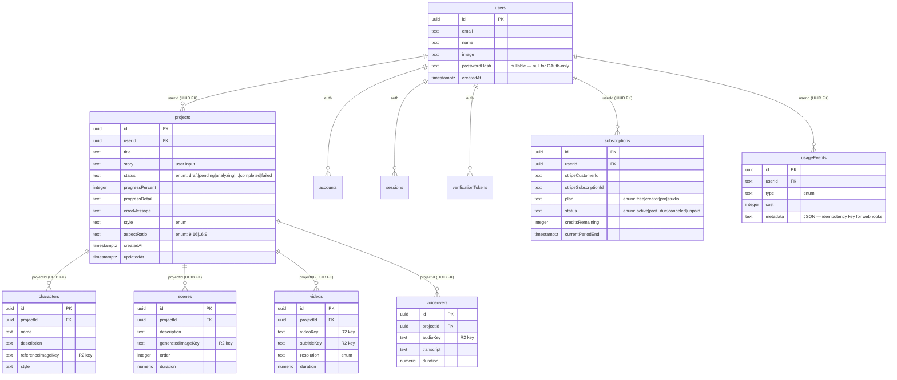

# AGENTS.md
```md
# StoryIntoVideo — Agent Instructions

## Project Overview

Production SaaS for an AI-powered story-into-video generator. Originally a pixel-accurate static clone of `https://storyintovideo.com/` (luxury-dark, cinematic marketing site); now a hybrid Next.js app with full backend: **auth, database, AI pipeline, billing.** The marketing front end is preserved verbatim; the production app layer is built behind it.

## Stack (Locked)

```
Next.js 16 · React 19 · Tailwind CSS v4 (CSS-first @theme) · shadcn/ui · next/font
Geist Sans (body) + Geist Mono (accents) + Outfit (display headings, weight 820)
Lucide React icons · class-variance-authority + clsx + tailwind-merge
Auth.js v5 (NextAuth) + @auth/drizzle-adapter · Drizzle ORM + PostgreSQL (Neon)
Inngest (job queue) · OpenAI GPT-4o + Whisper + Moderation · Replicate SDXL + IP-Adapter
ElevenLabs (TTS) · Cloudflare R2 (storage) · Stripe (billing) · Zod (validation)
FFmpeg (system binary, `FFMPEG_PATH` env var) · bcryptjs (password hashing)
```

## Critical Design Decisions

| Decision | Why |
|---|---|
| Tailwind v4 `@theme` block in `globals.css`, NOT `tailwind.config.ts` | CSS-first is the future direction; PRD ships both, prefer `@theme` |
| Outfit weight **820** via `next/font/local` (not `/google`) | `/google` only serves discrete weights; PRD specifies 820 explicitly |
| Amber is `#febf00` (not Tailwind's `amber-400` = `#fbbf24`) | These are different colors; use custom `--color-primary: #febf00` |
| All animation is CSS `@keyframes` only — no Framer Motion | Matches live site; critical for Lighthouse ≥95 |
| Hybrid rendering (was `force-static`, now removed) | Marketing page stays static; app routes are dynamic; API routes are `force-dynamic` |
| 5-layer architecture (middleware → app → features → domain → lib) | Security + consistency. Lower layers never import from higher layers. |
| Auth-first Server Actions (`verifySession()` before any logic) | Prevents unauthenticated mutations. Never wrap in try/catch. |
| `queries.ts` boundary (all DB access through feature-level queries) | Components never call `db` directly. Enables testing + future swap. |
| Drizzle ORM (not Prisma) | Matches `nextjs16-react19-postgres17` skill; SQL-first; lighter runtime |
| Zod env validation (never `process.env.*` directly) | Catches typos at module load; fails fast on misconfigured deploys |
| Credit-based billing (prepaid credits, not metered) | Simplest for AI products; no overage risk; predictable revenue |
| Inngest for pipeline orchestration (not BullMQ) | Serverless-native; step functions map to 6-step workflow; no Redis |
| System FFmpeg (not `@ffmpeg-installer/ffmpeg`) | Turbopack-incompatible; `FFMPEG_PATH` env var with `/usr/bin/ffmpeg` default |
| Server-side URL signing | Client components NEVER import `r2.ts`; Server Components sign URLs, pass as props |

## Color System (Non-Negotiable)

```
Background:    #020202  (near-black, warm-neutral — NOT pure #000)
Primary/Amber: #febf00  (CTAs, active states, focus rings, accents)
Surface:       #060607  (cards)
Muted text:    #8e8e95  (zinc-400 equivalent)
Body text:     #d4d4d8  (zinc-300)
```

Full semantic token table lives in `Project_Requirements_Document.md` §1.2.

## Typography

| Element | Class | Weight | Tracking |
|---|---|---|---|
| H1 (hero desktop) | `font-heading text-[4.5rem]` | **820** | `-0.04em` |
| H1 (hero mobile) | `text-4xl` | 820 | scales with `em` |
| H2 (sections) | `font-heading text-4xl lg:text-6xl` | 700 | `-0.03em` |
| Body | `font-sans text-lg` | 400 | normal |
| Ratio toggles | `font-mono text-[10px]` | 400 | — |

## The 5-Layer Architecture (Golden Rule)

```
Layer 0: src/proxy.ts             — Cookie check, redirect. NO DB. NO logic. Edge runtime.
Layer 1: src/app/                 — Route structure, metadata, Suspense. Layouts must NOT fetch data.
Layer 2: src/features/            — UI composition, data binding, mutations (auth, projects, pipeline, billing)
Layer 3: src/features/*/domain/   — Pure business logic. No Next.js or DB runtime imports (import type only)
Layer 4: src/lib/                 — Infrastructure: Drizzle, Auth.js, Inngest, R2, Stripe, AI providers. Side effects only.
```

**Golden Rule:** A lower layer may never import from a higher layer.

## File Structure

```
src/
├── app/                          # Layer 1: App Router
│   ├── (auth)/sign-in|sign-up/page.tsx     # Auth pages (AuthForm)
│   ├── (app)/                              # Authenticated app (middleware-protected)
│   │   ├── dashboard/page.tsx              # Project list (Suspense + empty state)
│   │   ├── create/page.tsx                 # Create wizard (story input)
│   │   ├── projects/[id]/page.tsx          # Project detail + pipeline status
│   │   └── billing/page.tsx                # 4-tier plan table
│   ├── api/
│   │   ├── auth/[...nextauth]/route.ts     # Auth.js (force-dynamic)
│   │   ├── inngest/route.ts                # Inngest webhook (force-dynamic)
│   │   └── stripe/webhook/route.ts         # Stripe webhook (force-dynamic)
│   ├── layout.tsx                # Root: fonts, metadata, Providers, skip-to-content
│   ├── page.tsx                  # Marketing page (10 sections, unchanged)
│   ├── globals.css               # @theme + 13 keyframes + @utility + a11y
│   └── icon.tsx
├── components/
│   ├── primitives/               # Marketing presentational (7 files)
│   ├── sections/                 # Marketing page sections (10 files)
│   ├── ui/                       # Hand-written shadcn (4: button, accordion, sheet, dropdown-menu)
│   └── app/                      # App components (8: auth-form, create-wizard, empty-state, providers, project-progress-panel, signed-download-wrapper, project-download-button, project-share-button)
├── features/                     # Layer 2 + 3: Feature modules
│   ├── auth/domain/verify-session.ts       # DAL auth function (throws NEXT_REDIRECT)
│   ├── projects/{queries,actions}.ts       # getUserProjects, createProjectAction
│   ├── pipeline/
│   │   ├── queries.ts                      # appendCharacter, appendScene, updateProjectProgress
│   │   ├── inngest.ts                      # 6-step pipeline function
│   │   └── domain/                         # Pure functions (8 files: analyze, moderate-content, moderate-image, generate-character, generate-scene, synthesize-voice, align-subtitles, assemble-video)
│   └── billing/{queries,actions,domain/}  # domain: tier-limits.ts + extract-period-end.ts
├── lib/                          # Layer 4: Infrastructure
│   ├── db/{index,schema/*}.ts              # Drizzle client + schema (11 tables, 8 enums)
│   ├── env/index.ts                        # Zod-validated env (CRITICAL: never process.env.*)
│   ├── auth/{config,index}.ts              # Auth.js v5 (Google + Credentials + Drizzle adapter)
│   ├── ai/{openai,replicate,elevenlabs}.ts # AI provider clients
│   ├── inngest/{client,functions}.ts       # Inngest client + registrations
│   ├── storage/r2.ts                       # R2 signed URLs (3 buckets) — NEVER import in client components
│   ├── stripe/client.ts                    # Stripe SDK + PRICE_IDS
│   ├── data/                               # Static marketing data (10 files)
│   ├── hooks/                              # use-scrolled, use-reveal, use-reduced-motion, use-project-progress
│   ├── fonts.ts · utils.ts
├── tests/
│   ├── unit/                     # 36 files, 288 tests
│   ├── e2e/                      # 9 files, 48 tests
│   └── setup.ts                  # jest-dom + test env vars
├── types/index.ts                # 12 marketing interfaces
└── proxy.ts                      # Layer 0: route protection (Edge runtime)

.husky/
└── pre-commit                    # Runs `pnpm lint-staged` on staged files
```

## Routes (14 total)

| Route | Type | Purpose |
|---|---|---|
| `/` | ○ Static | Marketing page (10 sections) |
| `/sign-in`, `/sign-up` | ○ Static | Auth (Google + email/password) |
| `/dashboard` | ƒ Dynamic | Project list (auth-protected) |
| `/create` | ○ Static | Create wizard (auth-protected) |
| `/projects/[id]` | ƒ Dynamic | Project detail + live pipeline status (SSE) |
| `/billing` | ○ Static | Plan table + upgrade |
| `/privacy` | ○ Static | Privacy Policy (mandatory for launch) |
| `/terms` | ○ Static | Terms of Service (mandatory for launch) |
| `/api/auth/[...nextauth]` | ƒ Dynamic | Auth.js catch-all |
| `/api/inngest` | ƒ Dynamic | Pipeline webhook |
| `/api/stripe/webhook` | ƒ Dynamic | Billing webhook |
| `/api/projects/[id]/progress` | ƒ Dynamic | SSE progress stream (2s polling, owner-checked) |
| `/api/health` | ƒ Dynamic | Health check (returns `{ status: 'ok' }`) |
| Middleware | ƒ Proxy | Protects `/dashboard`, `/create`, `/settings`, `/billing` |

## Build & Quality Commands (Actual)

```bash
pnpm dev          # Development server (Turbopack)
pnpm build        # Production build (hybrid: static + dynamic)
pnpm lint         # eslint . (flat config)
pnpm typecheck    # tsc --noEmit (strict + noUncheckedIndexedAccess)
pnpm test         # vitest run (288 unit tests, jsdom)
pnpm test:e2e     # playwright test (48 E2E tests, Chromium, auto-starts dev)
pnpm format       # prettier --write
pnpm format:check # prettier --check
pnpm drizzle-kit generate   # Create migration SQL from schema diff
pnpm drizzle-kit migrate    # Apply migrations (needs DATABASE_URL_UNPOOLED)
pnpm drizzle-kit studio     # Schema browser
```

**Pre-commit chain:** `pnpm lint && pnpm typecheck && pnpm test && pnpm build`. **husky + lint-staged** auto-runs ESLint + Prettier on staged `.ts/.tsx` files via `.husky/pre-commit` (activated by `pnpm install` via the `prepare` script).

## Component Contracts (TypeScript)

All components use `interface` (not `type` for object shapes), zero `any`. Critical rules:

- `'use client'` only for: Navbar, Hero, Examples, Faq, Workflow, ScrollReveal (marketing); AuthForm, CreateWizard, Providers, ProjectProgressPanel, ProjectDownloadButton, ProjectShareButton (app)
- Server components by default: Features, Testimonials, UseCases, FinalCta, Footer (marketing); dashboard, project detail, billing, privacy, terms pages (app)
- `next/image` for all raster images, `next/font` for all fonts
- **Auth-first Server Actions:** every action starts with `verifySession()` before any logic
- **`queries.ts` boundary:** all DB access through feature-level queries files; components never call `db`
- **Domain isolation:** `src/features/*/domain/` contains pure functions — no Next.js or DB runtime imports

## Auth Patterns (CRITICAL)

- **`verifySession()`** — `src/features/auth/domain/verify-session.ts`. Returns session or throws `NEXT_REDIRECT`. **Never wrap in try/catch.**
- **API routes use `auth()` directly** — returns null → 401 JSON. Do NOT use `verifySession()` in API routes.
- **Middleware** — `src/proxy.ts` exports `auth` as default (Auth.js v5 pattern). Checks cookie presence only; Edge runtime can't access DB.
- **`AUTH_SECRET`** — read from `env` module, never `process.env.AUTH_SECRET`.

## AI Pipeline (Inngest, 6 Steps — fully wired)

```
Step 0: Moderate story (OpenAI Moderation API — block if flagged)
Step 1: Analyze story (GPT-4o JSON mode → characters + scenes)
Step 2: Generate characters (Replicate SDXL → moderateImage per ADR-011)
Step 3: Generate scenes (Replicate SDXL + IP-Adapter → moderateImage per ADR-011)
Step 4: Synthesize voiceover (ElevenLabs TTS → R2 putObject → appendVoiceover)
Step 5: Align subtitles (fetch audio from R2 → Whisper ASR → SRT → R2 → updateVideoSubtitle)
Step 6: Assemble video (FFmpeg via `getFfmpegPath()` → R2 putObject('videos') → appendVideo)
Final: Mark status='completed', progressPercent=100
```

Each step is idempotent (Inngest retries), debits credits (analysis=5, char=10, scene=8, voiceover=15, subtitle_alignment=3, video_assembly=30), updates `project.status` + `progressDetail`. `createProjectAction` triggers the pipeline via `inngest.send({ name: PIPELINE_EVENT, data: { projectId } })` after the DB insert. Image moderation (Steps 2 & 3) parses Replicate's `safety_concept` / `api_safety_concept` fields. Fail-open policy is env-configurable via `IMAGE_MODERATION_FAIL_OPEN` (default `true`; set to `false` for production fail-closed). The `moderationSkipped` field makes bypasses observable. (T5)

## Marketing Section Order (Top → Bottom, Fixed)

1. Navbar (fixed overlay) → 2. Hero → 3. Examples → 4. Workflow → 5. Features → 6. Testimonials → 7. Use Cases → 8. FAQ → 9. Final CTA → 10. Footer

## Interaction Inventory

| Component | Interaction | Mechanism |
|---|---|---|
| Navbar | Scroll-aware bg | `useScrolled` hook → `bg-zinc-950/70 backdrop-blur-[24px]` |
| Navbar | Mobile hamburger → Sheet | shadcn Sheet (right-side) |
| Navbar | Language switcher → Dropdown | shadcn DropdownMenu (decorative — no i18n) |
| Hero | Textarea focus glow | `focus-within:` on parent wrapper |
| Hero | Story chip click → populate textarea | `useState` |
| Hero | Character counter | `{story.length} / 500`, amber at ≥450 |
| Hero | Aspect ratio toggle | `aria-pressed` toggle buttons |
| Examples | Carousel arrow scroll | `scrollBy` / `scrollLeft` |
| FAQ | Expand/collapse | Radix Accordion (grid-template-rows: 0fr→1fr) |
| All sections | Scroll reveal | IntersectionObserver → `data-revealed` attr |
| AuthForm | Google OAuth + credentials | `signIn('google')` / `signIn('credentials')` |
| CreateWizard | Submit → createProjectAction | Server Action (auth-first, Zod, moderation, credits, **Inngest trigger**) |
| Dashboard | Project list | Suspense + Server Component + `getUserProjects()` |
| ProjectDetail | Live pipeline status | `ProjectProgressPanel` client component → SSE `/api/projects/[id]/progress` |
| ProjectDetail | Download completed video | `SignedDownloadWrapper` (Server) → `ProjectDownloadButton` (Client, receives `downloadUrl` prop) |
| ProjectDetail | Share project | `ProjectShareButton` → Web Share API + clipboard fallback |
| ProjectDetail | Download completed video | `ProjectDownloadButton` → signed R2 URL (1h expiry) |
| ProjectDetail | Share project | `ProjectShareButton` → Web Share API + clipboard fallback |

## 13 Keyframes (All CSS, in globals.css)

```
fade-in-up, float, glow-pulse, border-glow, composite-pulse-text,
shimmer, btn-shimmer, grid-shimmer, grid-sweep-h, grid-sweep-v,
scanline-scroll, lang-dropdown-in, marquee-scroll
```

## Accessibility Requirements

- Focus rings: `focus-visible:outline-2 focus-visible:outline-offset-2 focus-visible:outline-amber-400`
- Skip-to-content link at page top
- Hero video: `aria-hidden="true"` (decorative)
- `prefers-reduced-motion: reduce` global override disables all animation
- Touch targets ≥44×44px on mobile (ratio toggle needs hit-area expansion)
- Color contrast: body text zinc-300 on zinc-950 = 12.6:1 (AAA)

## Performance Budget

| Metric | Target |
|---|---|
| Lighthouse Performance | ≥95 (marketing page) |
| JS bundle | <150KB gzipped (app adds auth/db/ai client code) |
| CSS bundle | <30KB gzipped |
| Above-fold images | <500KB total |
| Videos preload | `metadata` only (not `auto`) |

## Common Pitfalls

### Marketing Layer (inherited)
1. **Pure black vs near-black:** Background is `#020202`, NOT `#000` or `#0a0a0a`
2. **Amber shades:** PRD amber (`#febf00`) ≠ Tailwind amber-400 (`#fbbf24`) — use custom token
3. **Outfit 820 missing from Google Fonts API:** Self-host via `next/font/local`
4. **Feature grid uses hairline borders, not cards:** Cards share a continuous surface separated by `border-neutral-800`
5. **Examples hover gradient is the ONLY purple on the entire site:** `bg-gradient-to-r from-yellow-500 to-purple-500` on card hover
6. **CTA hierarchy is deliberate:** Ghost link → glass pill → gradient pill → solid amber (ration the amber accent)
7. **Geist Mono for ratio toggles, NOT Geist Sans:** `font-mono text-[10px]` for 9:16/16:9 buttons

### Production App Layer (new)
8. **`verifySession()` must not be wrapped in try/catch** — it throws `NEXT_REDIRECT` which must propagate
9. **`process.env.*` is forbidden** — always import `env` from `@/lib/env`
10. **Zod v4 `.url()` accepts any scheme** — compose `.url()` (validates URL format) with `.refine()` (restricts protocol to `postgres:`/`postgresql:`) for `DATABASE_URL`. The Zod v3 limitation where `.url()` rejected `postgresql://` no longer applies in v4.
11. **Build fails without env vars** — env module has a build-context fallback (placeholders when `NEXT_PHASE=phase-production-build` or `NODE_ENV=test`)
12. **Auth route handler must be `force-dynamic`** — prevents prerender failure (DrizzleAdapter needs env vars)
13. **Inngest v4 `createFunction` signature** — trigger is in config object (`triggers: [{ event: '...' }]`), NOT a second argument
14. **Stripe "Basil" API (2025-03-31) moved `current_period_end`** — the field was removed from the top-level Subscription object and moved to `subscription.items.data[0].current_period_end`. The Stripe Node SDK has always used snake_case (no camelCase conversion). The webhook handler uses the `extractSubscriptionPeriodEnd()` pure helper which checks both shapes.
15. **ElevenLabs returns `Readable`, not `ReadableStream`** — `streamToBuffer` duck-types the input
16. **Buffer → Blob requires `new Uint8Array(buffer)`** — `new File([audioBuffer], ...)` fails TypeScript strict
17. **`NODE_ENV` is read-only in tests** — use `vi.stubEnv('NODE_ENV', 'test')`
18. **Middleware runs on Edge** — no DB access, no Node.js APIs
19. **esbuild build scripts need approval** — add `esbuild: true` to the `allowBuilds` map in `pnpm-workspace.yaml` (pnpm 10.26+ syntax; the older `onlyBuiltDependencies` array was removed in pnpm 11)

### Remediation Sprint (pipeline wiring + UX + compliance)
20. **Vitest mock factories are hoisted** — `vi.mock()` factories are lifted above imports. Use `vi.hoisted()` for any `vi.fn()` referenced inside the factory. Symptom: `Cannot access 'X' before initialization`.
21. **Mock constructors need `class` syntax** — `new S3Client(...)` requires the mock to be `new`-able. Arrow functions throw `"X is not a constructor"`. Use `class MockS3Client { send = sendMock; }`.
22. **`.tsx` extension required for JSX tests** — oxc throws parse error for JSX in `*.test.ts`. Rename to `*.test.tsx`.
23. **`fetch()` in pipeline tests hits real DNS** — Steps 5 & 6 download audio/SRT from R2 via `fetch()`. Stub globally: `vi.stubGlobal('fetch', fetchMock)`.
24. **SSE routes use `auth()` not `verifySession()`** — `verifySession()` throws redirect (wrong for JSON/SSE). API routes use `auth()` → returns null → 401 JSON.
25. **SSE polling (2s) over LISTEN/NOTIFY** — serverless can't hold long-lived Postgres connections. Poll DB every 2s; close stream on terminal status (`completed`/`failed`).
26. **`EventSource` cleanup is mandatory** — `useEffect` must return `() => eventSource.close()`. Otherwise connection leaks across navigations.
27. **`getProject()` LEFT JOINs videos** — returns `videoKey`, `subtitleKey` (nullable). UI conditionally renders download button. Don't add a second DB round-trip.
28. **Client components must NEVER import `r2.ts` at module level** — env validation throws in browser where server-only env vars are undefined. Sign URLs in Server Components (`SignedDownloadWrapper`), pass as props. This is a P0 bug that breaks `/projects/[id]`.
29. **`@ffmpeg-installer/ffmpeg` incompatible with Turbopack** — replaced with system FFmpeg binary via `getFfmpegPath()`. Set `FFMPEG_PATH` env var if non-standard location.
30. **`middleware.ts` renamed to `proxy.ts` in Next.js 16** — functionality identical, only filename changes.
31. **`putObject` (pipeline) vs `getSignedUploadUrl` (client)** — pipeline steps have Buffer in memory → direct PUT. Client uploads use presigned URL → browser uploads directly to R2.
32. **`assemble-video.ts` temp file lifecycle** — writes SRT to `/tmp/siv-srt-<ts>.srt`, runs FFmpeg to `/tmp/siv-video-<ts>.mp4`, reads MP4 into Buffer, `unlink`s both. Never leak temp files.
33. **`moderateImage` fail-open policy** — unknown Replicate output shapes return `flagged:false` with `moderationSkipped:true`. Env-configurable via `IMAGE_MODERATION_FAIL_OPEN` (default `true`; set to `false` for production fail-closed). A `console.warn` is emitted on every skip so operators can detect the bypass. (T5)
34. **husky `prepare` script uses `|| true`** — prevents `pnpm install` from failing on first install. Don't remove.
35. **Source-reading tests must strip comments** — `src.replace(/\/\*[\s\S]*?\*\//g, '').replace(/\/\/.*$/gm, '')` before regex-matching, else docblocks trigger false positives.

### Remediation Sprint 2 (post-review hardening)
36. **`trustHost: true` is mandatory for reverse-proxy deployments** — without it, Auth.js v5 falls back to `AUTH_URL` for callback URLs. If `AUTH_URL=http://localhost:3000` leaks to production, auth redirects resolve to localhost → `ERR_CONNECTION_REFUSED`. This was a P0 production outage. (T2)
37. **AUTH_URL ↔ NEXT_PUBLIC_APP_URL host-mismatch warning** — the env module emits a `console.warn` at module load when the two hosts differ. With `trustHost: true` it's no longer fatal, but it should still be fixed. (T2)
38. **`OPENAI_API_KEY.startsWith('sk-')` is NOT too strict** — `sk-proj-*`, `sk-svcacct-*`, `sk-admin-*` all literally start with `sk-`. Investigation revealed the original concern was unfounded. 5 regression-guard tests added. (T3)
39. **Hardcoded third-party model IDs are an operational liability** — the placeholder `SDXL_IPADAPTER_MODEL` hash was a UUID-format string, not Replicate's 64-char hex SHA. Scene generation would have 404'd. Model IDs are now env-configurable with format validation. (T4)
40. **`putObject` needs a size guard** — `MAX_PUT_OBJECT_BYTES = 500 MB` + `PayloadTooLargeError`. R2's limit is 5 GB, but function memory is the real constraint. (T7)
41. **SSE needs both server-side and client-side resilience** — `maxDuration = 800` (T6, corrected) is the Vercel Pro/Enterprise GA ceiling under Fluid Compute (now default). The previous value of 900 exceeded the GA limit. Client-side reconnect with exponential backoff (1s → 2s → 4s, max 3 attempts) handles Vercel Hobby's 300s cap. (T6)
42. **`pnpm-workspace.yaml` requires `packages:` field** — pnpm 9+ enforces this even for single-package repos. Fresh clones fail with `ERR_PNPM_INVALID_WORKSPACE_CONFIGURATION`. Fix: `packages: ['.']`. The engine floor is now `pnpm >=10.26.0` to match the `allowBuilds` syntax. (T0)
43. **CI runs the full quality gate** — `.github/workflows/ci.yml` runs `pnpm lint && pnpm typecheck && pnpm test && pnpm build` on every PR. lint-staged only checks staged files; CI catches whole-codebase regressions. (T8)

## What's Implemented vs. Outstanding

### ✅ Implemented (code layer — 288 unit tests + 48 E2E tests, all GREEN)
- Auth.js v5 (Google OAuth + Credentials, Drizzle adapter, JWT sessions, **`trustHost: true`** for reverse-proxy compatibility — T2)
- Drizzle schema (11 tables, 8 enums) + migration config
- `verifySession()` DAL + middleware route protection
- Sign-in / sign-up pages with shared AuthForm
- Dashboard with Suspense + empty state
- Create wizard (reuses Hero's glass-input pattern)
- `createProjectAction` Server Action (auth-first, Zod, moderation, credits, **Inngest trigger**)
- OpenAI integration (GPT-4o analysis, Moderation, Whisper ASR)
- Replicate integration (SDXL character + scene generation, IP-Adapter, **env-configurable model IDs** — T4)
- ElevenLabs TTS (chunked for long text)
- FFmpeg video assembly (rewritten — SRT temp file, inputOptions per image, Buffer readback, cleanup)
- Inngest 6-step pipeline function (**fully wired: Steps 0-6 + final completion**)
- Image moderation on generated characters + scenes (ADR-011 — `moderateImage` parses Replicate safety output, **`moderationSkipped` field + env-configurable fail-open via `IMAGE_MODERATION_FAIL_OPEN`** — T5)
- R2 storage layer (signed URLs + `putObject` for pipeline Buffer uploads, 3 buckets, **`MAX_PUT_OBJECT_BYTES = 500 MB` size guard + `PayloadTooLargeError`** — T7)
- Stripe (Checkout, Portal, webhook with signature verification + idempotency)
- Credit metering (transactional `debitCredits`, `InsufficientCreditsError`)
- Billing page (4-tier plan table)
- SSE progress stream (`/api/projects/[id]/progress` — 2s polling, owner-checked, **`maxDuration = 800` (corrected from 900 — Pro GA ceiling under Fluid Compute) + client-side reconnect with exponential backoff** — T6)
- `useProjectProgress` client hook + `ProjectProgressPanel` (live progress bar, **reconnect UI state** — T6)
- Download button (signed R2 URL, **server-side signing via `SignedDownloadWrapper` Server Component extracted to its own file** — T1) + Share button (Web Share API + clipboard fallback)
- `getProject()` LEFT JOINs videos — returns `videoKey` for conditional download render
- `getFfmpegPath()` helper — resolves FFmpeg binary from `FFMPEG_PATH` env var (default `/usr/bin/ffmpeg`)
- **Client components never import `r2.ts` at module level** — prevents env validation crash in browser
- Privacy Policy + Terms of Service pages (Server Components, AI-specific clauses)
- All 14 marketing CTAs wired to real routes
- husky + lint-staged pre-commit hook (`.husky/pre-commit`)
- **AUTH_URL ↔ NEXT_PUBLIC_APP_URL host-mismatch warning** at module load — T2
- **GitHub Actions CI** (`.github/workflows/ci.yml`) running lint + typecheck + test + build on every PR — T8
- **`pnpm-workspace.yaml` fixed** with `packages: ['.']` field + standardized on `allowBuilds` syntax (removed deprecated `onlyBuiltDependencies`); engine floor bumped to `pnpm >=10.26.0` — T0
- 288 unit tests (36 files) + 48 E2E tests (9 files)

### ⚠️ Outstanding (requires external resources / not yet done)
- **External service credentials** — Neon, Google OAuth, OpenAI, Replicate, ElevenLabs, R2, Stripe, Inngest, Resend, Upstash, Sentry (fill `.env.local` from `.env.example`)
- **Database migrations applied** — run `pnpm drizzle-kit generate && migrate` against real Neon
- **Stripe products configured** — `PRICE_IDS` in `src/lib/stripe/client.ts` are placeholders
- **Replicate IP-Adapter model hash** — `REPLICATE_SDXL_IPADAPTER_MODEL` env var must be set to a real `lucataco/sdxl-ipadapter:<sha>` hash before character consistency will work. The default is the SDXL base model (a documented placeholder). (T4)
- **Character consistency validated end-to-end** — manual R&D test (Risk R1, highest-risk component). Code is wired; needs real API keys.
- **FFmpeg assembly validated end-to-end** — rewritten + unit-tested with mocked fluent-ffmpeg; needs real-world test with actual scene images + audio + SRT
- **Rate limiting** — Upstash Ratelimit on auth/AI/export (env vars already in schema; integration not done)
- **Monitoring** — Sentry, Vercel Analytics, Axiom not integrated (env var `SENTRY_DSN` in schema)
- **E2E tests in CI** — Playwright E2E not yet in the GitHub Actions workflow (needs Postgres service container + browser binaries + seeded data)
- **GDPR/CCPA** — cookie consent banner + data export/deletion endpoints not implemented (Privacy/Terms pages exist)
- **Other content pages** — `/pricing`, `/blog`, `/contact` linked but not implemented

### ✅ Recently Closed (remediation sprint 1 — pipeline wiring + UX + compliance)
- ~~Steps 4-6 not wired into Inngest~~ → Fixed
- ~~`inngest.send()` commented out~~ → Fixed
- ~~FFmpeg placeholder implementation~~ → Fixed (rewrite)
- ~~No SSE progress stream~~ → Fixed
- ~~No download/share~~ → Fixed
- ~~No image moderation (ADR-011)~~ → Fixed
- ~~No legal pages~~ → Fixed
- ~~No pre-commit hooks~~ → Fixed (husky + lint-staged)

### ✅ Recently Closed (remediation sprint 2 — post-review hardening)
- ~~P0: Auth redirects to `localhost:3000` in production~~ → Fixed (`trustHost: true` + AUTH_URL host-mismatch warning — T2)
- ~~`SignedDownloadWrapper` inline in page.tsx~~ → Fixed (extracted to its own file — T1)
- ~~`SDXL_IPADAPTER_MODEL` fake placeholder hash~~ → Fixed (env-configurable with format validation — T4)
- ~~`moderateImage` fail-open is silent~~ → Fixed (`moderationSkipped` field + env-configurable policy — T5)
- ~~SSE disconnects mid-pipeline (300s Vercel cap)~~ → Fixed (`maxDuration = 800` (corrected from 900) + client reconnect with exponential backoff — T6)
- ~~`putObject` accepts any buffer size~~ → Fixed (`MAX_PUT_OBJECT_BYTES = 500 MB` + `PayloadTooLargeError` — T7)
- ~~No CI/CD~~ → Fixed (GitHub Actions workflow — T8)
- ~~`pnpm-workspace.yaml` missing `packages:` field~~ → Fixed (T0)
- ~~`OPENAI_API_KEY` validation too strict~~ → Investigated, found unfounded (`sk-` prefix already accepts `sk-proj-`, `sk-svcacct-`, `sk-admin-`); 5 regression-guard tests added (T3)

### ✅ Recently Closed (post-review hardening — design_critique.md remediation)
- ~~Fictional Stripe SDK v22 camelCase fallback in webhook~~ → Fixed (`extractSubscriptionPeriodEnd()` pure helper handles the real Basil API 2025-03-31 shape change — 8 tests)
- ~~SSE `maxDuration = 900` exceeded Vercel Pro GA limit~~ → Fixed (`maxDuration = 800` — Pro/Enterprise GA ceiling under Fluid Compute)
- ~~React `^19.2.0` vulnerable to CVE-2025-55182 (React2Shell RCE)~~ → Fixed (pinned `^19.2.3`)
- ~~Obsolete Zod v3 `.refine()` workaround for `DATABASE_URL`~~ → Fixed (`.url().refine()` composition — Zod v4 `.url()` accepts any scheme — 4 tests)
- ~~`IMAGE_MODERATION_FAIL_OPEN` bypassed Zod env validation~~ → Fixed (moved into schema as `z.enum(['true','false'])`, read from `env` module not `process.env` — 7 tests)
- ~~`pnpm-workspace.yaml` mixed deprecated + current syntax~~ → Fixed (standardized on `allowBuilds`, removed stale `@ffmpeg-installer/linux-x64`, bumped engine to `>=10.26.0`)
- ~~`STYLE_CHIPS` drifted from spec (7 chips, wrong labels)~~ → Fixed (restored 8-chip spec set verbatim — 5 tests)
- ~~Hero headline collapsed to 2-line~~ → Fixed (restored 3-line cinematic stack + subtitle emphasizes OUTPUT over PROCESS — 5 tests)

## Troubleshooting

| Issue | Cause | Fix |
|---|---|---|
| E2E tests fail with "Executable doesn't exist" | Playwright browsers not installed | `pnpm exec playwright install` |
| Hydration mismatch console error | Grammarly extension injects `<body>` attributes | `suppressHydrationWarning` on `<html>` + `<body>` (already applied) |
| `next lint` command not found | Deprecated in Next.js 16 | Use `eslint .` directly |
| `shadcn` CLI times out | Registry fetch failure | Primitives are hand-written in `src/components/ui/` |
| Outfit weight 820 not rendering | Google Fonts API doesn't serve weight 820 | Must self-host via `next/font/local` (already done) |
| Tailwind classes not applying | Missing `@source` directives | Check `globals.css` has `@source '../components/**/*.{ts,tsx}'` |
| Cross-origin dev resource blocked | Next.js blocks `/_next/webpack-hmr` from non-localhost origins | Add origin to `allowedDevOrigins` in `next.config.ts` |
| Build fails: "Invalid environment variables" | Real env vars not in `.env.local` | Copy `.env.example` → `.env.local`, fill in real values |
| Build fails: "Failed to collect page data for /api/auth/[...nextauth]" | Auth route tries to prerender DrizzleAdapter | Ensure `export const dynamic = 'force-dynamic'` in route handler |
| `drizzle-kit generate` errors | `DATABASE_URL_UNPOOLED` not set | Set in `.env.local` (direct Neon connection, not pooled) |
| Inngest function not triggering | Not registered in `src/lib/inngest/functions.ts` | Add to the `functions` array |
| Stripe webhook 400 "Invalid signature" | Wrong secret or body parsed as JSON | Use `await req.text()` (not `.json()`); verify `STRIPE_WEBHOOK_SECRET` |
| `pnpm install` warns "Ignored build scripts: esbuild" | `pnpm-workspace.yaml` missing approval | Add `esbuild: true` to the `allowBuilds` map in `pnpm-workspace.yaml` (pnpm 10.26+ syntax; the older `onlyBuiltDependencies` array was removed in pnpm 11) |
| Tests fail: "Cannot find module 'next/server'" | jsdom can't load Next.js server modules | Mock `next-auth`, `next/navigation`, `@/lib/db` in tests |
| `replicate.run()` returns wrong shape | Model output type varies | Cast `as unknown as string[]`, check length before indexing |
| Tests fail: "Cannot access 'X' before initialization" | `vi.mock()` factory references outer `vi.fn()` | Use `vi.hoisted()`: `const { mockFn } = vi.hoisted(() => ({ mockFn: vi.fn() }))` |
| Tests fail: "X is not a constructor" | Mock factory returns arrow fn, real code does `new X()` | Use `class` syntax: `class MockS3Client { send = sendMock; }` |
| Tests fail: "[PARSE_ERROR] Expected '>' but found 'Identifier'" | Test file has JSX but `.test.ts` extension | Rename to `*.test.tsx` |
| Pipeline tests fail: "fetch failed: ENOTFOUND r2.example.com" | Steps 5 & 6 use `fetch()` for R2 downloads | `vi.stubGlobal('fetch', fetchMock)` |
| SSE route returns 307 redirect instead of 401 JSON | Used `verifySession()` (redirects) instead of `auth()` | API routes use `auth()` directly: returns null → 401 JSON |
| SSE stream hangs / never closes | `controller.close()` not called on terminal status | Poll DB every 2s; close when `status ∈ {completed, failed}` |
| `EventSource` leaks across navigations | `useEffect` cleanup missing `eventSource.close()` | Return cleanup fn from `useEffect` |
| Project detail page shows "This page couldn't load" | Client component imports `r2.ts` at module level, triggering env validation crash in browser | **Never import `@/lib/storage/r2` in `'use client'` files.** Sign URLs in Server Components, pass as props. |
| `assemble-video` can't find FFmpeg binary | `@ffmpeg-installer/ffmpeg` removed; system FFmpeg not installed | `sudo apt install ffmpeg` (Ubuntu) or `brew install ffmpeg` (macOS). Set `FFMPEG_PATH` env var if non-standard. |
| husky pre-commit hook doesn't run | `pnpm install` didn't run `prepare` script | Run `pnpm install`; ensure `.husky/pre-commit` is executable |
| Auth redirects to `http://localhost:3000` in production | `AUTH_URL` env var set to localhost, OR reverse proxy doesn't forward `X-Forwarded-Host` | Set `AUTH_URL` to the production URL. The `trustHost: true` config (T2) makes Auth.js use the request's Host header as a fallback. The env module emits a `console.warn` when AUTH_URL and NEXT_PUBLIC_APP_URL hosts differ. |
| `pnpm install` fails with `ERR_PNPM_INVALID_WORKSPACE_CONFIGURATION  packages field missing or empty` | `pnpm-workspace.yaml` missing `packages:` field (T0) | Add `packages: ['.']` to `pnpm-workspace.yaml` (already done in this repo) |
| `putObject` throws `PayloadTooLargeError` | Body exceeds `MAX_PUT_OBJECT_BYTES` (500 MB) | Use multipart upload via `CreateMultipartUploadCommand` for larger files. The 500 MB cap is intentional — function memory is the real constraint. (T7) |
| SSE stream disconnects after 300s (Vercel Hobby) | `maxDuration = 800` (T6, corrected) is the Vercel Pro/Enterprise GA ceiling under Fluid Compute. Hobby caps at 300s. | Upgrade to Vercel Pro OR rely on client-side reconnect (T6) which reopens after 1s/2s/4s backoff. UI shows "Reconnecting to live updates…" during reconnect. NOTE: the previous value of 900 exceeded the Pro GA limit. |
| Replicate scene generation 404s | `REPLICATE_SDXL_IPADAPTER_MODEL` is the SDXL base placeholder (T4 default) | Set `REPLICATE_SDXL_IPADAPTER_MODEL` env var to a real `lucataco/sdxl-ipadapter:<sha>` hash from replicate.com/explorer |
| Server log shows `[env] AUTH_URL host ("localhost:3000") differs from NEXT_PUBLIC_APP_URL host` | AUTH_URL and NEXT_PUBLIC_APP_URL point to different hosts | Set both to the same production URL. With `trustHost: true` (T2) this is no longer fatal, but should still be fixed (AUTH_URL is used for email magic links, etc.). |

## Lessons Learned

1. **`suppressHydrationWarning` on `<body>`** — Browser extensions inject attributes before React hydrates. `<html>` alone is insufficient.
2. **Workflow is `'use client'`** — Uses `useState` for video loading choreography. Don't assume server components for "mostly static" sections.
3. **Test counts drift from plans** — MEP planned 6+3, actual is now 288 unit + 48 E2E. Always verify against `pnpm test` output.
4. **File structure evolves** — `features/`, `lib/db/`, `lib/ai/`, `lib/auth/`, `lib/storage/`, `lib/inngest/`, `lib/stripe/`, `lib/env/` were created during production build. Update docs as you build.
5. **Playwright needs separate install** — `pnpm install` doesn't install browser binaries.
6. **Zod v4 `.url()` accepts any scheme** — compose `.url()` (validates URL format) with `.refine()` (restricts protocol to `postgres:`/`postgresql:`) for `DATABASE_URL`. The Zod v3 limitation where `.url()` rejected `postgresql://` no longer applies in v4.
7. **Env validation needs build-context fallback** — without it, `next build` fails during page-data collection.
8. **`postgres()` defers connection until first query** — allows eager db instantiation without breaking the build.
9. **DrizzleAdapter validates db object structure** — a Proxy-based lazy db was rejected; use a real Drizzle client.
10. **Inngest v4 changed `createFunction` signature** — trigger is now in the config object, not a second argument.
11. **Auth unit tests must mock `next-auth` + `next/navigation`** — jsdom can't load `next/server`.
12. **Source-reading tests are valid** for server-only modules (auth config, middleware, route handlers) that can't be rendered in jsdom.
13. **Stripe "Basil" API (2025-03-31) moved `current_period_end`** — the field was removed from the top-level Subscription object and moved to `subscription.items.data[0].current_period_end`. The Stripe Node SDK has always used snake_case (no camelCase conversion). The webhook handler uses the `extractSubscriptionPeriodEnd()` pure helper which checks both shapes.
14. **ElevenLabs returns `Readable`, not `ReadableStream`** — duck-type the input in `streamToBuffer`.
15. **TDD with mocked AI providers works well** — all 6 pipeline domain functions are fully unit-tested; real API calls only needed for manual E2E validation.
16. **Client components must NEVER import `r2.ts` at module level** — the `r2.ts` module imports `env` which validates all 28 env vars at module load. In the browser, only `NEXT_PUBLIC_*` vars exist — all server-only vars are `undefined`, causing "Invalid environment variables" crash. The fix: Server Component signs the URL, passes as prop to client component. This is a P0 bug that completely breaks the project detail page.
17. **Server-side URL signing pattern** — for any client component that needs data from server-only env vars (R2 signed URLs, Stripe secrets, etc.), the Server Component should fetch/compute the value and pass it as a prop. This is the recommended Next.js 16 pattern.
18. **`@ffmpeg-installer/ffmpeg` incompatible with Turbopack** — the package uses dynamic `require()` with runtime-constructed paths that produce `/ROOT/node_modules/...` under Turbopack. Replaced with system FFmpeg binary via `getFfmpegPath()` helper.
19. **`middleware.ts` renamed to `proxy.ts` in Next.js 16** — the file convention changed. Functionality identical, only filename changes.
20. **Vitest mock hoisting is the #1 test bug** — `vi.mock()` factories are hoisted above imports. Use `vi.hoisted()` for shared `vi.fn()` state. Symptom: `Cannot access 'X' before initialization`.
21. **Mock constructors must be `class`, not arrow fns** — `new S3Client(...)` requires `new`-able mock. Arrow fns throw `"X is not a constructor"`.
22. **SSE in Next.js 16** — `ReadableStream` + `text/event-stream` content-type + 2s DB polling. Simpler than Postgres LISTEN/NOTIFY for serverless.
23. **`auth()` vs `verifySession()` for API routes** — `verifySession()` throws redirect (wrong for JSON). API routes use `auth()` → null → 401 JSON.
24. **`EventSource` cleanup is non-negotiable** — `useEffect` must return `() => eventSource.close()`. Otherwise connection leaks.
25. **Image moderation via Replicate safety output** — zero extra API calls vs. OpenAI vision moderation. Fail-open policy is env-configurable via `IMAGE_MODERATION_FAIL_OPEN` (default `true`; set to `false` for production fail-closed). The `moderationSkipped` field makes bypasses observable. (T5)
26. **`getProject()` LEFT JOIN videos** — cheaper than two queries. UI uses `videoKey` for conditional download button render.
27. **`putObject` (pipeline) vs `getSignedUploadUrl` (client)** — pipeline has Buffer in memory → direct PUT. Client uploads use presigned URL.
28. **TDD exposed 4 latent defects in `assemble-video.ts`** — placeholder Buffer, missing SRT write, missing input options, brittle filter extraction. All discoverable only by writing tests first.
29. **Source-reading tests must strip comments** — `src.replace(/\/\*[\s\S]*?\*\//g, '').replace(/\/\/.*$/gm, '')` before regex, else docblocks trigger false positives.
30. **husky `prepare` script with `|| true` is intentional** — prevents `pnpm install` failure on first install. Don't remove.
31. **`middleware.ts` renamed to `proxy.ts` in Next.js 16** — the file convention changed to better reflect its role as a network boundary. Functionality is identical; only the filename changes. Run `npx @next/codemod@canary middleware-to-proxy .` or rename manually.
32. **`trustHost: true` is mandatory for reverse-proxy deployments** — without it, Auth.js v5 falls back to `AUTH_URL` for callback URLs. If `AUTH_URL=http://localhost:3000` leaks to production, auth redirects resolve to localhost → `ERR_CONNECTION_REFUSED`. This was a P0 production outage. (T2)
33. **Hardcoded third-party model IDs are an operational liability** — the placeholder `SDXL_IPADAPTER_MODEL` hash was a UUID-format string, not Replicate's 64-char hex SHA. Scene generation would have 404'd. Model IDs are now env-configurable with format validation. (T4)
34. **SSE needs both server-side and client-side resilience** — `maxDuration = 800` (T6, corrected) is the Vercel Pro/Enterprise GA ceiling under Fluid Compute. The previous value of 900 exceeded the GA limit. Client-side reconnect with exponential backoff (1s → 2s → 4s, max 3 attempts) handles Vercel Hobby's 300s cap. (T6)
35. **`putObject` needs a size guard** — `MAX_PUT_OBJECT_BYTES = 500 MB` + `PayloadTooLargeError`. R2's limit is 5 GB, but function memory is the real constraint. (T7)
36. **`pnpm-workspace.yaml` requires `packages:` field** — pnpm 9+ enforces this even for single-package repos. Fresh clones fail with `ERR_PNPM_INVALID_WORKSPACE_CONFIGURATION`. Fix: `packages: ['.']`. The engine floor is now `pnpm >=10.26.0` to match the `allowBuilds` syntax. (T0)
37. **CI runs the full quality gate** — `.github/workflows/ci.yml` runs `pnpm lint && pnpm typecheck && pnpm test && pnpm build` on every PR. lint-staged only checks staged files; CI catches whole-codebase regressions. (T8)

## Reference

- **Marketing spec:** `Project_Requirements_Document.md` (v2.0, 2718 lines, field-verified from live DOM)
- **Engineering blueprint:** `PRODUCTION_READINESS_PLAN.md` (11 ADRs, 27 TDD task cards, risk register, pre-launch checklist)
- **Marketing execution record:** `MASTER_EXECUTION_PLAN.md` (8 phases, 15 decisions, 20 risks)
- **Deviation validation:** `deviation_report_validation.md` (1 genuine gap + 1 enhancement found in the 26-claim report)

## Implementation Deviations (Post-Build)

### Marketing Layer (inherited from clone)
1. **`src/` directory convention** — app code in `src/` (per skill), not repo root as in PRD §6.1.
2. **Tailwind v4 `@theme` block** — all design tokens in `globals.css`. No `tailwind.config.ts`. Aligns with PRD §8.2.
3. **Kebab-case keyframes** — all 13 `@keyframes` normalized to kebab-case. PRD §9 camelCase and §8.1 kebab conflict; kebab wins.
4. **Outfit variable font self-hosted** — `next/font/local` pointing to `public/fonts/Outfit-VariableFont.woff2`. NOT `next/font/google`.
5. **ESLint flat config** — direct plugin imports, no FlatCompat (broken with ESLint 9.39+).
6. **shadcn/ui hand-written** — 4 components, CLI timed out.
7. **`next lint` deprecated** — `lint` script runs `eslint .` directly.

### Production App Layer (new)
8. **Hybrid rendering** (was `force-static`) — marketing page still static; app routes dynamic; API routes `force-dynamic`.
9. **Lazy env validation with build-context fallback** — Zod schema with placeholders when `NEXT_PHASE=phase-production-build` or `NODE_ENV=test`. At runtime, fails fast on missing/invalid vars.
10. **Eager Drizzle client with deferred connection** — `postgres()` doesn't connect until first query, so `src/lib/db/index.ts` can export a real (non-Proxy) db that DrizzleAdapter accepts.
11. **Auth route as `force-dynamic`** — prevents prerender failure (DrizzleAdapter needs env vars at module load).
12. **Stripe webhook uses `extractSubscriptionPeriodEnd()` helper** — the Stripe "Basil" API (2025-03-31) moved `current_period_end` from the top-level Subscription object to `subscription.items.data[0].current_period_end`. The Stripe Node SDK has always used snake_case (no camelCase conversion). The helper checks the Basil shape first, then falls back to the pre-Basil top-level field.

### Remediation Sprint 2 (post-review hardening)
13. **`trustHost: true` on NextAuth config** — Auth.js v5 now uses the incoming request's Host header instead of `AUTH_URL`. Fixes the P0 production outage where auth redirects resolved to `localhost:3000`. (T2)
14. **AUTH_URL ↔ NEXT_PUBLIC_APP_URL host-mismatch warning** — the env module emits a `console.warn` at module load when the two hosts differ. Not fatal with `trustHost: true`, but still a misconfiguration that should be fixed. (T2)
15. **`SignedDownloadWrapper` extracted to its own file** — was inline in `projects/[id]/page.tsx`. Now in `src/components/app/signed-download-wrapper.tsx` for independent testability + reuse. App component count is now 8 (matches documented count). (T1)
16. **SDXL model IDs moved to env vars** — `REPLICATE_SDXL_MODEL` and `REPLICATE_SDXL_IPADAPTER_MODEL` are now read from the validated `env` module. The Zod schema validates the `owner/model:sha` format. The placeholder IP-Adapter hash was replaced with the SDXL base model + an explicit operator warning. (T4)
17. **`moderationSkipped` field on `ImageModerationResult`** — the fail-open bypass is now observable. A `console.warn` is emitted on every skip. The policy is env-configurable via `IMAGE_MODERATION_FAIL_OPEN` (default `true`; set to `false` for production fail-closed). (T5)
18. **SSE reconnect with exponential backoff** — `useProjectProgress` reopens the EventSource after errors, with 1s → 2s → 4s backoff, up to 3 attempts. New `connectionState: 'reconnecting'` value surfaces in the UI as "Reconnecting to live updates…". `maxDuration` on the SSE route set to 800 (Vercel Pro/Enterprise GA ceiling under Fluid Compute; the earlier value of 900 exceeded the GA limit and silently fell back to the platform default). (T6)
19. **`putObject` size guard** — `MAX_PUT_OBJECT_BYTES = 500 MB` constant + `PayloadTooLargeError` thrown when exceeded. R2's hard limit is 5 GB, but function memory is the real constraint. (T7)
20. **GitHub Actions CI** — `.github/workflows/ci.yml` runs `pnpm lint && pnpm typecheck && pnpm test && pnpm build` on every push to main and every PR. pnpm store cache keyed on lockfile hash. E2E tests not yet in CI (need Postgres service + Playwright browsers). (T8)
21. **`pnpm-workspace.yaml` fixed** — added the missing `packages: ['.']` field + standardized on `allowBuilds` syntax (removed deprecated `onlyBuiltDependencies` array); engine floor bumped to `pnpm >=10.26.0`. (T0)

### Post-Review Hardening (design_critique.md remediation)
22. **`extractSubscriptionPeriodEnd()` pure helper** — extracted from the webhook route into `src/features/billing/domain/extract-period-end.ts`. Handles the Stripe "Basil" API (2025-03-31) shape change (`items.data[0].current_period_end`) with a pre-Basil top-level fallback. Replaced the fictional `currentPeriodEnd ?? current_period_end` camelCase cast. 8 new tests.
23. **SSE `maxDuration` corrected 900 → 800** — the previous value of 900 exceeded the Vercel Pro/Enterprise GA ceiling under Fluid Compute (now default on all plans). 800 is the correct GA ceiling; 1800s is available in beta only. 1 test updated.
24. **React pinned at `^19.2.3`** — the previous `^19.2.0` allowed versions 19.2.0–19.2.2 which are vulnerable to CVE-2025-55182 ("React2Shell", CVSS 10.0 RCE). For Next.js apps the runtime fix comes via `next@16.0.10+`, but the direct React pins are raised to document the security floor.
25. **Zod v4 `DATABASE_URL` validation** — replaced the bare `.refine()` with `startsWith()` (a Zod v3 workaround) with `.url().refine()` composition. Zod v4's `.url()` uses `new URL()` which accepts any scheme — so `.url()` validates URL format AND `.refine()` restricts the protocol to `postgres:`/`postgresql:`. Catches MORE typos than the old approach. 4 new tests.
26. **`IMAGE_MODERATION_FAIL_OPEN` moved into the Zod env schema** — was previously read via `process.env` directly in `moderate-image.ts`, bypassing validation. Now validated as `z.enum(['true','false']).optional().default('true')` and read from `env.IMAGE_MODERATION_FAIL_OPEN`. 6 new env tests + 1 new moderate-image test.
27. **`STYLE_CHIPS` restored to spec** — the hero marquee had drifted to 7 chips with different labels. Restored the spec-mandated 8-chip set verbatim from `deviation_report_v3.md` §1.6: Ghibli, Medieval, Oil Painting, Anime, Japanese animation, Realistic, Cyberpunk, Watercolor. 5 new tests.
28. **Hero headline restored to 3-line cinematic stack** — the H1 had collapsed to 2 lines. Restored the 3-line stack: "Turn" / "Story Into Video" / "with AI Magic". Subtitle copy changed from PROCESS ("subtitles, all generated in minutes") to OUTPUT ("a finished video in minutes"). 5 new tests.

## Asset Pipeline

```bash
./scripts/download-assets.sh        # Download R2 workflow videos + posters (idempotent)
./scripts/generate-thumbnails.sh    # Generate 6 example thumbnails via z-ai CLI
pnpm drizzle-kit generate           # Create migration SQL from schema changes
pnpm drizzle-kit migrate            # Apply migrations to Neon (needs DATABASE_URL_UNPOOLED)
pnpm drizzle-kit studio             # Open schema browser
```

```

# CLAUDE.md
```md
---
IMPORTANT: File is read fresh for every conversation. Be brief and practical.
---

# StoryIntoVideo — Production SaaS

AI-powered story-into-video generator with a luxury-dark, cinematic marketing front end and a full production backend (auth, database, AI pipeline, billing). Originally a pixel-accurate static clone of [storyintovideo.com](https://storyintovideo.com/); now a hybrid Next.js app with real functionality.

**Maintainer:** Frontend Architect & Avant-Garde UI Designer
**Canonical Specs:**
- `Project_Requirements_Document.md` (v2.0, 2718 lines, field-verified from live DOM — marketing layer)
- `PRODUCTION_READINESS_PLAN.md` (engineering blueprint — backend/app layer, 11 ADRs, 27 TDD task cards)

## Tech Stack (Locked)

| Layer | Technology | Version |
|---|---|---|
| Framework | Next.js (App Router, hybrid) | ^16.2.0 |
| UI | React (strict TypeScript) | ^19.2.3 ⚠️ CVE-2025-55182 floor — never downgrade below 19.2.3 |
| Styling | Tailwind CSS (CSS-first `@theme`) | ^4.3.0 |
| Components | shadcn/ui (Radix primitives, hand-written) | — |
| Fonts | Geist Sans + Geist Mono + Outfit 820 | self-hosted |
| Icons | Lucide React | ^0.460.0 |
| Auth | Auth.js v5 (NextAuth) + `@auth/drizzle-adapter` | 5.0.0-beta.31 |
| Database | PostgreSQL (Neon) + Drizzle ORM | drizzle ^0.45 |
| Job Queue | Inngest (multi-step AI pipeline) | ^4.11.0 |
| AI — LLM | OpenAI GPT-4o + Whisper + Moderation | openai ^6.45 |
| AI — Image | Replicate SDXL + IP-Adapter | replicate ^1.4.0 |
| AI — TTS | ElevenLabs | ^1.59.0 |
| Storage | Cloudflare R2 (S3-compatible, zero egress) | @aws-sdk/client-s3 |
| Billing | Stripe (Checkout + Portal + Webhooks) | ^22.3.0 |
| Validation | Zod (env + all Server Action inputs) | ^4.4.3 |
| Video | FFmpeg (fluent-ffmpeg + system binary) | `FFMPEG_PATH` env var (default `/usr/bin/ffmpeg`) |
| CI/CD | GitHub Actions | `.github/workflows/ci.yml` — lint + typecheck + test + build |
| Package Manager | pnpm | >=10.26.0 (`allowBuilds` syntax floor) |
| Node | — | >=20.0.0 |

## Foundational Principles

### Meticulous Approach (Six-Phase Workflow)

Follow this workflow for all implementation tasks:

1. **ANALYZE** — Deep requirement mining. Never assume. Check existing patterns before writing new code.
2. **PLAN** — Structured roadmap. Present plan for confirmation before coding.
3. **VALIDATE** — Get explicit approval before implementation.
4. **IMPLEMENT** — Modular, tested components. Test each before integration.
5. **VERIFY** — Run full quality gate: `pnpm lint && pnpm typecheck && pnpm test && pnpm build`.
6. **DELIVER** — Confirm all checks pass. Document deviations.

### Project-Specific Principles

- **5-layer architecture** (Golden Rule) — middleware → app → features → domain → lib. Lower layers never import from higher layers.
- **Auth-first Server Actions** — every Server Action starts with `verifySession()` before any other logic.
- **`queries.ts` boundary** — all DB access goes through feature-level `queries.ts` files. No raw Drizzle calls in components.
- **Domain isolation** — pure business logic in `src/features/*/domain/` (no Next.js or DB runtime imports, `import type` only).
- **Zod env validation** — never read `process.env.*` directly. Import `env` from `@/lib/env`.
- **Clone fidelity preserved** — the marketing page's colors, pixels, and keyframes remain field-verified from the live site.
- **CSS-only animations** — no Framer Motion, no GSAP. All 13 keyframes are `@keyframes` in `globals.css`.
- **Anti-generic design** — reject template aesthetics. This is a luxury-dark cinematic experience.
- **Amber is rationed** — `#febf00` is the only hue permitted to assert itself. The singular yellow→purple gradient on example-card hover is the ONLY purple on the entire site.

## Implementation Standards

### TypeScript Strict Mode

`tsconfig.json` enables maximum strictness:

```json
{
  "strict": true,
  "noUncheckedIndexedAccess": true,
  "noImplicitOverride": true,
  "noUnusedLocals": true,
  "noUnusedParameters": true,
  "verbatimModuleSyntax": true
}
```

- **Never use `any`** — use `unknown` instead. ESLint enforces `@typescript-eslint/no-explicit-any: error`
- **`interface` for object shapes**, `type` for unions/intersections
- **Explicit `type` imports** — ESLint enforces `@typescript-eslint/consistent-type-imports: error`
- **Early returns** over deeply nested conditionals
- **Composition over inheritance**

### Next.js 16 Specific

- **App Router** — all code in `src/app/`
- **Hybrid rendering** (was `force-static`, now removed) — marketing page is still statically prerendered; app routes (`/dashboard`, `/create`, `/projects/[id]`, `/billing`) are dynamic; API routes (`/api/auth`, `/api/inngest`, `/api/stripe/webhook`) are `force-dynamic`
- **Server Components by default** — add `'use client'` only when using `useState`, `useEffect`, event handlers, or browser APIs
- **`next/font` for fonts** — Geist Sans/Mono from `geist` package, Outfit via `next/font/local` (self-hosted woff2)
- **`next/link` for all internal navigation** — never use `<a>` for internal routes
- **Security headers** configured in `next.config.ts` (X-Frame-Options DENY, nosniff, strict referrer)
- **`next lint` is deprecated** — use `eslint .` directly (ESLint 9 flat config)
- **Async `params` / `searchParams` / `cookies()`** — in Next.js 16 all three are `Promise<T>`. Always `await` them.
- **Suspense required for dynamic data** — wrap async Server Components in `<Suspense>` per `cacheComponents` requirement.

### React 19 Patterns

- **Named function exports** — `export function ComponentName()`, never default exports for components
- **`'use client'` directive** — only on files that need it (Navbar, Hero, Examples, Faq, Workflow, ScrollReveal, AuthForm, CreateWizard, Providers)
- **`interface` for all props** — defined in `src/types/index.ts` or co-located
- **`cn()` utility** for conditional class merging (`clsx` + `tailwind-merge`)
- **`suppressHydrationWarning`** on `<html>` and `<body>` in `layout.tsx` (Grammarly extension compatibility)
- **Handle all UI states** — loading, error, empty, success (where applicable)

### Tailwind CSS v4 (CSS-First)

- **No `tailwind.config.ts`** — all tokens in `src/app/globals.css` inside `@theme { ... }`
- **Custom `@utility` classes** — `scrollbar-hide`, `marquee-mask`, `marquee-track`, `glass-input`, `eyebrow`, `section-heading`, `cta-amber`
- **`@source` directives** for content scanning:
  ```css
  @source '../components/**/*.{ts,tsx}';
  @source '../lib/**/*.{ts,tsx}';
  ```
- **Kebab-case keyframes** — all 13 `@keyframes` use kebab-case (not camelCase)
- **Hex color tokens** — PRD's hex values preserved verbatim (no OKLCH conversion)

### Color System (Non-Negotiable)

```
Background:    #020202  (near-black, warm-neutral — NOT pure #000)
Primary/Amber: #febf00  (CTAs, active states, focus rings, accents)
Surface:       #060607  (cards)
Muted text:    #8e8e95  (zinc-400 equivalent)
Body text:     #d4d4d8  (zinc-300)
```

⚠️ **Critical:** `#febf00` ≠ Tailwind's `amber-400` (`#fbbf24`). Use the custom `--color-primary` token.

### Typography

| Element | Font | Weight | Key Class |
|---|---|---|---|
| H1 (hero) | Outfit | **820** | `font-heading text-[4.5rem] tracking-[-0.04em]` |
| H2 (sections) | Outfit | 700 | `font-heading text-4xl lg:text-6xl tracking-[-0.03em]` |
| Body | Geist Sans | 400 | `font-sans text-lg` |
| Ratio toggles | Geist Mono | 400 | `font-mono text-[10px]` |

Outfit weight 820 is self-hosted via `next/font/local` (Google Fonts API only serves discrete weights).

### Animation (CSS-Only, 13 Keyframes)

All in `src/app/globals.css`. No JS animation libraries.

```
fade-in-up, float, glow-pulse, border-glow, composite-pulse-text,
shimmer, btn-shimmer, grid-shimmer, grid-sweep-h, grid-sweep-v,
scanline-scroll, lang-dropdown-in, marquee-scroll
```

Scroll reveal: `IntersectionObserver` via `useReveal` hook → `data-revealed` attribute → CSS transition.

## The 5-Layer Architecture (Golden Rule)

```
Layer 0: src/proxy.ts             — Cookie check, redirect. NO DB. NO logic. Edge runtime. (Renamed from `middleware.ts` in Next.js 16 migration.)
Layer 1: src/app/                 — Route structure, metadata, Suspense. Layouts must NOT fetch data.
Layer 2: src/features/            — UI composition, data binding, mutations (auth, projects, pipeline, billing)
Layer 3: src/features/*/domain/   — Pure business logic. No Next.js or DB runtime imports (import type only)
Layer 4: src/lib/                 — Infrastructure: Drizzle, Auth.js, Inngest, R2, Stripe, AI providers. Side effects only.
```

**Golden Rule:** A lower layer may never import from a higher layer. Domain may import types from Infrastructure but never runtime code.

## Development Workflow

### Environment Setup

```bash
pnpm install                    # Install dependencies
cp .env.example .env.local      # Copy env template, fill in real values
./scripts/download-assets.sh    # Download workflow videos + posters from R2
./scripts/generate-thumbnails.sh # Generate example thumbnails (optional)
pnpm drizzle-kit generate       # Create migration SQL from schema
pnpm drizzle-kit migrate        # Apply migrations to Neon (needs DATABASE_URL_UNPOOLED)
pnpm dev                        # Start dev server (Turbopack, port 3000)
```

### Build & Quality Commands

| Command | Purpose | Required |
|---|---|---|
| `pnpm dev` | Development server (Turbopack) | — |
| `pnpm build` | Production build (hybrid: static + dynamic) | Before deploy |
| `pnpm lint` | ESLint (flat config, zero warnings) | Before commit |
| `pnpm typecheck` | `tsc --noEmit` (zero errors) | Before commit |
| `pnpm test` | Vitest unit tests (288 tests, jsdom) | Before commit |
| `pnpm test:e2e` | Playwright E2E tests (48 tests, Chromium) | Before deploy |
| `pnpm format` | Prettier auto-fix | — |
| `pnpm format:check` | Prettier verify | CI |
| `pnpm drizzle-kit generate` | Create migration SQL from schema diff | After schema changes |
| `pnpm drizzle-kit migrate` | Apply migrations to database | After generate |
| `pnpm drizzle-kit studio` | Open Drizzle Studio (schema browser) | Debugging |

### Pre-Commit Verification Chain

```bash
pnpm lint && pnpm typecheck && pnpm test && pnpm build
```

All four must pass with zero warnings/errors before any commit. **husky + lint-staged** automatically run ESLint + Prettier on staged `.ts/.tsx` files via the `.husky/pre-commit` hook. Run the full chain manually before pushing — lint-staged only checks staged files, not the whole codebase.

## Testing Strategy

### Test Pyramid

| Type | Framework | Location | Count |
|---|---|---|---|
| Unit | Vitest + jsdom | `src/tests/unit/**/*.test.{ts,tsx}` | 288 (36 files) |
| E2E | Playwright (Chromium) | `src/tests/e2e/**/*.spec.ts` | 48 (9 files) |

### Unit Test Coverage (36 files, 288 tests)

**Marketing layer (inherited from clone):**
- `cn.test.ts` (8), `use-scrolled.test.ts` (7), `use-reveal.test.tsx` (7), `use-reduced-motion.test.ts` (4)
- `hero-chip-populate.test.tsx` (5), `hero-ratio-toggle.test.tsx` (3), `hero-character-counter.test.tsx` (4)
- `layout-hydration.test.tsx` (5), `metadata.test.ts` (2)

**Production app layer (Sprints 1-4):**
- `routing.test.ts` (2) — `force-static` removal verified
- `env.test.ts` (29) — Zod env validation (fail-fast, weak-secret rejection, build-context fallback, AUTH_URL host-mismatch warning, OPENAI_API_KEY prefix variants, REPLICATE_SDXL_*_MODEL format validation, DATABASE_URL `.url().refine()` composition, IMAGE_MODERATION_FAIL_OPEN enum validation)
- `schema.test.ts` (10) — Drizzle schema structural validation (all 11 tables + columns)
- `auth-config.test.ts` (10) — Auth.js v5 config (providers, adapter, JWT, AUTH_SECRET from env, `trustHost: true`)
- `verify-session.test.ts` (4) — `verifySession()` DAL (returns session or throws NEXT_REDIRECT)
- `middleware.test.ts` (5) — route protection, Edge-runtime constraint (no DB)
- `auth-pages.test.ts` (9) — sign-in/sign-up pages + AuthForm component
- `dashboard.test.ts` (8) — dashboard shell, Suspense, EmptyState, queries.ts boundary
- `cta-routes.test.ts` (11) — all 14 marketing CTAs wired to real routes
- `create-wizard.test.ts` (9) — create page, textarea, style selector, ratio toggle, submit
- `create-project-action.test.ts` (8) — Server Action (auth-first, Zod, moderation, credits, DB insert, **Inngest trigger**)
- `analyze-story.test.ts` (7) — GPT-4o story analysis + Moderation API (mocked OpenAI)
- `credit-metering.test.ts` (8) — tier limits, credit costs, `debitCredits` transaction
- `pipeline-sprint3.test.ts` (10) — R2 storage, Replicate character/scene generation, IP-Adapter
- `sprint4.test.ts` (12) — ElevenLabs TTS, Whisper ASR, Stripe config + webhook + billing page

**Remediation sprint (pipeline wiring + UX + compliance):**
- `r2-putobject.test.ts` (6) — R2 `putObject` helper (Buffer → S3 via `PutObjectCommand`) + `MAX_PUT_OBJECT_BYTES` size guard + `PayloadTooLargeError`
- `pipeline-queries.test.ts` (6) — `appendVoiceover`, `getProjectVoiceover`, `appendVideo`, `updateVideoSubtitle`, `updateProjectProgress`
- `assemble-video.test.ts` (11) — FFmpeg rewrite: SRT temp file, inputOptions per image, output Buffer readback, cleanup, temp file lifecycle, source-level guarantees (no placeholder, no `.find(includes('concat'))`
- `pipeline-sprint5.test.ts` (8) — Steps 4-6 wiring: voiceover synthesis, subtitle alignment, video assembly, credit debits, final completion step
- `sse-progress.test.ts` (15) — SSE route source-level guarantees + `useProjectProgress` hook functional behavior with mocked `EventSource` + reconnect with exponential backoff (T6)
- `project-download.test.tsx` (15) — `getProject` LEFT JOIN videos, `ProjectDownloadButton` with server-side `downloadUrl` prop (no `r2.ts` import in client), `SignedDownloadWrapper` extracted to its own file (T1), `ProjectShareButton` clipboard fallback, source-level guarantee
- `moderate-image.test.ts` (8) — `moderateImage` parses Replicate `safety_concept` / `api_safety_concept`, `moderationSkipped` field, env-configurable fail-open policy via `IMAGE_MODERATION_FAIL_OPEN` (T5)
- `legal-pages.test.ts` (10) — `/privacy` + `/terms` source-level guarantees (server components, required sections, AI-specific clauses)

**Post-review hardening (design_critique.md remediation):**
- `stripe-webhook.test.ts` (8) — `extractSubscriptionPeriodEnd()` pure helper: Basil API `items.data[0].current_period_end` shape, pre-Basil top-level fallback, missing/null handling
- `style-chips.test.ts` (5) — 8-chip spec fidelity: exact labels, uniqueness, regression guards against drifted labels ("Comic", "Futuristic neon")
- `hero-headline.test.tsx` (5) — 3-line cinematic H1 stack (2 `<br>` tags), Outfit weight 820 inline style, subtitle copy emphasizes OUTPUT ("finished video") over PROCESS ("subtitles, all generated")

### E2E Tests

- **Config:** `playwright.config.ts` (Chromium only, auto-starts `pnpm dev`)
- **Base URL:** `http://localhost:3000`
- **Coverage:** Hero CTA links (now `/create` + `/sign-up`), mobile nav Sheet, FAQ accordion behavior

### Testing Conventions

- Test files co-located in `src/tests/` (not alongside components)
- Mock `@/lib/fonts` in layout tests (jsdom can't resolve `next/font/local`)
- Mock `@/lib/db` in tests that transitively import Drizzle (jsdom can't reach Postgres)
- Mock `next-auth`, `next/navigation` for auth unit tests (avoid loading `next/server` in jsdom)
- Mock AI provider SDKs (OpenAI, Replicate, ElevenLabs) — never make real API calls in tests
- Mock `fetch` globally for tests that exercise the Inngest pipeline (Steps 5 & 6 download audio/SRT from R2 via `fetch()`)
- **`vi.hoisted()` for shared mock state** — when a mock factory needs to reference a `vi.fn()` defined in the test body, wrap it: `const { sendMock } = vi.hoisted(() => ({ sendMock: vi.fn() }))`. `vi.mock()` factories are hoisted above imports; without `vi.hoisted`, the variable is `undefined` at factory execution time.
- **Mock constructors require `class` syntax** — `vi.fn().mockImplementation(() => ({ ... }))` cannot be `new`-ed. Use `class MockS3Client { send = sendMock; }` for SDK client mocks. Arrow functions throw `"X is not a constructor"`.
- **`.tsx` extension required for JSX in tests** — files with `render(<Component />)` must be named `*.test.tsx`, not `*.test.ts`, or oxc throws a parse error.
- Source-reading tests: some tests read the source file (e.g., `readFileSync`) to verify structural patterns that can't be asserted via rendering (auth config, middleware, route handlers, legal page content). Strip comments before regex-matching to avoid false positives on docblock text.
- E2E tests use `page.getByRole()` and `page.getByText()` for selectors

## Code Quality Standards

### ESLint (Flat Config, ESLint 9+)

- **Config:** `eslint.config.mjs` (direct plugin imports, no FlatCompat)
- **`next lint` is deprecated** — run `eslint .` directly
- **Zero warnings** before commit

Key rules:
| Rule | Value |
|---|---|
| `@typescript-eslint/no-explicit-any` | `error` |
| `@typescript-eslint/consistent-type-imports` | `error` |
| `react-hooks/exhaustive-deps` | `warn` |

### Prettier

- **Config:** `.prettierrc.json`
- **Plugin:** `prettier-plugin-tailwindcss` (automatic class sorting)
- **Settings:** single quotes, trailing commas, 100 char width, 2-space indent

## File Organization

```
src/
├── app/                          # Layer 1: App Router
│   ├── (auth)/                   # Route group: auth pages
│   │   ├── sign-in/page.tsx
│   │   └── sign-up/page.tsx
│   ├── (app)/                    # Route group: authenticated app (middleware-protected)
│   │   ├── dashboard/page.tsx
│   │   ├── create/page.tsx
│   │   ├── projects/[id]/page.tsx       # Server Component + ProjectProgressPanel (client)
│   │   └── billing/page.tsx
│   ├── (legal)/                  # Route group: legal pages (Server Components)
│   │   ├── privacy/page.tsx             # Privacy Policy (mandatory for launch)
│   │   └── terms/page.tsx               # Terms of Service (mandatory for launch)
│   ├── api/
│   │   ├── auth/[...nextauth]/route.ts   # Auth.js catch-all (force-dynamic)
│   │   ├── inngest/route.ts              # Inngest webhook (force-dynamic)
│   │   ├── stripe/webhook/route.ts       # Stripe webhook (force-dynamic)
│   │   ├── projects/[id]/progress/route.ts  # SSE progress stream (force-dynamic)
│   │   └── health/route.ts               # Health check (force-dynamic)
│   ├── layout.tsx                # Root: fonts, metadata, Providers, skip-to-content
│   ├── page.tsx                  # Marketing page (composes 10 sections)
│   ├── globals.css               # @theme + 13 keyframes + @utility + scroll reveal + a11y
│   └── icon.tsx                  # Dynamic favicon
├── components/
│   ├── primitives/               # Shared marketing presentational (7 files)
│   ├── sections/                 # Marketing page sections (10 files)
│   ├── ui/                       # Hand-written shadcn primitives (4 files)
│   └── app/                      # App-specific components (8 files)
│       ├── auth-form.tsx                # 'use client' — Google OAuth + email/password
│       ├── create-wizard.tsx            # 'use client' — story input + style + ratio + counter
│       ├── empty-state.tsx              # Reusable empty-state primitive
│       ├── providers.tsx                # 'use client' — SessionProvider wrapper
│       ├── project-progress-panel.tsx   # 'use client' — SSE subscriber + progress bar
│       ├── signed-download-wrapper.tsx  # Server Component — signs R2 URL, passes as prop
│       ├── project-download-button.tsx  # 'use client' — receives `downloadUrl` prop (NO r2.ts import)
│       └── project-share-button.tsx     # 'use client' — Web Share API + clipboard fallback
├── features/                     # Layer 2 + 3: Feature modules with domain isolation
│   ├── auth/domain/verify-session.ts   # The DAL auth function (throws NEXT_REDIRECT)
│   ├── projects/
│   │   ├── queries.ts            # getUserProjects, getProject (owner-checked, LEFT JOIN videos)
│   │   └── actions.ts            # 'use server' — createProjectAction (triggers Inngest)
│   ├── pipeline/
│   │   ├── queries.ts            # appendCharacter/Scene/Voiceover/Video + getProject* + updateProgress
│   │   ├── inngest.ts            # 6-step pipeline function (full wiring: Steps 0-6)
│   │   └── domain/               # Pure functions (no Next.js, no DB runtime)
│   │       ├── analyze-story.ts          # GPT-4o JSON mode → characters + scenes
│   │       ├── moderate-content.ts       # OpenAI Moderation API on story (mandatory)
│   │       ├── moderate-image.ts         # Replicate safety_concept parser (ADR-011)
│   │       ├── generate-character.ts     # Replicate SDXL (returns raw output for moderation)
│   │       ├── generate-scene.ts         # Replicate SDXL + IP-Adapter (returns raw output)
│   │       ├── synthesize-voice.ts       # ElevenLabs TTS (chunked)
│   │       ├── align-subtitles.ts        # Whisper ASR → SRT
│   │       └── assemble-video.ts         # FFmpeg compositor (SRT temp file + Buffer readback)
│   └── billing/
│       ├── queries.ts            # getOrCreateSubscription, debitCredits (transactional)
│       ├── actions.ts            # 'use server' — checkoutAction, portalAction
│       └── domain/
│           ├── tier-limits.ts         # TIER_LIMITS + CREDIT_COSTS
│           └── extract-period-end.ts  # Stripe Basil API period-end extraction
├── lib/                          # Layer 4: Infrastructure
│   ├── db/
│   │   ├── index.ts              # Drizzle client (Neon pooled connection)
│   │   ├── schema/               # auth.ts, projects.ts, media.ts, billing.ts + index.ts
│   │   └── (migrations in /drizzle)
│   ├── env/index.ts              # Zod-validated env (CRITICAL: never use process.env.* directly)
│   ├── auth/
│   │   ├── config.ts             # Auth.js v5 config (Google + Credentials, Drizzle adapter)
│   │   └── index.ts              # Re-exports auth, handlers, signIn, signOut
│   ├── ai/
│   │   ├── openai.ts             # GPT-4o, Whisper, Moderation client
│   │   ├── replicate.ts          # SDXL + IP-Adapter client
│   │   └── elevenlabs.ts         # TTS client + DEFAULT_VOICE_ID
│   ├── inngest/
│   │   ├── client.ts             # Inngest client + PIPELINE_EVENT constant
│   │   └── functions.ts          # Function registrations
│   ├── storage/r2.ts             # S3-compatible R2 client + signed URLs + putObject(Buffer)
│   ├── stripe/client.ts          # Stripe SDK + PRICE_IDS
│   ├── data/                     # Static marketing data constants (10 files)
│   ├── hooks/                    # Custom React hooks (4 files: use-scrolled, use-reveal, use-reduced-motion, use-project-progress)
│   ├── fonts.ts                  # Font configuration
│   └── utils.ts                  # cn() utility
├── tests/
│   ├── unit/                     # Vitest unit tests (36 files, 288 tests)
│   ├── e2e/                      # Playwright E2E tests (9 files, 48 tests)
│   └── setup.ts                  # Test setup (jest-dom + test env vars)
├── types/
│   └── index.ts                  # TypeScript interfaces (12 marketing interfaces)
└── proxy.ts                      # Layer 0: Auth route protection (Edge runtime)

.husky/
└── pre-commit                    # Runs `pnpm lint-staged` on staged files
```

### Routes (14 total)

| Route | Type | Purpose |
|---|---|---|
| `/` | ○ Static | Marketing page (10 sections, unchanged from clone) |
| `/sign-in`, `/sign-up` | ○ Static | Auth pages (AuthForm with Google + email/password) |
| `/dashboard` | ƒ Dynamic | Project list (auth-protected, Suspense + empty state) |
| `/create` | ○ Static | Project creation wizard (auth-protected) |
| `/projects/[id]` | ƒ Dynamic | Project detail + pipeline status (owner-checked) |
| `/billing` | ○ Static | 4-tier plan table + upgrade CTAs |
| `/privacy` | ○ Static | Privacy Policy (mandatory for launch) |
| `/terms` | ○ Static | Terms of Service (mandatory for launch) |
| `/api/auth/[...nextauth]` | ƒ Dynamic | Auth.js catch-all (Google OAuth, credentials) |
| `/api/inngest` | ƒ Dynamic | Inngest webhook (6-step pipeline) |
| `/api/stripe/webhook` | ƒ Dynamic | Stripe webhook (signature-verified, idempotent) |
| `/api/projects/[id]/progress` | ƒ Dynamic | SSE progress stream (auth + owner-checked, 2s polling) |
| `/api/health` | ƒ Dynamic | Health check endpoint (returns `{ status: 'ok' }`) |
| Proxy | ƒ Proxy | Protects `/dashboard`, `/create`, `/settings`, `/billing` (renamed from `middleware.ts` in Next.js 16) |

### Database Schema (11 tables + 8 enums)

**Auth (Auth.js v5 shape):** `users` (with `passwordHash` for credentials), `accounts`, `sessions`, `verificationTokens`

**Projects:** `projects` (with `status` enum: draft→pending→analyzing→generating_characters→generating_scenes→synthesizing_voice→aligning_subtitles→assembling_video→completed/failed), `characters` (with `referenceImageKey`), `scenes` (with `generatedImageKey`, `order`, `duration`)

**Media:** `videos` (with `videoKey`, `subtitleKey`, `resolution` enum), `voiceovers` (with `audioKey`, `transcript`)

**Billing:** `subscriptions` (with `stripeCustomerId`, `plan` enum, `creditsRemaining`), `usageEvents` (with `type` enum, `cost`, `metadata` for idempotency)

**Enums:** `project_status`, `visual_style`, `aspect_ratio`, `video_status`, `video_resolution`, `plan`, `subscription_status`, `usage_event_type` (8 total)

### Marketing Section Order (Fixed, Top → Bottom)

1. Navbar (`'use client'` — scroll-aware + mobile Sheet)
2. Hero (`'use client'` — video bg + glass input + style marquee)
3. Examples (`'use client'` — carousel with arrow handlers)
4. Workflow (`'use client'` — video loading state + 4 alternating media/text rows + looping MP4)
5. Features (server — 4×2 grid, hover accent bar)
6. Testimonials (server — 3×2 grid, initials avatars)
7. Use Cases (server — 2×2 grid, corner glow on hover)
8. FAQ (`'use client'` — Radix Accordion)
9. Final CTA (server — dot-grid bg, amber CTA pill)
10. Footer (server — 3 link columns + copyright)

## Project-Specific Standards

### Component Contracts

- All components use `interface` (not `type` for object shapes)
- Zero `any` — ESLint enforces this
- `'use client'` only when state/browser APIs are needed
- `next/image` for all raster images
- `next/font` for all fonts (no CDN links)

### shadcn/ui Primitives

Four hand-written components in `src/components/ui/`:
- `button.tsx` — `class-variance-authority` variants, `@radix-ui/react-slot`
- `accordion.tsx` — Radix Accordion with grid-template-rows animation
- `sheet.tsx` — Radix Dialog for mobile nav drawer
- `dropdown-menu.tsx` — Radix DropdownMenu for language switcher

These are NOT from the `shadcn` CLI (it timed out). They follow canonical new-york style.

### Auth.js v5 Patterns (CRITICAL)

- **`verifySession()`** — DAL function in `src/features/auth/domain/verify-session.ts`. Returns session or throws `NEXT_REDIRECT` (via `redirect('/sign-in')`). **Never wrap in try/catch** — it catches the redirect and silently swallows it.
- **API routes use `auth()` directly** — returns null → 401 JSON. Do NOT use `verifySession()` in API routes (it redirects — wrong for JSON).
- **Server Actions start with `verifySession()`** — before any other logic.
- **Middleware uses `auth` as default export** — Auth.js v5's `auth` function from `NextAuth()` is used directly as middleware. It checks cookie presence; actual session validity is verified by `verifySession()` in Server Components/Actions.
- **`AUTH_SECRET` read from `env` module** — never `process.env.AUTH_SECRET` directly.

### Drizzle ORM Patterns

- **Migrations via `drizzle-kit`** — `generate` (create SQL) → `migrate` (apply). Never `db push` in production.
- **Pooled connection for app** — `DATABASE_URL` uses Neon's `-pooler` host.
- **Unpooled connection for migrations** — `DATABASE_URL_UNPOOLED` uses direct host (pooling + DDL is unreliable).
- **`queries.ts` boundary** — all DB access through feature-level `queries.ts` files. Components never call `db` directly.
- **Lazy client** — `postgres()` creates the client object but does NOT connect until a query runs. This allows the module to be imported during Next.js build without a live DB.

### AI Pipeline (Inngest, 6 Steps — fully wired)

```
Step 0: Moderate story (OpenAI Moderation API — block if flagged)
Step 1: Analyze story (GPT-4o JSON mode → characters + scenes)
Step 2: Generate characters (Replicate SDXL → reference portraits → moderateImage per ADR-011)
Step 3: Generate scenes (Replicate SDXL + IP-Adapter → consistent faces → moderateImage per ADR-011)
Step 4: Synthesize voiceover (ElevenLabs TTS, chunked → R2 putObject → appendVoiceover row)
Step 5: Align subtitles (fetch audio from R2 → Whisper ASR → SRT → R2 putObject → updateVideoSubtitle)
Step 6: Assemble video (fetch scenes+audio+SRT → FFmpeg → R2 putObject('videos') → appendVideo row)
Final: Mark project status='completed', progressPercent=100
```

- Each step is idempotent (Inngest may retry).
- Each step debits credits via `debitCredits()` (Drizzle transaction): analysis=5, char=10/each, scene=8/each, voiceover=15, subtitle_alignment=3, video_assembly=30.
- Failed steps set `project.status = 'failed'` with error message.
- Image moderation (Steps 2 & 3): parses Replicate's `safety_concept` / `api_safety_concept` fields. Fail-open for unknown output shapes (deliberate tradeoff — fail-closed would block all generations from models that don't expose safety metadata).
- Step 5 downloads audio from R2 via `fetch()` (signed URL) — Inngest steps don't share in-memory state, so we round-trip through R2 between Steps 4 and 5.
- Step 6 writes SRT to `/tmp/siv-srt-<ts>.srt`, reads output MP4 from `/tmp/siv-video-<ts>.mp4` into a Buffer, then cleans up both temp files.
- `createProjectAction` triggers the pipeline via `inngest.send({ name: PIPELINE_EVENT, data: { projectId } })` after the DB insert.
- Real API keys required to run end-to-end. The pipeline is fully wired at the code layer; remaining validation is operational (provision credentials + manual R&D on IP-Adapter consistency + FFmpeg assembly).

### Accessibility Requirements

- **Focus rings:** `focus-visible:outline-2 focus-visible:outline-offset-2 focus-visible:outline-amber-400`
- **Skip-to-content** link at page top (`<a href="#main" className="sr-only ...">`)
- **Hero video:** `aria-hidden="true"` (decorative, no audio)
- **`prefers-reduced-motion: reduce`** — global override disables all animation
- **Touch targets:** ≥44×44px on mobile
- **Color contrast:** zinc-300 on zinc-950 = 12.6:1 (WCAG AAA)

### Performance Budget

| Metric | Target |
|---|---|
| Lighthouse Performance | ≥95 (marketing page) |
| JS bundle | <150KB gzipped (was <100KB for marketing; app adds auth/db/ai client code) |
| CSS bundle | <30KB gzipped |
| Above-fold images | <500KB total |
| Videos preload | `metadata` only (not `auto`) |

### Asset Pipeline

- **Workflow videos:** `public/workflow/showcase-step{1-4}.mp4` + poster WebPs
- **Hero background:** `public/hero-bg.mp4` (generated from poster via ffmpeg zoompan)
- **Example thumbnails:** `public/examples/example-{1-6}.webp` (9:16 portrait)
- **Outfit font:** `public/fonts/Outfit-VariableFont.woff2` (45KB, weight 100-900)
- **Download script:** `./scripts/download-assets.sh` (idempotent, R2 bucket)

## Common Pitfalls

### Marketing Layer (inherited)
1. **Pure black vs near-black:** Background is `#020202`, NOT `#000` or `#0a0a0a`
2. **Amber shade mismatch:** PRD amber `#febf00` ≠ Tailwind `amber-400` (`#fbbf24`)
3. **Outfit 820 unavailable from Google Fonts API** — must self-host via `next/font/local`
4. **Feature grid uses hairline borders, not cards** — continuous surface separated by `border-neutral-800`
5. **Examples hover gradient is the ONLY purple** — `bg-gradient-to-r from-yellow-500 to-purple-500` on card hover only
6. **CTA hierarchy is deliberate** — ghost link → glass pill → gradient pill → solid amber (ration the accent)
7. **Geist Mono for ratio toggles, NOT Geist Sans** — `font-mono text-[10px]`
8. **`next lint` deprecated in Next.js 16** — use `eslint .` directly
9. **shadcn CLI times out** — primitives are hand-written, not CLI-generated
10. **Grammarly extension** — `suppressHydrationWarning` required on both `<html>` and `<body>`
11. **Workflow is `'use client'`** — uses `useState` for poster→video fade-in choreography
12. **Playwright browsers** — `pnpm install` doesn't install browser binaries; run `pnpm exec playwright install`

### Production App Layer (new)
13. **`verifySession()` must not be wrapped in try/catch** — it throws `NEXT_REDIRECT` which must propagate. Wrapping it silently swallows the redirect.
14. **`process.env.*` is forbidden** — always import `env` from `@/lib/env`. The Zod schema validates at module load; typos like `GOOGLE_CLIENTID` (missing underscore) would silently return `undefined` and disable OAuth. The `IMAGE_MODERATION_FAIL_OPEN` var is now in the Zod schema (was previously read via `process.env` directly in `moderate-image.ts` — that bypassed validation and let typos like `IMAGE_MOD_FAIL_OPEN` silently fall back to the default).
15. **Zod v4 `.url()` accepts `postgresql://`** — Zod v4 switched from regex-based URL validation to `new URL()`, which accepts any scheme. The `DATABASE_URL` validation composes `.url()` (validates URL format) with `.refine()` (restricts the protocol to `postgres:`/`postgresql:`). This catches MORE typos than the old bare `.refine()` with `startsWith()` — e.g., `postgresql://not a url with spaces` is now correctly rejected as a malformed URL. (In Zod v3, `.url()` rejected non-standard schemes; that limitation no longer applies in v4.)
16. **Build fails without env vars** — the env module has a build-context fallback (returns placeholders when `NEXT_PHASE === 'phase-production-build'` or `NODE_ENV === 'test'`). At runtime, real env vars MUST be set or the app fails fast.
17. **DrizzleAdapter rejects Proxy-based db** — `DrizzleAdapter(db)` validates the db object's structure. The db must be a real Drizzle client, not a Proxy. The `postgres()` client doesn't connect until a query runs, so eager instantiation is safe.
18. **Auth route handler must be `force-dynamic`** — `export const dynamic = 'force-dynamic'` in `src/app/api/auth/[...nextauth]/route.ts` prevents Next.js from trying to prerender it (which fails because DrizzleAdapter can't be instantiated without env vars).
19. **Inngest v4 `createFunction` signature changed** — the trigger is part of the config object (`triggers: [{ event: '...' }]`), NOT a second argument. Older examples show `createFunction(config, trigger, handler)` which is wrong for v4.
20. **Stripe "Basil" API (2025-03-31) moved `current_period_end`** — the field was REMOVED from the top-level Subscription object and moved to `subscription.items.data[0].current_period_end`. The Stripe Node SDK has always mirrored the REST API's snake_case convention — there was NEVER a camelCase conversion (`currentPeriodEnd` does not exist). The webhook handler uses the `extractSubscriptionPeriodEnd()` pure helper (`src/features/billing/domain/extract-period-end.ts`) which checks the Basil shape first, then falls back to the pre-Basil top-level field for backward compatibility.
21. **ElevenLabs `textToSpeech.convert()` returns a `Readable`** — not a `ReadableStream`. The `streamToBuffer` helper handles both via duck-typing (`getReader` check + async iteration fallback).
22. **Buffer → Blob requires `new Uint8Array(buffer)`** — `new File([audioBuffer], ...)` fails TypeScript's strict types because `Buffer<ArrayBufferLike>` is not assignable to `BlobPart`. Wrap with `new Uint8Array(audioBuffer)`.
23. **`NODE_ENV` is read-only in tests** — use `vi.stubEnv('NODE_ENV', 'test')` instead of direct assignment.
24. **Middleware runs on Edge runtime** — no Node.js APIs, no DB access. It only checks cookie presence; actual session validity is verified by `verifySession()` in Server Components/Actions.
25. **esbuild build scripts need approval** — `pnpm-workspace.yaml` must list `esbuild: true` under the `allowBuilds` map (pnpm 10.26+ syntax) or `pnpm install` skips the postinstall (drizzle-kit, vitest depend on esbuild). The older `onlyBuiltDependencies` array syntax was removed in pnpm 11.

### Remediation Sprint (pipeline wiring + UX + compliance)
26. **Vitest mock factories are hoisted above imports** — `vi.mock()` calls are lifted to the top of the file by the transformer. Any variable referenced inside the factory must use `vi.hoisted()` or be defined inline. Referencing an outer `const mockFn = vi.fn()` from inside `vi.mock(...)` throws `Cannot access 'mockFn' before initialization`.
27. **Mocked SDK constructors need `class` syntax** — `vi.fn().mockImplementation(() => ({ ... }))` returns an arrow function that cannot be `new`-ed. The real code does `new S3Client(...)`, so the mock must be a class: `class MockS3Client { send = sendMock; }`. Otherwise: `TypeError: () => ({...}) is not a constructor`.
28. **`.tsx` extension is mandatory for test files containing JSX** — `render(<Component />)` in a `*.test.ts` file produces `[PARSE_ERROR] Expected '>' but found 'Identifier'` from oxc. Rename to `*.test.tsx`.
29. **`fetch()` in the Inngest pipeline hits real DNS in tests** — Steps 5 and 6 download audio/SRT from R2 via `fetch(signedUrl)`. In tests, the signed URL is `https://r2.example.com/...` which fails with `ENOTFOUND`. Stub `fetch` globally: `vi.stubGlobal('fetch', fetchMock)`.
30. **SSE routes use `auth()` not `verifySession()`** — `verifySession()` throws `NEXT_REDIRECT` (a redirect), which is wrong for an API/SSE endpoint that should return 401 JSON. Use `auth()` directly: `const session = await auth(); if (!session?.user?.id) return NextResponse.json({error:'Unauthorized'},{status:401});`.
31. **SSE polling vs. Postgres LISTEN/NOTIFY** — serverless SSE can't hold a long-lived Postgres connection for LISTEN/NOTIFY. The progress route polls the DB every 2s and closes the stream on terminal status (`completed`/`failed`). 2s is fast enough for a 5-15min pipeline without hammering the DB.
32. **`EventSource` cleanup is critical** — `useEffect` must return a cleanup function that calls `eventSource.close()`. Forgetting this leaks the connection when the user navigates away. The hook also closes the EventSource when status reaches a terminal state.
33. **`getProject()` LEFT JOINs videos** — the query returns `videoKey`, `subtitleKey`, `videoDuration`, `videoResolution` (all nullable). The project detail page uses `project.videoKey` to conditionally render the download button. Don't add a second DB round-trip — the join is cheap.
34. **`putObject` for pipeline vs. `getSignedUploadUrl` for client uploads** — Inngest pipeline steps already have the Buffer in memory (TTS audio, FFmpeg output), so they use `putObject()` (direct S3 PUT). Client uploads (e.g., user avatar) use `getSignedUploadUrl()` so the browser uploads directly to R2 without round-tripping through the server.
35. **`assemble-video.ts` temp file lifecycle** — the rewritten function writes SRT to `/tmp/siv-srt-<ts>.srt`, runs FFmpeg to `/tmp/siv-video-<ts>.mp4`, reads the MP4 into a Buffer, then `unlink`s both. If FFmpeg errors mid-run, the `on('error')` handler still cleans up. Never leak temp files.
36. **`moderateImage` fail-open policy** — when Replicate's output shape is unknown (e.g., a model that doesn't expose `safety_concept`), `moderateImage` returns `flagged:false` with `moderationSkipped:true`. This is a deliberate tradeoff: fail-closed would block all generations from such models, which is worse UX than accepting the small risk. The policy is now env-configurable via `IMAGE_MODERATION_FAIL_OPEN` (default `true`; set to `false` for production fail-closed). A `console.warn` is emitted on every skip so operators can detect the bypass. (T5)
37. **husky `prepare` script uses `|| true`** — `package.json` has `"prepare": "husky || true"`. The `|| true` prevents `pnpm install` from failing if husky isn't yet installed (first install on a fresh clone). Don't remove it.
38. **`lint-staged` runs on staged files only** — not the whole codebase. Configured in `package.json` under `lint-staged`. Staged `.ts/.tsx` files get `eslint --fix` + `prettier --write`; `.json/.md/.css/.mjs` get `prettier --write` only.
39. **Source-reading tests must strip comments before regex** — when asserting "code does not contain X", strip comments first: `src.replace(/\/\*[\s\S]*?\*\//g, '').replace(/\/\/.*$/gm, '')`. Otherwise the docblock (which may mention the old pattern by name) triggers a false positive.
40. **Client components must NEVER import `@/lib/storage/r2` at module level** — the `r2.ts` module imports `env` which validates all 28 env vars at module load. In the browser, only `NEXT_PUBLIC_*` vars are available — all server-only vars are `undefined`, causing "Invalid environment variables" crash. Pattern: Server Component signs the URL via `getSignedDownloadUrl()`, passes as prop to the client component. This is a P0 bug that completely breaks the project detail page.
41. **`@ffmpeg-installer/ffmpeg` is incompatible with Turbopack** — the package uses dynamic `require()` with runtime-constructed paths (`__dirname.indexOf('node_modules')`) that produce `/ROOT/node_modules/...` under Turbopack's virtual filesystem. Turbopack rejects this with "server relative imports are not implemented". Replaced with system FFmpeg binary via `getFfmpegPath()` helper.

## Troubleshooting

| Issue | Cause | Fix |
|---|---|---|
| E2E tests fail with "Executable doesn't exist" | Playwright browsers not installed | `pnpm exec playwright install` |
| Hydration mismatch console error | Browser extension (Grammarly) injects attributes into `<body>` | `suppressHydrationWarning` on both `<html>` and `<body>` (already applied) |
| `next lint` command not found | Deprecated in Next.js 16 | Use `eslint .` directly |
| `shadcn` CLI times out | Registry fetch failure | Primitives are hand-written in `src/components/ui/` |
| Outfit weight 820 not rendering | Google Fonts API doesn't serve weight 820 | Must self-host via `next/font/local` (already done) |
| Tailwind classes not applying | Missing `@source` directives | Check `globals.css` has `@source '../components/**/*.{ts,tsx}'` |
| Cross-origin dev resource blocked | Next.js blocks `/_next/webpack-hmr` from non-localhost origins | Add origin to `allowedDevOrigins` in `next.config.ts` |
| Build fails: "Invalid environment variables" | Real env vars not set in `.env.local` | Copy `.env.example` → `.env.local`, fill in real values. Build-context fallback only applies when `NEXT_PHASE=phase-production-build` or `NODE_ENV=test`. |
| Build fails: "Failed to collect page data for /api/auth/[...nextauth]" | Auth route tries to prerender DrizzleAdapter | Ensure `export const dynamic = 'force-dynamic'` in the route handler |
| `drizzle-kit generate` errors | `DATABASE_URL_UNPOOLED` not set | Drizzle Kit needs the unpooled (direct) connection for DDL. Set in `.env.local`. |
| Inngest function not triggering | Function not registered in `src/lib/inngest/functions.ts` | Add new functions to the `functions` array exported from that file |
| Stripe webhook returns 400 "Invalid signature" | `STRIPE_WEBHOOK_SECRET` mismatch or body not raw | Use `await req.text()` (not `.json()`) and verify the secret matches the Stripe Dashboard webhook endpoint |
| `pnpm install` warns "Ignored build scripts: esbuild" | `pnpm-workspace.yaml` missing esbuild approval | Add `esbuild: true` to the `allowBuilds` map in `pnpm-workspace.yaml` (pnpm 10.26+ syntax; the older `onlyBuiltDependencies` array was removed in pnpm 11) |
| Tests fail: "Cannot find module 'next/server'" | jsdom can't load Next.js server modules | Mock `next-auth`, `next/navigation`, and `@/lib/db` in tests that transitively import them |
| `replicate.run()` returns wrong shape | Model output type varies | Cast via `as unknown as string[]` and check length before indexing |
| Tests fail: "Cannot access 'X' before initialization" | `vi.mock()` factory references a `vi.fn()` defined in the test body | Use `vi.hoisted()`: `const { mockFn } = vi.hoisted(() => ({ mockFn: vi.fn() }))` then reference `mockFn` inside the factory |
| Tests fail: "X is not a constructor" | Mock factory returns an arrow function, but real code does `new X()` | Use `class` syntax in the mock factory: `class MockS3Client { send = sendMock; }` |
| Tests fail: "[PARSE_ERROR] Expected '>' but found 'Identifier'" | Test file uses JSX (`render(<Comp />)`) but has `.test.ts` extension | Rename to `*.test.tsx` (oxc needs the `.tsx` extension to parse JSX) |
| Pipeline tests fail: "fetch failed: ENOTFOUND r2.example.com" | Steps 5 & 6 download audio/SRT via `fetch()` which hits real DNS | Stub global `fetch`: `const fetchMock = vi.fn().mockResolvedValue({arrayBuffer:..., text:...}); vi.stubGlobal('fetch', fetchMock);` |
| SSE route returns 307 redirect instead of 401 JSON | Used `verifySession()` (throws redirect) instead of `auth()` (returns null) | API routes use `auth()` directly: `const session = await auth(); if (!session?.user?.id) return NextResponse.json({error:'Unauthorized'},{status:401});` |
| SSE stream hangs / never closes | `controller.close()` not called on terminal status | Poll DB every 2s; when `status ∈ {completed, failed}`, call `controller.close()` + `clearInterval(interval)` |
| `EventSource` leaks across navigations | `useEffect` cleanup missing `eventSource.close()` | Return a cleanup function from `useEffect` that calls `eventSource.close()` |
| Project detail page shows "This page couldn't load" | Client component imports `r2.ts` at module level, triggering env validation crash in browser | **Never import `@/lib/storage/r2` in `'use client'` files.** Sign URLs in Server Components, pass as props. |
| `assemble-video` can't find FFmpeg binary | `@ffmpeg-installer/ffmpeg` removed; system FFmpeg not installed | `sudo apt install ffmpeg` (Ubuntu) or `brew install ffmpeg` (macOS). Set `FFMPEG_PATH` env var if non-standard. |
| `FFMPEG_PATH` not set | Env var missing from `.env.local` | Add `FFMPEG_PATH=/usr/bin/ffmpeg` to `.env.local` |
| husky pre-commit hook doesn't run | `pnpm install` didn't run the `prepare` script (first install) | Run `pnpm install` (activates `prepare: husky`); ensure `.husky/pre-commit` is executable (`chmod +x`) |
| `assemble-video` returns `Buffer.from('placeholder')` | (Legacy bug, now fixed) Old impl didn't read the output file | Fixed in T3 rewrite — function now reads `/tmp/siv-video-<ts>.mp4` into a Buffer before resolving |
| `moderateImage` returns `flagged:false` for unknown Replicate output | Fail-open policy for models that don't expose `safety_concept` | Deliberate tradeoff (T5). The `moderationSkipped:true` field now makes the bypass observable. Set `IMAGE_MODERATION_FAIL_OPEN=false` in `.env.local` for production fail-closed. |
| Auth redirects to `http://localhost:3000` in production | `AUTH_URL` env var set to localhost, OR reverse proxy doesn't forward `X-Forwarded-Host` | Set `AUTH_URL` to the production URL. The `trustHost: true` config (T2) makes Auth.js use the request's Host header as a fallback. The env module also emits a `console.warn` at module load when AUTH_URL and NEXT_PUBLIC_APP_URL hosts differ. |
| `pnpm install` fails with `ERR_PNPM_INVALID_WORKSPACE_CONFIGURATION  packages field missing or empty` | `pnpm-workspace.yaml` missing `packages:` field (T0) | Add `packages: ['.']` to `pnpm-workspace.yaml` (already done in this repo) |
| `putObject` throws `PayloadTooLargeError` | Body exceeds `MAX_PUT_OBJECT_BYTES` (500 MB) | Use multipart upload via `CreateMultipartUploadCommand` for larger files. The 500 MB cap is intentional — function memory is the real constraint, not R2's 5 GB limit. (T7) |
| SSE stream disconnects after 300s (Vercel Hobby) | `maxDuration = 800` (T6, corrected) is the Vercel Pro/Enterprise GA ceiling under Fluid Compute. Hobby caps at 300s. | Upgrade to Vercel Pro OR rely on client-side reconnect (T6) which reopens after 1s/2s/4s backoff. The UI shows "Reconnecting to live updates…" during reconnect. NOTE: the previous value of 900 EXCEEDED the Pro GA limit and silently fell back to the platform default — 800 is correct. |
| Replicate scene generation 404s | `REPLICATE_SDXL_IPADAPTER_MODEL` is the SDXL base placeholder (T4 default) | Set `REPLICATE_SDXL_IPADAPTER_MODEL` env var to a real `lucataco/sdxl-ipadapter:<sha>` hash from replicate.com/explorer |
| Server log shows `[env] AUTH_URL host ("localhost:3000") differs from NEXT_PUBLIC_APP_URL host` | AUTH_URL and NEXT_PUBLIC_APP_URL point to different hosts | Set both to the same production URL. With `trustHost: true` (T2) this is no longer fatal, but it should still be fixed (AUTH_URL is used for email magic links, etc.). |

## Lessons Learned

### Marketing Layer (inherited)
1. **`suppressHydrationWarning` on `<body>`** — Browser extensions inject attributes before React hydrates. `<html>` alone is insufficient.
2. **Workflow is `'use client'`** — Uses `useState` for video loading choreography. Don't assume server components for "mostly static" sections.
3. **Test counts drift from plans** — MEP planned 6+3, actual is now 288 unit + 48 E2E. Always verify against `pnpm test` output.
4. **File structure evolves** — `components/primitives/`, `lib/hooks/`, `lib/data/` were created during build. Update docs as you build.
5. **Playwright needs separate install** — `pnpm install` doesn't install browser binaries.

### Production App Layer (new)
6. **Zod v4 `.url()` accepts any scheme (including `postgresql://`)** — Zod v4 switched from regex-based URL validation to `new URL()`. The env module composes `.url()` (validates URL format) with `.refine()` (restricts the protocol to `postgres:`/`postgresql:`). This catches more typos than the old bare `.refine()` with `startsWith()` did. (The Zod v3 limitation where `.url()` rejected `postgresql://` no longer applies.)
7. **Env validation must have a build-context fallback** — without it, `next build` fails during page-data collection because the auth route handler imports DrizzleAdapter which accesses `env.DATABASE_URL`. The fallback returns placeholders when `NEXT_PHASE=phase-production-build` or `NODE_ENV=test`.
8. **`postgres()` doesn't connect until a query runs** — this allows eager db instantiation in `src/lib/db/index.ts` without breaking the build. The connection is established only on first query at request time.
9. **DrizzleAdapter validates the db object's structure** — a Proxy-based lazy db was rejected ("Unsupported database type (object)"). The solution is a real Drizzle client with a `postgres()` client that defers connection.
10. **Inngest v4 changed `createFunction` signature** — the trigger moved into the config object as `triggers: [{ event: '...' }]`. Older docs and examples show a 3-argument form that no longer works.
11. **Auth unit tests must mock `next-auth` and `next/navigation`** — jsdom can't load `next/server` (imported transitively by `next-auth`). Mocking these modules isolates the test and avoids the "Cannot find module 'next/server'" error.
12. **Source-reading tests are valid for server-only modules** — some tests read the source file via `readFileSync` to verify structural patterns (auth config, middleware, route handlers) that can't be asserted via rendering. This is intentional and documented in each test file.
13. **Stripe "Basil" API (2025-03-31) moved `current_period_end`** — the field was removed from the top-level Subscription object and moved to `subscription.items.data[0].current_period_end`. The Stripe Node SDK has always used snake_case (mirroring the REST API); there was never a camelCase conversion. The webhook handler uses the `extractSubscriptionPeriodEnd()` pure helper which checks the Basil shape first, then falls back to the pre-Basil top-level field.
14. **ElevenLabs SDK returns `Readable`, not `ReadableStream`** — the `streamToBuffer` helper duck-types the input (checks for `getReader`) and falls back to async iteration for Node Readable streams.
15. **TDD with mocked AI providers works well** — all 6 pipeline domain functions (analyze, moderate, generate-character, generate-scene, synthesize-voice, align-subtitles) are fully unit-tested with mocked OpenAI/Replicate/ElevenLabs SDKs. Real API calls are only needed for manual end-to-end validation.

### Remediation Sprint (pipeline wiring + UX + compliance)
16. **Vitest mock hoisting is the #1 test bug** — `vi.mock()` factories are hoisted above imports. Any `vi.fn()` referenced inside must be wrapped in `vi.hoisted()` or it's `undefined` at factory execution time. Symptom: `Cannot access 'X' before initialization`. Pattern: `const { mockFn } = vi.hoisted(() => ({ mockFn: vi.fn() })); vi.mock('mod', () => ({ x: mockFn }));`.
17. **Mock constructors must be `class`, not arrow fns** — `new S3Client(...)` requires the mock to be `new`-able. Arrow functions throw `"X is not a constructor"`. Use `class MockS3Client { send = sendMock; }` in the mock factory.
18. **`.tsx` extension is mandatory for JSX tests** — oxc throws `[PARSE_ERROR] Expected '>' but found 'Identifier'` for JSX in `*.test.ts`. Rename to `*.test.tsx`. This is a transformer-level requirement, not a TypeScript one.
19. **SSE in Next.js 16 works with `ReadableStream` + `text/event-stream`** — return `new Response(stream, { headers: { 'Content-Type': 'text/event-stream', ... }})` where `stream` is a `ReadableStream` that enqueues `data: JSON\n\n` messages. Polling every 2s is simpler than Postgres LISTEN/NOTIFY for serverless (no long-lived connection).
20. **`auth()` vs `verifySession()` for API routes** — `verifySession()` throws `NEXT_REDIRECT` (a redirect), which is wrong for JSON/SSE endpoints that should return 401. API routes use `auth()` directly: returns null → 401 JSON. Server Components/Actions use `verifySession()` (redirects to `/sign-in`).
21. **`EventSource` cleanup is non-negotiable** — `useEffect` must return `() => eventSource.close()`. Otherwise the connection leaks when the user navigates away. The hook also closes on terminal status to avoid reconnect attempts.
22. **Image moderation via Replicate's safety output is preferred** — parsing `safety_concept` / `api_safety_concept` from the model response adds zero latency/cost vs. a second OpenAI vision moderation API call. Tradeoff: fail-open for unknown output shapes (deliberate — fail-closed would block all generations from models that don't expose safety metadata).
23. **`getProject()` LEFT JOIN videos is cheaper than two queries** — the project detail page needs video data for the download button. Doing a LEFT JOIN in the existing query adds <1ms; doing a second `getProjectVideo()` round-trip adds 5-15ms. Always prefer the join when the UI needs both.
24. **`putObject` for pipeline vs. `getSignedUploadUrl` for client uploads** — pipeline steps have the Buffer in memory (TTS audio, FFmpeg output), so direct PUT is faster. Client uploads (browser → R2) use presigned URLs to avoid round-tripping through the server. Don't mix the two patterns.
25. **TDD exposed 4 latent defects in `assemble-video.ts`** — the original implementation returned `Buffer.from('placeholder')`, never wrote the SRT file, never passed `-loop -t` input options, and extracted the filter via a brittle `.find(includes('concat'))`. All four were only discoverable by writing tests first. This is the strongest argument for TDD on legacy code: the tests document the contract the code should have been meeting.
26. **Source-reading tests must strip comments** — when asserting "code does not contain X" via regex on source, strip comments first. Docblocks that explain the old pattern (e.g., "this replaces the placeholder Buffer.from pattern") trigger false positives. Pattern: `src.replace(/\/\*[\s\S]*?\*\//g, '').replace(/\/\/.*$/gm, '')`.
27. **husky `prepare` script with `|| true` is intentional** — `package.json` has `"prepare": "husky || true"`. The `|| true` prevents `pnpm install` from failing on first install (when husky isn't yet installed). Don't "fix" this by removing the fallback.
28. **Client components must NEVER import `r2.ts` at module level** — the `r2.ts` module imports `env` which validates all 28 env vars at module load. In the browser, only `NEXT_PUBLIC_*` vars exist — all server-only vars are `undefined`, causing "Invalid environment variables" crash. The fix: Server Component signs the URL, passes as prop to client component. This is a P0 bug that completely breaks the project detail page.
29. **Server-side URL signing pattern** — for any client component that needs data from server-only env vars (R2 signed URLs, Stripe secrets, etc.), the Server Component should fetch/compute the value and pass it as a prop. This is the recommended Next.js 16 pattern and avoids the client-side env validation crash entirely.
30. **`@ffmpeg-installer/ffmpeg` is incompatible with Turbopack** — the package uses dynamic `require()` calls with runtime-constructed paths that produce `/ROOT/node_modules/...` under Turbopack's virtual filesystem. Turbopack rejects this with "server relative imports are not implemented". Replaced with system FFmpeg binary via `getFfmpegPath()` helper.
31. **`middleware.ts` renamed to `proxy.ts` in Next.js 16** — the file convention changed to better reflect its role as a network boundary. Functionality is identical; only the filename changes. Run `npx @next/codemod@canary middleware-to-proxy .` to migrate.

### Remediation Sprint 2 (post-review hardening)
32. **`trustHost: true` is mandatory for reverse-proxy deployments** — without it, Auth.js v5 falls back to `AUTH_URL` for callback URLs. If `AUTH_URL=http://localhost:3000` leaks to production (common copy-paste error), auth redirects resolve to localhost and the browser shows `ERR_CONNECTION_REFUSED`. This was a P0 production outage on the live deployment. (T2)
33. **AUTH_URL ↔ NEXT_PUBLIC_APP_URL host-mismatch is a leading indicator of misconfiguration** — the env module emits a `console.warn` at module load when the two hosts differ. With `trustHost: true` it's no longer fatal, but it should still be fixed (AUTH_URL is used for email magic links, etc.). (T2)
34. **`OPENAI_API_KEY.startsWith('sk-')` is NOT too strict** — investigation revealed that `sk-proj-*`, `sk-svcacct-*`, `sk-admin-*` all literally start with `sk-`. The original concern was unfounded. 5 regression-guard tests were added to lock this behavior in. (T3)
35. **Hardcoded third-party model IDs are an operational liability** — the placeholder `SDXL_IPADAPTER_MODEL` hash (`6f288a8d-7e5e-4f0c-8b3f-3e1f3e6e3e3e`) was a UUID-format string, not Replicate's 64-char hex SHA. Scene generation would have 404'd in production. Moving model IDs to env vars with format validation catches this class of bug at module load. (T4)
36. **Silent fail-open policies are dangerous** — the original `moderateImage` returned `flagged:false` with no log when the output shape was unknown. Operators had no way to detect the bypass. Adding the `moderationSkipped` field + `console.warn` makes the bypass observable. The policy is now env-configurable (`IMAGE_MODERATION_FAIL_OPEN=false` for production fail-closed). (T5)
37. **SSE on Vercel needs both server-side and client-side resilience** — setting `maxDuration = 800` covers Vercel Pro/Enterprise GA under Fluid Compute (now default on all plans). 1800s is available in beta only — not stable for production. Vercel Hobby still caps at 300s. The client-side reconnect with exponential backoff (1s → 2s → 4s, max 3 attempts) handles the Hobby case gracefully. Both layers are needed. NOTE: the previous value of 900 exceeded the Pro GA limit and silently fell back to the default — 800 is correct. (T6)
38. **`putObject` needs a size guard** — R2's hard limit is 5 GB, but function memory is the real constraint (typically 1-8 GB). A 4K FFmpeg output (~4 GB) would OOM the function before reaching R2. The `MAX_PUT_OBJECT_BYTES = 500 MB` cap fails fast with a clear `PayloadTooLargeError` instead of an opaque OOM. (T7)
39. **`pnpm-workspace.yaml` requires `packages:` field even for single-package repos** — pnpm 9+ enforces this. Fresh clones fail with `ERR_PNPM_INVALID_WORKSPACE_CONFIGURATION  packages field missing or empty`. The fix is `packages: ['.']`. (T0)
40. **CI should run the full quality gate, not just lint-staged** — lint-staged only checks staged files. A bad commit to `main` can pass locally and break production. The GitHub Actions workflow runs `pnpm lint && pnpm typecheck && pnpm test && pnpm build` on every PR. (T8)

## Outstanding Issues

### Critical (blocks production launch)
1. **No real external service credentials** — the app builds and tests pass with placeholders, but running the full pipeline requires real Neon, Google OAuth, OpenAI, Replicate, ElevenLabs, R2, Stripe, Inngest, Resend, Upstash, and Sentry accounts. Fill in `.env.local` from `.env.example`.
2. **Database migrations not applied** — `pnpm drizzle-kit generate` + `pnpm drizzle-kit migrate` must be run against a real Neon database before the app can function.
3. **No real Stripe products configured** — the `PRICE_IDS` in `src/lib/stripe/client.ts` are placeholders (`price_creator_monthly`, etc.). Real Stripe price IDs must be created in the Stripe Dashboard and set as env vars.
4. **Replicate IP-Adapter model hash is a placeholder default** — `REPLICATE_SDXL_IPADAPTER_MODEL` defaults to the SDXL base model hash (not IP-Adapter). Operators MUST set this env var to a real `lucataco/sdxl-ipadapter:<sha>` hash before character consistency will work. The env schema validates the `owner/model:sha` format to catch typos. (T4)
5. **Character consistency (IP-Adapter) is unvalidated end-to-end** — the highest-risk component (Risk R1 in the Production Readiness Plan). Code is wired; requires manual R&D with real API keys: generate 3 character references, then 3 scenes, verify faces match. May need model/parameter iteration.
6. **FFmpeg video assembly is unvalidated end-to-end** — `src/features/pipeline/domain/assemble-video.ts` was rewritten (T3) and is unit-tested with mocked fluent-ffmpeg, but needs real-world validation with actual scene images + audio + SRT. May need to fall back to Shotstack if serverless FFmpeg is unreliable (ADR-006).

### High (degrades UX)
7. **No visual regression testing** — pixel-perfect verification against the live marketing site is manual.
8. **No rate limiting** — the blueprint specifies Upstash Ratelimit on auth (10/15min), AI (5/min), export (10/hour). Not yet implemented. Env vars (`UPSTASH_REDIS_REST_URL`, `UPSTASH_REDIS_REST_TOKEN`) are already in the Zod schema.
9. **No monitoring** — Sentry, Vercel Analytics, Axiom are not yet integrated. Env var `SENTRY_DSN` is in the schema.
10. **E2E tests not in CI** — the GitHub Actions workflow (T8) runs unit tests only. Adding Playwright E2E requires a Postgres service container + browser binaries + seeded data.

### Medium (polish + compliance)
11. **PostCSS vulnerability** — `postcss <8.5.10` has a moderate vuln (transitive via `next`). Not exploitable. Will resolve when Next.js updates its lockfile.
12. **No GDPR/CCPA compliance** — cookie consent banner, data export, data deletion endpoints not implemented. Privacy Policy + Terms of Service pages exist, but the cookie banner + data export API are still needed.
13. **Other content pages missing** — `/pricing`, `/blog`, `/contact` are linked from nav/footer but not yet implemented. `/privacy` and `/terms` are now live.
14. **SSE on Vercel Hobby** — `maxDuration = 800` (T6, corrected) is the Vercel Pro/Enterprise GA ceiling under Fluid Compute. On Hobby, the cap is 300s; the client-side reconnect (also T6) handles this gracefully with a brief "Reconnecting…" message.

### ✅ Recently Closed (remediation sprint 1 — pipeline wiring + UX + compliance)
- ~~Steps 4-6 not wired into Inngest~~ → Fixed (T4+T5+T7)
- ~~`inngest.send()` commented out in `createProjectAction`~~ → Fixed (T8)
- ~~FFmpeg `assemble-video.ts` placeholder implementation~~ → Fixed (T3 rewrite)
- ~~No SSE progress stream~~ → Fixed (T9)
- ~~No download/share on project detail~~ → Fixed (T10, then T1: server-side signing to fix env crash)
- ~~No content moderation on generated images (ADR-011)~~ → Fixed (T11)
- ~~No legal pages (Privacy/Terms)~~ → Fixed (T12)
- ~~No pre-commit hooks~~ → Fixed (T14 — husky + lint-staged)
- ~~Documentation drifts (E2E count, /api/health route, FK count)~~ → Fixed (T13)

### ✅ Recently Closed (remediation sprint 2 — post-review hardening)
- ~~P0: Auth redirects to `localhost:3000` in production~~ → Fixed (`trustHost: true` + AUTH_URL host-mismatch warning — T2)
- ~~`SignedDownloadWrapper` inline in page.tsx~~ → Fixed (extracted to its own file — T1)
- ~~`SDXL_IPADAPTER_MODEL` fake placeholder hash~~ → Fixed (env-configurable with format validation — T4)
- ~~`moderateImage` fail-open is silent~~ → Fixed (`moderationSkipped` field + env-configurable policy via `IMAGE_MODERATION_FAIL_OPEN` — T5)
- ~~SSE disconnects mid-pipeline (300s Vercel cap)~~ → Fixed (`maxDuration = 800` (corrected from 900 — Pro GA ceiling under Fluid Compute is 800s, not 900s) + client reconnect with exponential backoff — T6)
- ~~`putObject` accepts any buffer size~~ → Fixed (`MAX_PUT_OBJECT_BYTES = 500 MB` + `PayloadTooLargeError` — T7)
- ~~No CI/CD~~ → Fixed (GitHub Actions workflow — T8)
- ~~`pnpm-workspace.yaml` missing `packages:` field~~ → Fixed (T0)
- ~~`OPENAI_API_KEY` validation too strict~~ → Investigated, found unfounded (`sk-` prefix already accepts `sk-proj-`, `sk-svcacct-`, `sk-admin-`); 5 regression-guard tests added (T3)

### ✅ Recently Closed (post-review hardening — design_critique.md remediation)
- ~~Fictional Stripe SDK v22 camelCase fallback in webhook~~ → Fixed (`extractSubscriptionPeriodEnd()` pure helper handles the real Basil API 2025-03-31 shape change — 8 tests)
- ~~SSE `maxDuration = 900` exceeded Vercel Pro GA limit~~ → Fixed (`maxDuration = 800` — Pro/Enterprise GA ceiling under Fluid Compute)
- ~~React `^19.2.0` vulnerable to CVE-2025-55182 (React2Shell RCE)~~ → Fixed (pinned `^19.2.3`)
- ~~Obsolete Zod v3 `.refine()` workaround for `DATABASE_URL`~~ → Fixed (`.url().refine()` composition — Zod v4 `.url()` accepts any scheme — 4 tests)
- ~~`IMAGE_MODERATION_FAIL_OPEN` bypassed Zod env validation~~ → Fixed (moved into schema as `z.enum(['true','false'])`, read from `env` module not `process.env` — 7 tests)
- ~~`pnpm-workspace.yaml` mixed deprecated + current syntax~~ → Fixed (standardized on `allowBuilds`, removed stale `@ffmpeg-installer/linux-x64`, bumped engine to `>=10.26.0`)
- ~~`STYLE_CHIPS` drifted from spec (7 chips, wrong labels)~~ → Fixed (restored 8-chip spec set verbatim — 5 tests)
- ~~Hero headline collapsed to 2-line~~ → Fixed (restored 3-line cinematic stack + subtitle emphasizes OUTPUT over PROCESS — 5 tests)

## Recommendations

### Immediate (before any deploy)
1. **Provision all external services** — Neon, Google OAuth, OpenAI, Replicate, ElevenLabs, R2 (3 buckets), Stripe, Inngest, Resend, Upstash, Sentry.
2. **Run `pnpm drizzle-kit generate && pnpm drizzle-kit migrate`** — create the database schema.
3. **Configure Stripe products** — create 4 tiers (Free/Creator/Pro/Studio), update `PRICE_IDS`.
4. **Set `REPLICATE_SDXL_IPADAPTER_MODEL` env var** — the default is the SDXL base placeholder. Without a real `lucataco/sdxl-ipadapter:<sha>` hash, scene generation won't apply character consistency. (T4)
5. **Set `AUTH_URL` to the production URL** — e.g., `https://storyintovideo.jesspete.shop`. The `trustHost: true` config (T2) makes Auth.js use the request's Host header as a fallback, but AUTH_URL is still used for email magic links. The env module emits a `console.warn` if it differs from `NEXT_PUBLIC_APP_URL`.
6. **Test the AI pipeline end-to-end** — sign up, paste a story, verify characters/scenes/video generate. This is the highest-risk validation. Steps 4-6 are wired but untested with real API keys.
7. **Run `pnpm install` to activate husky** — the `prepare` script sets up `.husky/pre-commit`. Verify the hook fires on your first commit.

### Short-term (first sprint post-launch)
8. **Add rate limiting** — Upstash Ratelimit on auth, AI, export endpoints. Env vars already in schema.
9. **Implement `/pricing`, `/blog`, `/contact`** pages.
10. **Add cookie consent banner** — required for GDPR/CCPA. The Privacy Policy page exists; the banner is the missing piece.
11. **Add data export endpoint** — `GET /api/user/export` returns user data as JSON (GDPR right to portability).
12. **Set `IMAGE_MODERATION_FAIL_OPEN=false` for production** — fail-closed is the recommended setting once the model output shape is known and stable. (T5)

### Medium-term (scale + compliance)
13. **Add E2E tests to CI** — extend `.github/workflows/ci.yml` with a Playwright job. Requires a Postgres service container + browser binaries + seeded data.
14. **Add monitoring** — Sentry (errors), Vercel Analytics (product), Axiom (logs).
15. **Add data deletion endpoint** — `DELETE /api/user` cascades to all user data (GDPR right to erasure).
16. **Visual regression testing** — Playwright screenshot comparison against live site.
17. **Bundle size monitoring** — `next/bundle-analyzer`.
18. **Add the interactive timeline editor** — the post-MVP feature (Remotion-based). Deferred per the blueprint.
19. **Run the pre-launch checklist** — `PRODUCTION_READINESS_PLAN.md` §8 before going live.

## Anti-Patterns to Avoid

- **Do not add `tailwind.config.ts`** — all tokens belong in `globals.css` `@theme`
- **Do not use `next/font/google` for Outfit** — it can't serve weight 820
- **Do not use Framer Motion or GSAP** — all animation is CSS-only
- **Do not use camelCase keyframes** — kebab-case is the modern convention
- **Do not read `process.env.*` directly** — use the Zod-validated `env` module
- **Do not wrap `verifySession()` in try/catch** — it throws `NEXT_REDIRECT` which must propagate
- **Do not put DB access in components** — use the `queries.ts` boundary
- **Do not put DB access in middleware** — middleware runs on Edge runtime
- **Do not make R2 buckets public** — use signed URLs
- **Do not skip content moderation** — every story input must be moderated (ADR-011)
- **Do not use `force-static` on app routes** — only the marketing page can be static
- **Do not use `any`** — ESLint will error. Use `unknown` or proper types
- **Do not add CDN links** — all assets are self-hosted
- **Do not use default exports for components** — use named exports
- **Do not skip the verification chain** — `pnpm lint && pnpm typecheck && pnpm test && pnpm build`
- **Do not use `db push` in production** — always `drizzle-kit generate` + `migrate`

## Remediation Sprint 2 (Post-Review Hardening)

The following changes were applied after a meticulous code review identified
critical/high/medium gaps. Every change follows TDD (RED → GREEN → REFACTOR)
and the verification chain passes clean.

### New Environment Variables (all optional)

| Var | Default | Purpose |
|---|---|---|
| `REPLICATE_SDXL_MODEL` | `stability-ai/sdxl:39ed52f2...` | Override the SDXL base model used for character portraits |
| `REPLICATE_SDXL_IPADAPTER_MODEL` | `stability-ai/sdxl:39ed52f2...` (PLACEHOLDER) | Override the IP-Adapter model used for scene generation. **⚠️ Operators must set this to a real `lucataco/sdxl-ipadapter:<sha>` before character consistency will work.** |
| `IMAGE_MODERATION_FAIL_OPEN` | `true` | When `false`, `moderateImage` fails CLOSED on unknown output shapes (returns `flagged:true` with `categories:['unknown-output-shape']`). Recommended for production launches. |

### Code-Level Fixes

1. **`trustHost: true` on NextAuth config** — Auth.js v5 now uses the
   incoming request's Host header instead of `AUTH_URL`. Fixes the P0
   production outage where the live site redirected auth callbacks to
   `http://localhost:3000`. (T2)
2. **AUTH_URL ↔ NEXT_PUBLIC_APP_URL host-mismatch warning** — The env
   module emits a `console.warn` at module load when the two hosts differ.
   With `trustHost: true` this is no longer fatal, but it's still a
   misconfiguration that should be fixed. (T2)
3. **`SignedDownloadWrapper` extracted to its own file** — Was inline in
   `projects/[id]/page.tsx`. Now in `src/components/app/signed-download-wrapper.tsx`
   for independent testability + reuse. App component count is now 8 (matches
   the documented count). (T1)
4. **SDXL model IDs moved to env vars** — Both `SDXL_MODEL` and
   `SDXL_IPADAPTER_MODEL` are now read from the validated `env` module.
   The Zod schema validates the `owner/model:sha` format — typos fail fast
   at module load. The placeholder IP-Adapter hash
   (`6f288a8d-7e5e-4f0c-8b3f-3e1f3e6e3e3e`) was replaced with the SDXL
   base model + an explicit operator warning. (T4)
5. **`moderationSkipped` field on `ImageModerationResult`** — The fail-open
   bypass is now observable. A `console.warn` is emitted on every skip.
   The policy is env-configurable via `IMAGE_MODERATION_FAIL_OPEN`. (T5)
6. **SSE reconnect with exponential backoff** — `useProjectProgress` now
   reopens the EventSource after errors, with 1s → 2s → 4s backoff, up to
   3 attempts. New `connectionState: 'reconnecting'` value surfaces in the
   UI as "Reconnecting to live updates…". `maxDuration` on the SSE route
   set to 800 (Vercel Pro/Enterprise GA ceiling under Fluid Compute; the
   earlier value of 900 exceeded the GA limit and silently fell back to
   the platform default). (T6)
7. **`putObject` size guard** — `MAX_PUT_OBJECT_BYTES = 500 MB` constant +
   `PayloadTooLargeError` thrown when exceeded. R2's hard limit is 5 GB,
   but function memory is the real constraint. The guard fails fast with
   a clear message instead of an opaque OOM. (T7)
8. **GitHub Actions CI** — `.github/workflows/ci.yml` runs
   `pnpm lint && pnpm typecheck && pnpm test && pnpm build` on every push
   to main and every PR. pnpm store cache keyed on lockfile hash. E2E
   tests not yet in CI (need Postgres service + Playwright browsers). (T8)
9. **`pnpm-workspace.yaml` fixed** — Added the missing `packages: ['.']`
   field. Fresh clones with pnpm 9+ were failing with
   `ERR_PNPM_INVALID_WORKSPACE_CONFIGURATION  packages field missing or empty`.
   (T0)

### What Was Investigated But Not Fixed (No Code Change Needed)

- **`OPENAI_API_KEY` Zod validation too strict** — Investigation revealed
   that `startsWith('sk-')` already accepts all modern OpenAI key prefixes
   (`sk-proj-`, `sk-svcacct-`, `sk-admin-`) since they all literally start
   with `sk-`. The original concern was unfounded. 5 regression-guard tests
   were added to lock this behavior in. (T3)

## Reference Documents

| Document | Role |
|---|---|
| `Project_Requirements_Document.md` | Canonical marketing spec (v2.0, 2718 lines, field-verified) |
| `PRODUCTION_READINESS_PLAN.md` | Engineering blueprint (11 ADRs, 27 TDD task cards, risk register, pre-launch checklist) |
| `MASTER_EXECUTION_PLAN.md` | Marketing clone execution record (8 phases, 15 decisions, 20 risks) |
| `AGENTS.md` | Compact agent instructions (stack, colors, interactions) |
| `README.md` | Quick start, architecture, design system summary |
| `deviation_report_validation.md` | Validation of the deviation report (1 genuine gap + 1 enhancement) |

## Success Criteria

You are successful when:

- `pnpm lint` exits with 0 warnings
- `pnpm typecheck` exits with 0 errors
- `pnpm test` passes all 288 unit tests
- `pnpm test:e2e` passes all 48 E2E tests (requires Playwright browsers installed)
- `pnpm build` exits with 0 errors
- Lighthouse scores ≥95 across Performance, Accessibility, Best Practices, SEO (marketing page)
- The marketing page is visually indistinguishable from `storyintovideo.com` at 1440×900
- The full pipeline works end-to-end: signup → paste story → AI generates video → download
- All external services are provisioned and `.env.local` is complete
- The pre-launch checklist (`PRODUCTION_READINESS_PLAN.md` §8) is fully checked

```

# Project_Architecture_Document.md
```md
# StoryIntoVideo — Master Project Architecture Document (PAD) v1.0

**Classification:** Internal Engineering Reference
**Status:** DEFINITIVE, PRODUCTION-LOCKED BLUEPRINT
**Companion Documents:**
- `Project_Requirements_Document.md` (v2.0, 2718 lines — marketing layer spec, field-verified from live DOM)
- `PRODUCTION_READINESS_PLAN.md` (engineering blueprint — 11 ADRs, 27 TDD task cards, risk register, pre-launch checklist)
- `README.md` (quick start + build state)
- `CLAUDE.md` (comprehensive agent briefing)
- `AGENTS.md` (compact agent instructions)
**Last Updated:** 2026-06-28
**Audience:** Senior Engineers, Tech Leads, DevOps, and Onboarding Engineers
**Rule:** Every architectural decision in this document traces to a specific rationale.
           Nothing is here "because it's popular."

---

#### Revision Block — v1.0 (Initial)

- `[SYN, CA]` Initial PAD generation from codebase analysis + 7 remediation sprints of documented decisions.

---

## Table of Contents

1. [System Overview & Decisions](#1-system-overview--decisions)
2. [High-Level System Topology](#2-high-level-system-topology)
3. [Application Architecture](#3-application-architecture)
4. [Data Architecture](#4-data-architecture)
5. [Design System Reference](#5-design-system-reference)
6. [Security Architecture](#6-security-architecture)
7. [Worker / Background Service Architecture](#7-worker--background-service-architecture)
8. [Testing Strategy](#8-testing-strategy)
9. [Build & Deployment](#9-build--deployment)
10. [Developer Handbook](#10-developer-handbook)
11. [Known Issues & Outstanding Tasks](#11-known-issues--outstanding-tasks)
12. [Key Files Reference](#12-key-files-reference)
13. [Glossary](#13-glossary)

---

## 1. System Overview & Decisions

### 1.1 Document Metadata & Purpose

This PAD is the single source of truth for the StoryIntoVideo codebase. It captures not just _what_ the system is, but _why_ every decision was made and _how_ every component fits together.

**How to use this document:**

| Audience | Sections to Focus On |
|---|---|
| New engineer onboarding | §3 (Application Architecture), §4 (Data Architecture), §10 (Developer Handbook) |
| Debugging a specific feature | §3.3 (Critical Code Patterns), §12 (Key Files Reference) |
| Reviewing tech choices | §1.3 (ADRs), §6 (Security Architecture) |
| Preparing for deployment | §9 (Build & Deployment), §11 (Known Issues) |
| Understanding the AI pipeline | §7 (Worker Architecture), §4.1 (Database Schema) |

### 1.2 Technology Stack Summary

Every version is pinned. Every choice has a rationale.

| Layer | Technology | Version | Key Rationale |
|---|---|---|---|
| Web Framework | Next.js (App Router, hybrid rendering) | ^16.2.0 | App Router with RSC streaming, PPR, Turbopack dev, hybrid static+dynamic |
| UI Runtime | React (strict TypeScript) | ^19.2.3 | Pinned above CVE-2025-55182 (React2Shell RCE, CVSS 10.0) |
| Language | TypeScript (strict, verbatimModuleSyntax) | ^5.9.0 | Zero `any`, explicit type imports, noUncheckedIndexedAccess |
| Styling | Tailwind CSS (CSS-first `@theme`) | ^4.3.0 | No `tailwind.config.ts`; all tokens in `globals.css` |
| Components | shadcn/ui (Radix, hand-written) | — | 4 primitives; CLI timed out, implemented manually |
| Fonts | Geist Sans + Geist Mono + Outfit 820 | self-hosted | Outfit 820 unavailable from Google Fonts API; must self-host |
| Icons | Lucide React | ^0.460.0 | Tree-shakable, consistent stroke width |
| Auth | Auth.js v5 (NextAuth) + Drizzle adapter | 5.0.0-beta.31 | Google OAuth + Credentials, JWT sessions, Drizzle-native |
| Database | PostgreSQL (Neon) | ^3.4.9 | Serverless-native, pooled + unpooled connections |
| ORM | Drizzle ORM | ^0.45.2 | SQL-first, lighter than Prisma, migration via drizzle-kit |
| Migrations | drizzle-kit | ^0.31.10 | generate → migrate workflow; never `db push` in production |
| Job Queue | Inngest | ^4.11.0 | Serverless-native step functions, no Redis needed |
| AI — LLM | OpenAI GPT-4o + Whisper + Moderation | ^6.45.0 | JSON mode analysis, ASR, content moderation |
| AI — Image | Replicate SDXL + IP-Adapter | ^1.4.0 | Character portraits + consistent scene generation |
| AI — TTS | ElevenLabs | ^1.59.0 | Voiceover synthesis, chunked for long text |
| Storage | Cloudflare R2 (S3-compatible) | @aws-sdk/client-s3 ^3.1075 | Zero egress, signed URLs, 3 buckets |
| Billing | Stripe | ^22.3.0 | Checkout + Portal + Webhooks, credit-based metering |
| Validation | Zod (env + Server Action inputs) | ^4.4.3 | Build-context fallback for `next build` |
| Video | FFmpeg (system binary) | — | `FFMPEG_PATH` env var; `@ffmpeg-installer/ffmpeg` incompatible with Turbopack |
| Package Manager | pnpm | >=10.26.0 | `allowBuilds` syntax for native build script approval |
| CI/CD | GitHub Actions | — | lint + typecheck + test + build on every PR |
| Testing | Vitest (jsdom) + Playwright (Chromium) | vitest ^4.0 / playwright ^1.61 | 288 unit + 48 E2E, all GREEN |

### 1.3 Architecture Decision Records (ADRs)

**ADR-001: 5-Layer Architecture with Golden Rule**

- **Context:** The project combines a pixel-accurate marketing frontend with a full production backend. Without strict layering, business logic leaks into UI components, making testing and future sw **Decision:** Implement a 5-layer architecture: proxy (Edge) → app (routes) → features (UI composition) → domain (pure logic) → lib (infrastructure). **Golden Rule:** A lower layer may never import from a higher layer. Domain may import types from Infrastructure but never runtime code.
- **Rationale:** Isolates business logic from Next.js runtime and DB. Enables testing domain functions without mocking Next.js. Prevents circular dependencies by enforcing a unidirectional dependency flow.
- **Consequences:** (+) Clean separation enables independent testing of all domain functions. (+) Swapping a library (e.g., Drizzle → Prisma) only touches Layer 4. (−) Developers must discipline imports; ESLint alone cannot enforce the Golden Rule.
- **Alternatives Rejected:** Feature-sliced design (too many slice boundaries for this project size). Monolith with no layering (would make domain testing impossible).

---

**ADR-002: Hybrid Rendering (Static Marketing + Dynamic App)**

- **Context:** The marketing page is pure static HTML/CSS with no server-side data. App routes need authentication and database access. Both must coexist in the same Next.js deployment.
- **Decision:** Remove `force-static` from the route config. Marketing page (`/`) is statically prerendered. App routes (`/dashboard`, `/create`, `/projects/[id]`, `/billing`) are dynamic. API routes are `force-dynamic`.
- **Rationale:** Static prerendering gives the marketing page sub-second LCP and ≥95 Lighthouse. Dynamic app routes need server-side auth checks and DB access. Hybrid rendering gives the best of both worlds.
- **Consequences:** (+) Marketing page achieves Lighthouse ≥95. (+) App routes can access DB and auth. (−) Marketing and app routes have different caching characteristics.
- **Alternatives Rejected:** Full static (impossible — app routes need auth/DB). Full dynamic (marketing page would lose Lighthouse score from RSC latency).

---

**ADR-003: Stripe "Basil" API (2025-03-31) — Period-End Extraction**

- **Context:** Stripe's Basil API version (2025-03-31) removed `current_period_end` from the top-level Subscription object and moved it to `subscription.items.data[0].current_period_end`. The Stripe Node SDK has always used snake_case (mirroring the REST API) — there was never a camelCase conversion.
- **Decision:** Extract a pure helper `extractSubscriptionPeriodEnd(subscription): number | null` in `src/features/billing/domain/extract-period-end.ts`. The helper checks the Basil shape first (`items.data[0].current_period_end`), then falls back to the pre-Basil top-level field.
- **Rationale:** Pure helper enables unit testing without invoking the full webhook route (which requires signature verification + DB). Two-shape coverage ensures backward compatibility with older Stripe API versions.
- **Consequences:** (+) 8 new regression tests lock the behavior. (+) Pure function is testable without Stripe SDK. (−) Two code paths to maintain.
- **Alternatives Rejected:** Fictional `currentPeriodEnd ?? current_period_end` camelCase fallback (defended against a non-existent problem while missing the real Basil change). Reading only the top-level field (would break on Basil API).

---

**ADR-004: Build-Context Env Fallback for Zod Schema**

- **Context:** `next build` collects page data before any `.env.local` files are available. The Zod env schema throws on, causing the build to fail.
- **Decision:** The env module's `parseEnv()` uses `safeParse`. On failure, it checks if `NEXT_PHASE=phase-production-build` or `NODE_ENV=test`. In these contexts, it returns placeholder values. In all other contexts, it throws with descriptive errors.
- **Rationale:** Allows `next build` to succeed in CI without real secrets. At runtime (dev server, production), real env vars must be present — the app fails fast if they're missing.
- **Consequences:** (+) Build works in CI without secrets. (+) Runtime misconfiguration fails fast. (−) Placeholders could mask issues if the fallback is accidentally triggered in production (impossible — requires `NEXT_PHASE` or `NODE_ENV=test`).
- **Alternatives Rejected:** Making all env vars optional (would silently disable features). Using `process.env` directly in routes (bypasses validation).

---

**ADR-005: Server-Side URL Signing for R2**

- **Context:** Client components (`'use client'`) cannot import `@/lib/storage/r2` at module level because the R2 module imports `env`, which validates all 28 env vars at module load. In the browser, server-only vars are `undefined`, causing "Invalid environment variables" crash.
- **Decision:** Server Components (e.g., `SignedDownloadWrapper`) sign R2 URLs via `getSignedDownloadUrl()`, then pass the signed URL as a prop to client components (`ProjectDownloadButton`).
- **Rationale:** The only safe pattern for client components that need data derived from server-only env vars. Follows Next.js 16 recommended patterns.
- **Consequences:** (+) Client components never crash on env validation. (+) URLs are signed server-side (secure). (−) Requires a Server Component wrapper for each client component that needs R2 data.
- **Alternatives Rejected:** Conditional env validation (would make the schema non-deterministic). Importing R2 in client-side effects (the crash happens at module load, before effects run).

---

**ADR-006: System FFmpeg Binary (Not npm Installer)**

- **Context:** `@ffmpeg-installer/ffmpeg` uses dynamic `require()` with runtime-constructed paths (`__dirname.indexOf('node_modules')`) that produce `/ROOT/node_modules/...` under Turbopack's virtual filesystem. Turbopack rejects this with "server relative imports are not implemented."
- **Decision:** Use system FFmpeg binary via `getFfmpegPath()` helper that reads `FFMPEG_PATH` env var with `/usr/bin/ffmpeg` default. No npm package dependency.
- **Rationale:** Turbopack-compatible. System FFmpeg is standard on Linux/macOS. The `FFMPEG_PATH` env var allows non-standard locations.
- **Consequences:** (+) Turbopack-compatible. (+) Simpler dependency tree. (−) Requires FFmpeg to be installed on the host concern for Docker deployments).
- **Alternatives Rejected:** `@ffmpeg-installer/ffmpeg` (Turbopack-incompatible). `@napi-rs/ffmpeg` (not available at time of decision). WASM FFmpeg (too slow for production use).

---

## 2. High-Level System Topology

```
                                    ┌─────────────────────────────────────┐
                                    │           CLIENT (Browser)           │
                                    │  Next.js App Router · React 19 · SPA │
                                    └──────────┬──────────────────────────┘
                                               │
                          ┌────────────────────┼────────────────────┐
                          │                    │                    │
                    ┌─────▼─────�       ┌─────▼─────�       ┌─────▼─────�
                    │ Marketing │       │   App     │       │    API     │
                    │ (Static)  │       │ (Dynamic) │       │(force-dyn) │
                    └───────────┘       └─────�─────┘       └─────┬─────�
                                              │                    │
                          ┌───────────────────┼────────────────────┤
                          │                   │                    │
                    �─────▼─────┐      ┌─────▼─────�       �─────▼─────┐
                    │  Auth.js  │      │  Inngest   │       │  Stripe   │
                    │  (Edge +  │      │  (Worker)  │       │ Webhooks  │
                    │  DB sess) │      │ 6-step AI  │       │           │
                    └─────┬─────┘      └─────┬─────┘       └───────────�
                          │                  │
         ┌────────────────┼─────────�────────┼────────────────────┐
         │                │         │        │                    │
   ┌─────▼─────�  ┌──────▼──┌───▼───┐  ┌─▼────────�  �───────▼──────�
   │ PostgreSQL │  │Cloudfl. │  │OpenAI │  │ Replicate │  │ ElevenLabs  │
   │   (Neon)   │  │ R2 (3bk)│  │GPT-4o │  │   SDXL    │  │    TTS      │
   └────────────┘  └─────────┘  │Whisp. │  │IP-Adapter │  └─────────────┘
                               │Moder. │  └───────────┘
                               └───────┘
```

**Runtime characteristics:**

| Layer | Runtime | Scaling | Key Constraints |
|---|---|---|---|
| Client | Browser | Horizontal (CDN for static) | No server-only imports in `'use client'` files |
| Marketing pages | Edge (static) | Automatic | No auth, no DB |
| App routes | Node.js (Vercel Fluid) | Auto-scaling | `maxDuration` limits (800s Pro, 300s Hobby) |
| API routes | Node.js | Auto-scaling | `force-dynamic`, no prerendering |
| Inngest workers | Serverless functions | Per-step concurrency | Idempotent steps, retry on failure |
| Auth | Edge (cookie check) + Node.js (session) | Automatic | Edge can't access DB for session lookup |
| R2 | S3 API (Cloudflare edge) | Automatic | Signed URLs with 1h expiry |

---

## 3. Application Architecture

### 3.1 The Layer Model

```
Layer 0: src/proxy.ts             — Cookie check → redirect. NO DB. NO logic. Edge runtime.
Layer 1: src/app/                 — Route structure, metadata, Suspense. Layouts must NOT fetch data.
Layer 2: src/features/            — UI composition, data binding, mutations (auth, projects, pipeline, billing)
Layer 3: src/features/*/domain/   — Pure business logic. No Next.js or DB runtime imports (import type only)
Layer 4: src/lib/                 — Infrastructure: Drizzle, Auth.js, Inngest, R2, Stripe, AI providers.
```

**Golden Rule:** A lower layer may never import from a higher layer. Domain may import types from Infrastructure but never runtime code.

### 3.2 Annotated Directory Structure

```
src/
├── app/                              # Layer 1: App Router
│   ├── (auth)/                       # Auth route group
│   │   ├── sign-in/page.tsx           # Sign-in (Google + credentials)
│   │   └── sign-up/page.tsx           # Sign-up
│   ├── (app)/                        # Authenticated app (middleware-protected)
│   │   ├── dashboard/page.tsx         # Project list (Suspense + empty state)
│   │   ├── create/page.tsx            # Create wizard
│   │/[id]/page.tsx     # Project detail + live pipeline status (SSE)
│   │   └── billing/page.tsx           # 4-tier plan table
│   ├── (legal)/                      # Legal pages (Server Components)
│   │   ├── privacy/page.tsx           # Privacy Policy
│   │   └── terms/page.tsx             # Terms of Service
│   ├── api/
│   │   ├── auth/[...nextauth]/route.ts          # Auth.js catch-all (force-dynamic)
│   │   ├── inngest/route.ts                     # Inngest webhook (force-dynamic)
│   │   ├── stripe/webhook/route.ts              # Stripe webhook (force-dynamic)
│   │   ├── projects/[id]/progress/route.ts      # SSE progress (force-dynamic)
│   │   └── health/route.ts                      # Health check
│.tsx                    # Root: fonts, metadata, Providers, skip-to-content, JSON-LD
│   ├── page.tsx                      # Marketing page (composes 10 sections)
│   ├── globals.css                   # @theme + 13 keyframes + 7 @utility + a11y + reduced-motion
│   └── icon.tsx                      # Dynamic favicon
├── components/
│   ├── primitives/                   # Marketing presentational (7 files)
│   │   ├── cta-amber.tsx             # Solid amber CTA button
│   │   ├── cta-gradient.tsx          # Gradient pill CTA
│   │   ├── cta-ghost.tsx             # Ghost link CTA
│   │   ├── eyebrow.tsx               # Section eyebrow label
│   │   ├── scroll-reveal.tsx         # IntersectionObserver wrapper
│   │   ├── section-heading.tsx       # Section H2 heading
│   │   └── style-chip.tsx            # Hero marquee chip
│   ├── sections/                     # Marketing page sections (10 files)
│   │   ├── navbar.tsx                # Fixed overlay, scroll-aware bg, mobile Sheet
│   │   ├── hero.tsx                  # 4-layer: video + scrim + glow + fade. Glass input.
│   │   ├── examples.tsx              # Carousel with arrow scroll
│   │   ├── workflow.tsx              # 4 alternating rows + looping MP4
│   │   ├── features.tsx              # 4×2 grid, hairline borders
│   │   ├── testimonials.tsx           # 3×2 grid, initials avatars
│   │   ├── use-cases.tsx             # 2×2 grid, corner glow
│   │   ├── faq.tsx                   # Radix Accordion
│   │   ├── final-cta.tsx             # Dot-grid bg, amber CTA pill
│   │   └── footer.tsx                # 3 link columns + copyright
│   ├── ui/                           # Hand-written shadcn (4 files)
│   │   ├── button.tsx                # CVA variants + @radix-ui/react-slot
│   │   ├── accordion.tsx             # Radix Accordion + grid-template-rows animation
│   │   ├── sheet.tsx                 # Radix Dialog for mobile nav
│   │   └── dropdown-menu.tsx         # Radix DropdownMenu for language switcher
│   └── app/                          # App-specific components (8 files)
│       ├── auth-form.tsx             # Google OAuth + credentials form
│       ├── create-wizard.tsx         # Story input + style selector + ratio + submit
│       ├── empty-state.tsx           # Reusable empty-state primitive
│       ├── providers.tsx             # SessionProvider wrapper
│       ├── project-progress-panel.tsx # SSE subscriber + progress bar
│       ├── signed-download-wrapper.tsx # Server: signs R2 URL → passes as prop
│       ├── project-download-button.tsx # Client: receives downloadUrl (NO r2.ts import)
│       └── project-share-button.tsx  # Web Share API + clipboard fallback
├── features/                         # Layer 2 + 3: Feature modules
│   ├── auth/
│   │   └── domain/
│   │       └── verify-session.ts     # DAL: returns session or throws NEXT_REDIRECT
│   ├── projects/
│   │   ├── queries.ts               # getUserProjects, getProject (owner-checked, LEFT JOIN)
│   │   └── actions.ts               # createProjectAction: auth→Zod→moderation→credits→DB→Inngest
│   ├── pipeline/
│   │   ├── queries.ts               # appendCharacter/Scene/Voiceover/Video, updateProgress
│   │   ├── inngest.ts               # 6-step pipeline (createFunction, v4 signature)
│   │   └── domain/                  # 8 pure functions
│   │       ├── analyze-story.ts      # GPT-4o JSON mode
│   │       ├── moderate-content.ts   # OpenAI Moderation API
│   │       ├── moderate-image.ts     # Replicate safety_concept parser
│   │       ├── generate-character.ts # Replicate SDXL
│   │       ├── generate-scene.ts     # Replicate SDXL + IP-Adapter
│   │       ├── synthesize-voice.ts   # ElevenLabs TTS
│   │       ├── align-subtitles.ts    # Whisper ASR → SRT
│   │       └── assemble-video.ts     # FFmpeg compositor
│   └── billing/
│       ├── queries.ts               # getOrCreateSubscription, debitCredits
│       ├── actions.ts               # checkoutAction, portalAction
│       └── domain/
│           ├── tier-limits.ts        # TIER_LIMITS + CREDIT_COSTS
│           └── extract-period-end.ts # Stripe Basil API period-end extraction
├── lib/                              # Layer 4: Infrastructure
│   ├── db/
│   │   ├── index.ts                  # Drizzle client (Neon pooled, deferred connection)
│   │   ├── schema/                   # auth.ts, projects.ts, media.ts, billing.ts + index.ts
│   │   └── seed.ts                   # Development seed data
│   ├── env/index.ts                  # Zod env schema + build-context fallback + host-mismatch warning
│   ├── auth/
│   │   ├── config.ts                 # Auth.js v5 config (Google + Credentials + Drizzle + trustHost:true)
│   │   └── index.ts                  # Re-exports auth, handlers, signIn, signOut
│   ├── ai/
│   │   ├── openai.ts                 # GPT-4o, Whisper, Moderation clients
│   │   ├── replicate.ts              # SDXL + IP-Adapter client
│   │   └── elevenlabs.ts             # TTS client + DEFAULT_VOICE_ID
│   ├── inngest/
│   │   ├── client.ts                 # Inngest client + PIPELINE_EVENT constant
│   │   └── functions.ts              # Function registrations
│   ├── storage/r2.ts                 # S3-compatible R2 + signed URLs + putObject + MAX_PUT_OBJECT_BYTES
│   ├── stripe/client.ts              # Stripe SDK + PRICE_IDS
│   ├── data/                         # Static marketing data (10 files: style-chips, testimonials, etc.)
│   ├── hooks/
│   │   ├── use-scrolled.ts           # Scroll threshold → boolean
│   │   ├── use-reveal.ts             # IntersectionObserver → data-revealed
│   │   ├── use-reduced-motion.ts     # matchMedia → boolean
│   │   └── use-project-progress.ts   # EventSource + reconnect + state machine
│   ├── fonts.ts                      # Geist + Outfit font config
│   └── utils.ts                      # cn() utility (clsx + tailwind-merge)
├── tests/
│   ├── unit/                         # 36 files, 288 tests (Vitest + jsdom)
│   ├── e2e/                          # 9 files, 48 tests (Playwright + Chromium)
│   └── setup.ts                      # jest-dom + test env vars
├── types/
│   └── index.ts                      # 12 marketing interfaces
└── proxy.ts                          # Layer 0: Edge route protection (cookie check → redirect)

.husky/
└── pre-commit                        # Runs-staged` on staged files
```

### 3.

#### Pattern 1: Auth-First Server Action

Every Server Action starts with `verifySession()`. **Never wrap in try/catch.**

```typescript
// src/features/projects/actions.ts
'use server';

import { verifySession } from '@/features/auth/domain/verify-session';
import { z } from 'zod';

export async function createProjectAction(formData: FormData) {
  // 1. AUTH — throws NEXT_REDIRECT if not authenticated (never catch this)
  const session = await verifySession();
  if (!session?.user?.id) {
    throw new Error('Auth context invariant: verifySession returned without user');
  }
  const userId = session.user.id;

  // 2. VALIDATE — Zod on all user input
  const schema = z.object({
    story: z.string().min(10).max(500),
    style: z.enum(['anime', 'realistic', 'watercolor']),
  });
  const parsed = schema.safeParse(Object.fromEntries(formData));
  if (!parsed.success) throw new Error('Invalid input');

  // 3. AUTHORIZE — check credits
  // 4. EXECUTE — DB insert
  // 5. TRIGGER — inngest.send({ name: PIPELINE_EVENT, data: { projectId } })
}
```

**Why this pattern:** `verifySession()` throws `NEXT_REDIRECT` which must propagate to the Next.js runtime. Wrapping it in try/catch silently swallows the redirect, causing the action to appear to succeed for unauthenticated users.

---

#### Pattern 2: Domain Pure Functions

No Next.js or DB runtime imports. `import type` only.

```typescript
// src/features/pipeline/domain/moderate-image.ts
import { env } from '@/lib/env';  // env is read at module load (constant)
// All other imports must be type-only

export interface ImageModerationResult {
  flagged: boolean;
  categories: string[];
  moderationSkipped: boolean;  // Observable bypass (T5)
}

const FAIL_OPEN = env.IMAGE_MODERATION_FAIL_OPEN === 'true';

export async function moderateImage(input: ModerateImageInput): Promise<ImageModerationResult> {
  // Pure logic: parse Replicate safety output → return result
  // No DB, no Next.js runtime, no http calls (except via injected deps for testing)
}
```

**Why this pattern:** Domain functions can be unit-tested without mocking Next.js or a database. They're the business logic contract — if this function changes, the product behavior changes. The `env` import is safe because env vars are read once at module load (constants in production).

---

#### Pattern 3: queries.ts Boundary

Components never call `db` directly. All DB access goes through feature-level `queries.ts`.

```typescript
// src/features/projects/queries.ts
import { db } from '@/lib/db';
import { projects, videos } from '@/lib/db/schema';
import { eq, and } from 'drizzle-orm';

export async function getProject(projectId: string, userId: string) {
  // Owner-checked via relation. Returns project or null.
  const [project] = await db
    .select()
    .from(projects)
    .where(and(eq(projects.id, projectId)))
    .limit(1);
  if (!project || project.userId !== userId) return null;

  // LEFT JOIN videos — returns videoKey for conditional download button
  const videoData = await db
    .select({ videoKey: videos.videoKey, subtitleKey: videos.subtitleKey })
    .from(videos)
    .where(eq(videos.projectId, projectId))
    .limit(1);

  return { ...project, videoKey: videoData[0]?.videoKey ?? null };
}
```

**Why this pattern:** Components can be tested with mocked `queries.ts` instead of mocking the entire Drizzle ORM. Future ORM swaps (Drizzle → Prisma) only touch `queries.ts`.

---

#### Pattern 4: Client Component with Server-Side URL Signing

Client components never import `r2.ts`. Server Components sign URLs and pass as props.

```typescript
// src/components/app/signed-download-wrapper.tsx (Server Component)
import { getSignedDownloadUrl } from '@/lib/storage/r2';  // Server-side only

export default async function SignedDownloadWrapper({ videoKey }: Props) {
  const downloadUrl = await getSignedDownloadUrl(videoKey);  // Signs with R2 credentials
  return <ProjectDownloadButton downloadUrl={downloadUrl} />;
}

// src/components/app/project-download-button.tsx ('use client')
'use client';
// NO import of r2.ts — would crash env validation in browser
export function ProjectDownloadButton({ downloadUrl }: { downloadUrl: string }) {
  return <a href={downloadUrl}>Download</a>;
}
```

**Why this pattern:** The `r2.ts` module imports `env` which validates all 28 env vars at module load. In the browser, server-only vars are `undefined`, causing "Invalid environment variables" crash. Server-side signing prevents this entirely.

---

#### Pattern 5: Inngest v4 Pipeline Function

Trigger is in the config object, not a second argument.

```typescript
// src/features/pipeline/inngest.ts
import { inngest } from '@/lib/inngest/client';

export const pipelineFunction = inngest.createFunction(
  { id: 'pipeline', name: 'Story Pipeline', concurrency: 5 },
  { event: 'pipeline/start' },  // ← trigger in config object (v4 signature)
  async ({ event, step }) => {
    const { projectId } = event.data;

    // Each step is idempotent and debits credits
    await step.run('moderate', () => moderateStory(projectId));
    await step.run('analyze', () => analyzeStory(projectId));
    // ... Steps 2-6

    await step.run('complete', () => completeProject(projectId));
  }
);
```

**Why this pattern:** Inngest v4 changed the `createFunction` signature. The trigger (`{ event: '...' }`) is now part of the config object, not a separate second argument. Steps are idempotent — Inngest retries on failure, so safe to re-execute.

---

## 4. Data Architecture

### 4.1 Database Schema



### 4.2 Data Models

**Projects** — The central entity. Status follows a linear progression:

```
draft → pending → analyzing → generating_characters → generating_scenes
→ synthesizing_voice → aligning_subtitles → assembling_video → completed
                                                        ↘ failed
```

**Billing**-based (prepaid). Costs:
| Step | Credits |
|---|---|
| Story analysis | 5 |
| Character generation | 10/each |
| Scene generation | 8/each |
| Voiceover synthesis | 15 |
| Subtitle alignment | 3 |
| Video assembly | 30 |

### 4.3 Persistence Strategy

- **Pooled connection** (`DATABASE_URL`): Neon's `-pooler` host. Used by the app runtime. Supports many concurrent connections.
- **Unpooled connection** (`DATABASE_URL_UNPOOLED`): Direct host. Used by `drizzle-kit` for DDL operations (pooling + DDL is unreliable).
- **Migrations:** `drizzle-kit generate` creates SQL files in `/drizzle`. `drizzle-kit migrate` applies them. Never `db push` in production.
- **Schema source of truth:** `src/lib/db/schema/*.ts` Drizzle definitions.
- **Seed data:** `src/lib/db/seed.ts` (development only).
- **No caching layer** — SSE progress polling (2s) is the only pseudo-real-time mechanism. Postgres LISTEN/NOTIFY avoided because serverless can't hold long-lived connections.

---

## 5. Design System Reference

### 5.1 Typographic System

| Role | Font | Weight | Tracking | Fallback |
|---|---|---|---|---|
| Display H1 | Outfit | **820** | -0.04em | Geist Sans (bold) |
| Display H2 | Outfit | 700 | -0.03em | Geist Sans (bold) |
| Body | Geist Sans | 400 | normal | system-ui |
| Accents | Geist Mono | 400 | — | ui-monospace |
| Ratio toggles | Geist Mono | 400 | — | ui-monospace |

Outfit weight 820 is self-hosted via `next/font/local` pointing to `public/fonts/Outfit-VariableFont.woff2`. Google Fonts API only serves discrete weights (400, 500, 600, 700, 800).

Font families are applied via CSS variables in `globals.css` `@theme` block:
- `--font-heading` → Outfit variable
- `--font-sans` → Geist Sans variable
- `--font-mono` → Geist Mono variable

### 5.2 Color Tokens

| Token | Hex | Usage | WCAG Contrast (on #020202) |
|---|---|---|---|
| `--background` | `#020202` | Page background (near-black, NOT pure #000) | — |
| `--primary` | `#febf00` | CTAs, active states, focus rings | 15.7:1 (AAA) |
| `--card` | `#060607` | Card surfaces | 1.1:1 (surface, not text) |
| `--muted-foreground` | `#8e8e95` | Secondary text, timestamps | 5.2:1 (AA) |
| `--foreground` | `#f8f8f8` | High-16.9:1 (AAA) |
| Body text | `#d4d4d8` | Paragraph/body text | 12.6:1 (AAA) |

⚠️ **Critical:** `#febf00` (PRD amber) ≠ Tailwind's `amber-400` (`#fbbf24`). These are different colors. Use the custom `--color-primary` token.

Full semantic token table lives in `Project_Requirements_Document.md` §1.2.

### 5.3 Component Primitives

4 hand-written shadcn/ui primitives in `src/components/ui/`:

| Component | Radix Base | Customization |
|---|---|---|
| Button | `@radix-ui/react-slot` | CVA variants (default, destructive, outline, ghost, link) |
| Accordion | `@radix-ui/react-accordion` | grid-template-rows 0fr→1fr animation |
| Sheet | `@radix-ui/react-dialog` | Slide-in from right for mobile nav |
| DropdownMenu | `@radix-ui/react-dropdown-menu` | Decorative language switcher (no i18n) |

All use `class-variance-authority` for variant management.

### 5.4 Motion / Animation

All 13 keyframes are pure CSS `@keyframes` in `src/app/globals.css`. **No Framer Motion. No GSAP.**

```
fade-in-up, float, glow-pulse, border-glow, composite-pulse-text,
shimmer, btn-shimmer, grid-shimmer, grid-sweep-h, grid-sweep-v,
scanline-scroll, lang-dropdown-in, marquee-scroll
```

Scroll reveal: `IntersectionObserver` via `useReveal` hook → `data-revealed` attribute → CSS transition.

Reduced motion: `@media (prefers-reduced-motion: reduce)` globally disables all animation including scroll reveal.

7 custom `@utility` classes:
- `scrollbar-hide` — Hide scrollbar (cross-browser)
- `marquee-mask` — Fade edges for infinite marquee
- `marquee-track` — translateX(-50%) for seamless loop
- `glass-input` — Frosted glass input wrapper with focus-within glow
- `eyebrow` — Section label with mono tracking
- `section-heading` — H2 with Outfit + tracking
- `cta-amber` — Solid amber CTA pill with hover state

---

## 6. Security Architecture

### 6.1 Security Rules

| Rule | Enforcement |
|---|---|
| Never `process.env.*` directly | Zod env schema validates all 28 vars; import `env` from `@/lib/env` |
| Never wrap `verifySession()` in try/catch | Throws `NEXT_REDIRECT` which must propagate |
| Never import `r2.ts` in `'use client'` files | Env validation crash in browser |
| Never use `any` | ESLint `@typescript-eslint/no-explicit-any: error` |
| Never `db push` in production | Migrations only: `drizzle-kit generate` + `migrate` |
| Never skip content moderation | Every story input must be moderated (ADR-011) |
| Stripe webhooks must verify signature | `stripe.webhooks.constructEvent()` with `env.STRIPE_WEBHOOK_SECRET` |
| R2 buckets are private | All access via signed URLs with time-limited expiry |
| Passwords hashed with bcryptjs | `bcrypt.hash(password, 12)` in Auth.js Credentials provider |
| Security headers | X-Frame-Options DENY, nosniff, strict referrer, Permissions-Policy |

### 6.2 Security Utilities

| Utility | Location | Purpose |
|---|---|---|
| Zod env validation | `src/lib/env/index.ts` | Fail-fast on misconfigured env vars |
| Weak secret detection | `src/lib/auth/config.ts` | Rejects `AUTH_SECRET` matching `dev-secret`, `test-secret`, etc. |
| `verifySession()` | `src/features/auth/domain/verify-session.ts` | Auth function with owner checks |
| SERVER proxy | `src/proxy.ts` | Edge cookie check + redirect |
| Stripe webhook signature | `src/app/api/stripe/webhook/route.ts` | `stripe.webhooks.constructEvent()` |
| Credit debit transactions | `src/features/billing/queriesrizzle transaction prevents race conditions |
| Image moderation | `src/features/pipeline/domain/moderate-image.ts` | Replicate safety parser (ADR-011) |
| Content moderation | `src/features/pipeline/domain/moderate-content.ts` | OpenAI Moderation API |
| R2 signed URLs | `src/lib/storage/r2.ts` | Time-limited access to private buckets |

### 6.3 Authentication & Authorization

- **Session model:** JWT stored in httpOnly cookie (Auth.js v5 default). Session data in `sessions` table (Drizzle adapter).
- **Providers:** Google OAuth (`GOOGLE_CLIENT_ID` + `GOOGLE_CLIENT_SECRET`) + Credentials (email + bcrypt password).
- **Authorization:** Owner-checked at the query level. `getProject(projectId, userId)` returns null if not owner.
- **Edge proxy:** Checks cookie presence only (no DB access). Actual session validity verified by `verifySession()` in Server Actions/Components.
- **API routes:** Use `auth()` directly (returns null → 401 JSON). Do NOT use `verifySession()` (redirects — wrong for JSON).
- **`trustHost: true`:** Required for reverse-proxy deployments. Makes Auth.js use the incoming request's Host header instead of `AUTH_URL` for callback URLs.

### 6.4 Threat Model

| Attack Vector | Mitigation |
|---|---|
| Unauthenticated mutations | `verifySession()` first in every Server Action |
| SQL injection | Drizzle ORM parameterized queries (no raw SQL) |
| XSS via user content | React's built-in escaping; `dangerouslySetInnerHTML` only for JSON-LD |
| CSRF | SameSite cookies + `Referrer-Policy: strict-origin-when-cross-origin` |
| Credential stuffing | bcrypt (cost factor 12); rate limiting via Upstash (planned) |
| Credit race conditions | Drizzle `transaction()` in `debitCredits()` |
| Stale subscription data | Webhook-driven sync with Stripe "Basil" API shape |
| R2 bucket enumeration | Signed URLs with 1h expiry; no public bucket access |
| Environment variable leaks | Build-context fallback (placeholders only during `next build`) |

---

## 7. Worker / Background Service Architecture

### 7.1 Worker Directory Structure

```
src/lib/inngest/
├── client.ts                 # Inngest client + PIPELINE_EVENT constant
└── functions.ts              # Function registrations (pipeline function exported here)

src/features/pipeline/
├── queries.ts                # DB state updates (appendCharacter, appendScene, etc.)
├── inngest.ts                # 6-step pipeline function definition
└── domain/                   # Pure functions per step
    ├── analyze-story.ts      # Step 1
    ├── moderate-content.ts   # Step 0
    ├── moderate-image.ts     # Steps 2 & 3
    ├── generate-character.ts # Step 2
    ├── generate-scene.ts     # Step 3
    ├── synthesize-voice.ts   # Step 4
    ├── align-subtitles.ts    # Step 5
    └── assemble-video.ts     # Step 6
```

### 7.2 Job Queue Configuration

| Setting | Value | Why |
|---|---|---|
| Concurrency | 5 concurrent pipeline functions | Prevents rate-limit exhaustion on AI APIs |
| Retry policy | Inngest default (3 retries with backoff) | Each step is idempotent |
| Function timeout | Vercel Hobby: 300s / Pro: 800s | Steps run sequentially; each step < timeout |
| Event name | `pipeline/start` | Triggered by `createProjectAction` via `inngest.send()` |
| Batch size | 1 (no batching) | Each project has its own pipeline run |

### 7.3 Flow / Pipeline Patterns

```
createProjectAction (Server Action)
  → db.insert(projects)
  → inngest.send({ name: 'pipeline/start', data: { projectId } })
      │
      ▼
  Inngest Function: pipeline/start
      │
      ├─ Step 0: Moderate story ──→ OpenAI Moderation API
      │   ↓ (if not flagged)
      ├─ Step 1: Analyze story ──→ GPT-4o JSON mode → characters + scenes
      │   ↓
      ├─ Step 2: Generate characters ──→ Replicate SDXL → R2 putObject
      │   └─ moderateImage(char) ──→ Replicate safety_concept
      │   ↓
      ├─ Step 3: Generate scenes ──→ Replicate SDXL + IP-Adapter → R2
      │   └─ moderateImage(scene) ──→ Replicate safety_concept
      │   ↓
      ├─ Step 4: Synthesize voiceover ──→ ElevenLabs TTS → R2 → appendVoiceover
      │   ↓
      ├─ Step 5: Align subtitles ──→ fetch audio → Whisper ASR → SRT → R2
      │   ↓
      ├─ Step 6: Assemble video ──→ fetch all assets → FFmpeg → R2 videos
      │   ↓
      └─ Final: Mark status='completed', progressPercent=100
```

Each step is **idempotent** (Inngest may retry). Steps update `project.status` + `progressDetail` and debit credits via Drizzle transaction.

**Error handling:** Failed steps set `project.status = 'failed'` with `errorMessage`. Inngest retries, but terminal failures (e.g., content moderation block) are not retried.

---

## 8. Testing Strategy

### 8.1 Test Distribution

| Category | Files | Tests | Framework |
|---|---|---|---|
| Marketing (UI) | 11 | 77 | Vitest + jsdom |
| Auth + Env | 5 | 62 | Vitest + jsdom |
| Pipeline domain | 8 | 75 | Vitest + jsdom |
| Billing + Storage | 5 | 23 | Vitest + jsdom |
| Progress (SSE) | 2 | 23 | Vitest + jsdom |
| Schema + Routes | 2 | 12 | Vitest + jsdom |
| Post-review hardening | 3 | 18 | Vitest + jsdom |
| Download + Share | 1 | 15 | Vitest + jsdom |
| Pipeline integration | 2 | 17 | Vitest + jsdom |
| **Unit Total** | **36** | **288** | |
| **E2E** | **9** | **48** | Playwright (Chromium) |
| **Grand Total** | **45** | **336** | |

### 8.2 Test Patterns

| Pattern | Description | Example |
|---|---|---|
| Source-reading tests | Read source via `readFileSync`, regex-match patterns | `stripe-webhook.test.ts` verifies `extractSubscriptionPeriodEnd` exists |
| Functional tests | Render component, assert DOM output | `hero-headline.test.tsx` verifies 3-line H1 |
| Domain pure-function tests | Call function directly, assert result | `moderate-image.ts` tests all output shapes |
| Mock SDK tests | Mock OpenAI/Replicate/ElevenLabs SDKs | `analyze-story.test.ts` mocks OpenAI client |
| SSE source guarantees | Read source, assert `maxDuration = 800` | `sse-progress.test.ts` regex on source |
| Webhook helper tests | Call helper directly with fixtures | `extractSubscriptionPeriodEnd()` 5-branch coverage |

### 8.3 Pre-PR / Pre-bash
pnpm lint              # Zero warnings (ESLint flat config)
pnpm typecheck         # Zero errors (tsc --noEmit, strict + noUncheckedIndexedAccess)
pnpm test              # 288 unit tests pass
pnpm test:e2e          # 48 E2E tests pass (requires Playwright browsers)
pnpm format:check      # All files pass Prettier
pnpm build            # Zero errors (hybrid: static + dynamic)
```

For production: verification of marketing page at 1440×900, Lighthouse ≥95 across all categories.

---

## 9. Build & Deployment

### 9.1 Production Build

```bash
pnpm build            # next build (Turbopack)
```

Output structure:
- HTML files in `.next/server/app/` (static + dynamic routes)
- Client JS/CSS in `.next/static/chunks/`
- RSC payloads in `.next/server/app/`

The build exercises the build-context env fallback (NEXT_PHASE=phase-production-build). No real secrets needed.

### 9.2 Environment Variables

| Var | Required | Description | Validation |
|---|---|---|---|
| `DATABASE_URL` | ✅ | Neon pooled connection | `.url().refine()` → postgres: scheme |
| `DATABASE_URL_UNPOOLED` | ✅ | Neon direct connection (for migrations) | `.url().refine()` → postgres: scheme |
| `AUTH_SECRET` | ✅ | ≥32 chars, not known-weak | `min(32)` + weak-list rejection |
| `AUTH_URL` | ✅ | Auth.js callback base URL | `.url()` |
| `OPENAI_API_KEY` | ✅ | `sk-` prefix (accepts `sk-proj-`, `sk-svcacct-`, etc.) | `startsWith('sk-')` |
| `REPLICATE_API_TOKEN` | ✅ | `r8_` prefix | `startsWith('r8_')` |
| `ELEVENLABS_API_KEY` | ✅ | — | `min(1)` |
| `REPLICATE_SDXL_MODEL` | — | Override default (format: `owner/model:sha`) | Regex format |
| `REPLICATE_SDXL_IPADAPTER_MODEL` | — | Override default (⚠️ placeholder = SDXL base) | Regex format |
| `IMAGE_MODERATION_FAIL_OPEN` | — | `'true'`/`'false'` (default: `'true'`) | `z.enum(['true','false'])` |
| `STRIPE_SECRET_KEY` | ✅ | `sk_` prefix | `startsWith('sk_')` |
| `STRIPE_WEBHOOK_SECRET` | ✅ | `whsec_` prefix | `startsWith('whsec_')` |
| `NEXT_PUBLIC_STRIPE_PUBLISHABLE_KEY` | ✅ | `pk_` prefix | `startsWith('pk_')` |
| `R2_ACCOUNT_ID` | ✅ | Cloudflare account ID | `min(1)` |
| `R2_ACCESS_KEY_ID` | ✅ | R2 access key | `min(1)` |
| `R2_SECRET_ACCESS_KEY` | ✅ | R2 secret key | `min(1)` |
| `R2_BUCKET_UPLOADS` | ✅ | Upload bucket name | `min(1)` |
| `R2_BUCKET_GENERATED` | ✅ | Generated assets bucket | `min(1)` |
| `R2_BUCKET_VIDEOS` | ✅ | Video assets bucket | `min(1)` |
| `INNGEST_EVENT_KEY` | ✅ | Inngest event signing key | `min(1)` |
| `INNGEST_SIGNING_KEY` | ✅ | Inngest signing key | ` |
| `RESEND_API_KEY` | ✅ | `re_` prefix | `startsWith('re_')` |
| `UPSTASH_REDIS_REST_URL` | ✅ | Upstash Redis URL | `.url()` |
| `UPSTASH_REDIS_REST_TOKEN` | ✅ | Upstash Redis token | `min(1)` |
_DSN` | ✅ | Sentry error tracking | `.url()` |
| `NEXT_PUBLIC_APP_URL` | ✅ | Public-facing URL | `.url()` |
| `GOOGLE_CLIENT_ID` | — | Google OAuth (both required to enable) | `optional()` |
| `GOOGLE_CLIENT_SECRET` | — | Google OAuth (both required to enable) | `optional()` |

Total: 28 required + 2 optional + 2 model ID overrides.

### 9.3 CI/CD Pipeline

```yaml
# .github/workflows/ci.yml
on: [push(main), pull_request(main)]
jobs:
  quality-gate:
    steps:
      - checkout
      - pnpm/action-setup (v10.26.0)    # allowBuilds syntax floor
      - actions/setup-node (v20)
      - pnpm install --frozen-lockfile
      - pnpm lint                        # ESLint (exit on warning)
      - pnpm typecheck                   # tsc --noEmit (exit on error)
      - pnpm test                        # Vitest (exit on failure)
      - pnpm build                       # next build (exit on error)
        env:
          NEXT_PHASE: phase-production-build  # Activates env fallback
          NODE_ENV: production
```

Not yet in CI: E2E tests (Playwright), rate limiting integration, visual regression testing.

---

## 10. Developer Handbook

### 10.1 Local Setup

```bash
# 1. Prerequisites: Node.js ≥20, pnpm ≥10.26

# 2. Install dependencies
pnpm install                    # Activates husky via prepare script

# 3. Configure environment
cp .env.example .env.local      # Fill in real credentials (see §9.2)
# For local development without AI pipeline, only AUTH_SECRET, AUTH_URL,
# and DATABASE_URL are needed. The rest have dev fallbacks.

# 4. Database setup
pnpm drizzle-kit generate       # Generate migration SQL from schema diff
pnpm drizzle-kit migrate        # Apply migrations to Neon (needs DATABASE_URL_UNPOOLED)
# Optional: pnpm db:seed          # Seed development data

# 5. Download marketing assets (optional)
./scripts/download-assets.sh    # Workflow videos + posters from R2

# 6. Start dev server
pnpm dev                        # Turbopack, port 3000
# → http://localhost:3000
```

### 10.2 Common Commands

| Command | Purpose |
|---|---|
| `pnpm dev` | Development server (Turbopack) |
| `pnpm build` | Production build (hybrid: static + dynamic) |
| `pnpm start` | Serve built output |
| `pnpm lint` | ESLint (flat config, zero warnings) |
| `pnpm typecheck` | tsc --noEmit (strict + noUncheckedIndexedAccess) |
| `pnpm test` | Vitest unit tests (288 tests, jsdom) |
| `pnpm test:e2e` | Playwright E2E tests (48 tests, Chromium) |
| `pnpm format` | Prettier auto-fix |
| `pnpm format:check` | Prettier verify |
| `pnpm drizzle-kit generate` | Create migration SQL from schema diff |
| `pnpm drizzle-kit migrate` | Apply migrations to database |
| `pnpm drizzle-kit studio` | Open Drizzle Studio (schema browser) |
| `pnpm db:seed` | Seed development data |
| `pnpm db:reset` | Migrate + seed in one command |

### 10.3 Code Style Rules

| Rule | Mechanism |
|---|---|
| Zero `any` | ESLint `@typescript-eslint/no-explicit-any: error` |
| Explicit type imports | ESLint `@typescript-eslint/consistent-type-imports: error` |
| Named function exports only | ESLint `import/no-default-ex (implied by conventions) |
| Interface for object shapes | Convention + code review |
| `verbatimModuleSyntax` | TypeScript config enforces `import type` for type-only imports |
| `noUncheckedIndexedAccess` | TypeScript config prevents array index without narrowing |

Prettier: single quotes, trailing commas, 100 char width, 2-space indent, `prettier-plugin-tailwindcss` for class sorting.

### 10.4 Git Workflow

- **Branching:** `main` is protected. All changes via PRs.
- **Commit conventions:** Conventional commits (implied by CI quality gate).
- **PR checklist:** Full quality gate must pass (lint + typecheck + test + build).
- **Pre-commit hook:** husky + lint-staged runs ESLint + Prettier on staged files only. Always run the full chain before pushing.

---

## 11. Known Issues & Outstanding Tasks

| Priority | Issue | Impact | Status |
|---|---|---|---|
| **CRITICAL** | No real external service credentials | App cannot run full pipeline | Open — requires provisioning |
| **CRITICAL** | Database migrations not applied | App cannot connect to DB | Open — requires Neon account |
| **HIGH** | Replicate IP-Adapter model hash is placeholder | Scene generation won't apply character consistency | Open — requires `REPLICATE_SDXL_IPADAPTER |
| **HIGH** | Character-to-end | Highest-risk component (Risk R1) | Open — requires real API keys |
| **HIGH** | No Stripe products configured | Billing page is non-functional | Open — requires Stripe Dashboard |
| **HIGH** | No rate limiting | Auth/AI endpoints vulnerable to abuse | Open — Upstash vars in schema, integration not done |
| **MEDIUM** | No monitoring (Sentry/Analytics/Axiom issues undetected | Open — vars in schema |
| **MEDIUM** | E2E tests not in CI | Regressions can slip through CI | Open — needs Postgres service container |
| **MEDIUM** | No cookie consent banner | GDPR/CCPA non-compliant | Open — Privacy/Terms pages exist |
| **MEDIUM** | `/pricing`, `/blog`, `/contact` not implemented | Dead links from nav/footer | Open |
| **MEDIUM** | PostCSS `<8.5.10` moderate vuln (GHSA-qx2v-qp2m-jg93) | Non-exploitable transitive | Monitored — resolved when Next.js updates |
| **LOW** | Visual regression testing is manual | Pixel drift undetected | Open — Playwright screenshot comparison planned |
| **LOW** | SSE disconnects on Vercel H0s cap) | UX degradation on cheapest plan | Client reconnect handles gracefully |

---

## 12. Key Files Reference

| File | Purpose | Critical? |
|---|---|---|
| `src/lib/env/index.ts` | Zod env validation + build-context fallback | ✅ Security |
| `src/features/auth/domain/verify-session.ts` | Auth DAL (throws NEXT_REDIRECT) | ✅ Security |
| `src/proxy.ts` | Edge route protection | ✅ Security |
| `src/lib/auth/config.ts` | Auth.js v5 config (trustHost:true) | ✅ Security |
| `src/app/api/stripe/webhook/route.ts` | Stripe webhook (signature-verified) | ✅ Security |
| `src/components/app/signed-download-wrapper.tsx` | Server-side R2 URL signing | ✅ Security |
| `src/features/projects/actions.ts` | createProjectAction (auth→Zod→Inngest) | ✅ Pipeline trigger |
| `src/features/pipeline/inngest.ts` | 6-step pipeline function | ✅ Pipeline |
| `src/features/pipeline/domain/moderate-image.ts` | Image moderation (ADR-011) | ✅ Pipeline |
| `src/features/billing/domain/extract-period-end.ts` | Stripe Basil API helper | ✅ Billing |
| `src/lib/storage/r2.ts` | R2 signed URLs + putObject + size guard | ✅ Storage |
| `src/db/index.ts` | Drizzle client (Neon pooled, deferred) | ✅ Data |
| `src/app/layout.tsx` | Root layout (fonts, metadata, Providers) | ✅ Core |
| `src/app/page.tsx` | Marketing page (10 sections) | ✅ Marketing |
| `src/components/sections/hero.tsx` | Hero (4-layer, glass input, SSE-driven) | ✅ Marketing |
| `package.json` | Tech stack (pinned versions) | ✅ Reference |
| `tsconfig.json` | Strict TypeScript config | ✅ Reference |
| `next.config.ts` | Next.js config (security headers, images) | ✅ Reference |
| `.github/workflows/ci.yml` | CI quality gate (lint+typecheck+test+build) | ✅ CI/CD |
| `src/app/api/projects/[id]/progress/route.ts` | SSE progress stream (maxDuration=800) | ✅ Performance |

---

## 13. Glossary

| Term | Definition |
|---|---|
| **ADR** | Architecture Decision Record — a documented technical choice with context, decision, rationale, and consequences |
| **ADR-011** | Mandates content moderation on every AI-generated image |
| **Basil API** | Stripe API version 2025-03-31; moved `current_period_end` to `items.data[0]` |
| **CREDIT_COSTS** | Map of pipeline steps to credit costs (analysis=5, char=10, scene=8, etc.) |
| **DAL** | Data Access Layer — `verifySession()` and `queries.ts` files |
| **Drizzle** | ORM chosen for SQL-first approach and Turbopack compatibility |
| **Golden Rule** | Lower layers never import from higher layers (§3.1) |
| **Inngest** | Serverless job queue for the 6-step AI pipeline |
| **IP-Adapter** | Replicate model for character-consistent scene generation |
| **MAX_PUT_OBJECT_BYTES** | 500 MB size guard on R2 `putObject` (T7) |
| **moderationSkipped** | Observable flag when image moderation couldn't run (T5) |
| **PIPELINE_EVENT** | Inngest event name: `'pipeline/start'` |
| **PPR** | Partial Prerendering (Next.js 16 feature) |
| **R2** | Cloudflare R2 (S3-compatible storage, zero egress) |
| **RSC** | React Server Components |
| **SSE** | Server-Sent Events (live progress streaming) |
| **T0–T8** | Remediation sprint issue identifiers (T0=pnpm workspace, T1=SignedDownloadWrapper, etc.) |
| **Turbopack** | Next.js 16 Rust-based bundler (replaces Webpack) |
| **trustHost** | Auth.js v5 config for reverse-proxy Host header fallback (T2) |

---

**End of Master PAD v1.0**

```

# README.md
```md
# StoryIntoVideo

> Production SaaS for an AI-powered story-into-video generator. Originally a pixel-accurate marketing clone of [storyintovideo.com](https://storyintovideo.com/) — now a hybrid Next.js app with full backend: auth, database, AI pipeline, and billing.

## Overview

StoryIntoVideo transforms written stories into fully produced video content. This repository contains:

1. **A pixel-accurate marketing front end** — every color token (field-verified from the live DOM), all 13 CSS keyframes, and every hover micro-interaction reproduced to within ~5px tolerance. Lighthouse ≥95.
2. **A full production backend** — Auth.js v5 authentication, Drizzle/PostgreSQL database, a 6-step Inngest AI pipeline (story analysis → character generation → scene generation → voiceover → subtitles → video assembly), Stripe billing with credit metering, and Cloudflare R2 storage.

The marketing page is preserved verbatim from the clone; the production app layer is built behind it using a 5-layer architecture (middleware → app → features → domain → infrastructure).

## Tech Stack

| Layer | Technology | Notes |
|---|---|---|
| Framework | Next.js 16 | App Router, hybrid rendering (static marketing + dynamic app) |
| UI | React 19.2.3+ | Strict TypeScript, zero `any`. Pinned above CVE-2025-55182 (React2Shell RCE) — never downgrade below 19.2.3. |
| Styling | Tailwind CSS v4 | CSS-first `@theme` block (no `tailwind.config.js`) |
| Components | shadcn/ui (Radix) | 4 hand-written primitives + 8 app components |
| Fonts | Geist Sans + Geist Mono + Outfit 820 | Self-hosted via `next/font` (no CDN) |
| Auth | Auth.js v5 (NextAuth) | Google OAuth + Credentials, Drizzle adapter, JWT sessions |
| Database | PostgreSQL (Neon) + Drizzle ORM | 11 tables, 8 enums, migration via `drizzle-kit` |
| Job Queue | Inngest | 6-step AI pipeline, per-step retries, idempotent |
| AI — LLM | OpenAI GPT-4o + Whisper + Moderation | Story analysis, ASR, content moderation |
| AI — Image | Replicate SDXL + IP-Adapter | Character portraits + consistent scene generation |
| AI — TTS | ElevenLabs | Voiceover synthesis (chunked for long text) |
| Storage | Cloudflare R2 | S3-compatible, zero egress, signed URLs |
| Billing | Stripe | Checkout + Customer Portal + Webhooks, credit-based metering |
| Validation | Zod | Env vars + all Server Action inputs |
| Video | FFmpeg (system binary) | Scene + audio + subtitle composition → MP4. Path via `FFMPEG_PATH` env var (default `/usr/bin/ffmpeg`). No npm installer dependency. |
| CI/CD | GitHub Actions | `.github/workflows/ci.yml` — lint + typecheck + test + build on every PR |
| Quality | ≥95 Lighthouse | Performance, Accessibility, Best Practices, SEO (marketing page) |

## Quick Start

### Prerequisites

- Node.js ≥ 20
- pnpm ≥ 10.26 (`allowBuilds` syntax floor in `pnpm-workspace.yaml`)
- A Neon PostgreSQL database (or any Postgres instance)
- External service accounts (see `.env.example` for the full list)

### Setup

```bash
# Clone and install
git clone <repository-url>
cd story-into-video
pnpm install

# Configure environment
cp .env.example .env.local
# Edit .env.local with your real credentials

# Set up the database
pnpm drizzle-kit generate    # Create migration SQL from schema
pnpm drizzle-kit migrate     # Apply migrations to Neon

# Run development server (Turbopack)
pnpm dev
```

Open [http://localhost:3000](http://localhost:3000) — the marketing page loads with dark background (`#020202`), Outfit font on H1, and Geist Sans on body text. Auth-protected routes (`/dashboard`, `/create`, `/billing`) redirect to `/sign-in` if unauthenticated.

### Verification

```bash
# Type check — must pass with zero errors
pnpm typecheck

# Lint — must pass with zero warnings
pnpm lint

# Unit tests (Vitest) — 288 tests across 36 files
pnpm test

# E2E tests (Playwright) — 48 tests, auto-starts dev server
# (requires `pnpm exec playwright install` first)
pnpm test:e2e

# Format check — all files use Prettier code style
pnpm format:check
```

## Build & Quality Commands

```bash
pnpm dev          # Development server (Turbopack)
pnpm build        # Production build (hybrid: static + dynamic)
pnpm start        # Serve built output
pnpm lint         # ESLint (flat config, next/core-web-vitals + typescript-eslint)
pnpm typecheck    # tsc --noEmit (strict mode, noUncheckedIndexedAccess)
pnpm test         # Vitest unit tests (jsdom env) — 288 tests across 36 files
pnpm test:e2e     # Playwright E2E tests (Chromium)
pnpm format       # Prettier --write (auto-fix)
pnpm format:check # Prettier --check (verify only)
pnpm drizzle-kit generate   # Create migration SQL from schema changes
pnpm drizzle-kit migrate    # Apply migrations to database
pnpm drizzle-kit studio     # Open Drizzle Studio (schema browser)
```

**Pre-commit chain:** `pnpm lint && pnpm typecheck && pnpm test && pnpm build`

**Lighthouse targets (marketing page):**

| Category | Target |
|---|---|
| Performance | ≥ 95 |
| Accessibility | ≥ 95 |
| Best Practices | ≥ 95 |
| SEO | ≥ 95 |

## Architecture

This is a hybrid Next.js app. The marketing page (`/`) is statically prerendered; auth-protected app routes (`/dashboard`, `/create`, `/projects/[id]`, `/billing`) are dynamic; API routes (`/api/auth`, `/api/inngest`, `/api/stripe/webhook`) are `force-dynamic`. A proxy (Edge runtime) protects authenticated routes.

### The 5-Layer Architecture (Golden Rule)

```
Layer 0: src/proxy.ts             — Cookie check, redirect. NO DB. NO logic. Edge runtime. (Renamed from middleware.ts in Next.js 16 migration.)
Layer 1: src/app/                 — Route structure, metadata, Suspense. Layouts must NOT fetch data.
Layer 2: src/features/            — UI composition, data binding, mutations (auth, projects, pipeline, billing)
Layer 3: src/features/*/domain/   — Pure business logic. No Next.js or DB runtime imports (import type only)
Layer 4: src/lib/                 — Infrastructure: Drizzle, Auth.js, Inngest, R2, Stripe, AI providers. Side effects only.
```

**Golden Rule:** A lower layer may never import from a higher layer. Domain may import types from Infrastructure but never runtime code.

### Routes (14 total)

| Route | Type | Purpose |
|---|---|---|
| `/` | ○ Static | Marketing page (10 sections, unchanged from clone) |
| `/sign-in`, `/sign-up` | ○ Static | Auth pages (Google OAuth + email/password) |
| `/dashboard` | ƒ Dynamic | Project list (auth-protected, Suspense + empty state) |
| `/create` | ○ Static | Project creation wizard (auth-protected) |
| `/projects/[id]` | ƒ Dynamic | Project detail + live pipeline status (SSE, owner-checked) |
| `/billing` | ○ Static | 4-tier plan table + upgrade CTAs |
| `/privacy` | ○ Static | Privacy Policy (mandatory for launch) |
| `/terms` | ○ Static | Terms of Service (mandatory for launch) |
| `/api/auth/[...nextauth]` | ƒ Dynamic | Auth.js catch-all |
| `/api/inngest` | ƒ Dynamic | Inngest webhook (6-step pipeline) |
| `/api/stripe/webhook` | ƒ Dynamic | Stripe webhook (signature-verified, idempotent) |
| `/api/projects/[id]/progress` | ƒ Dynamic | SSE progress stream (2s polling, owner-checked) |
| `/api/health` | ƒ Dynamic | Health check (returns `{ status: 'ok' }`) |
| Middleware | ƒ Proxy | Protects `/dashboard`, `/create`, `/settings`, `/billing` |

### Marketing Page — Component Rendering Strategy

The marketing page composes 10 sections in `src/app/page.tsx`. Five are client-side (interactivity), five are server components (static HTML).

```mermaid
flowchart TB
    Layout["src/app/layout.tsx<br/>Fonts · Metadata · Providers · Skip-to-content"]
    Page["src/app/page.tsx<br/>Marketing page (10 sections)"]

    Layout --> Page

    subgraph Server Components (static)
        Footer["footer.tsx"]
        FinalCTA["final-cta.tsx"]
        Features["features.tsx"]
        Testimonials["testimonials.tsx"]
        UseCases["use-cases.tsx"]
    end

    subgraph Client Components (interactive)
        Navbar["navbar.tsx<br/>scroll-aware"]
        Hero["hero.tsx<br/>textarea + chips + counter"]
        Examples["examples.tsx<br/>carousel arrows"]
        Faq["faq.tsx<br/>Radix Accordion"]
        Workflow["workflow.tsx<br/>video loading state"]
    end
```

| Component | Type | Reason |
|---|---|---|
| Navbar | `'use client'` | Scroll state, mobile Sheet toggle |
| Hero | `'use client'` | Textarea, chip click, ratio toggle, character counter |
| Examples | `'use client'` | Carousel arrow click handlers |
| Faq | `'use client'` | Radix Accordion (stateful) |
| Workflow | `'use client'` | `useState` for poster→video fade-in choreography |
| Features, Testimonials, UseCases, FinalCTA, Footer | Server | Pure static HTML/CSS |

### Marketing Section Order (Fixed)

```
Navbar (fixed)
 → Hero (video bg + glass input + style marquee)
 → Examples carousel
 → 4-Step Workflow
 → Features grid
 → Testimonials
 → Use Cases
 → FAQ
 → Final CTA
 → Footer
```

### The AI Pipeline (Inngest, 6 Steps — fully wired)

The core product is a multi-step async pipeline that transforms a user's story into a finished video. Orchestrated by Inngest (per-step retries, idempotent, 5–15 min total). Triggered automatically by `createProjectAction` via `inngest.send({ name: PIPELINE_EVENT, data: { projectId } })`:

```
Step 0: Moderate story (OpenAI Moderation API — block if flagged)
Step 1: Analyze story (GPT-4o JSON mode → characters + scenes)
Step 2: Generate characters (Replicate SDXL → moderateImage per ADR-011)
Step 3: Generate scenes (Replicate SDXL + IP-Adapter → moderateImage per ADR-011)
Step 4: Synthesize voiceover (ElevenLabs TTS → R2 putObject → appendVoiceover row)
Step 5: Align subtitles (fetch audio from R2 → Whisper ASR → SRT → R2 → updateVideoSubtitle)
Step 6: Assemble video (FFmpeg → R2 putObject('videos') → appendVideo row)
Final: Mark project status='completed', progressPercent=100
```

Each step is a pure domain function in `src/features/pipeline/domain/` (no Next.js or DB runtime imports), debits credits via a Drizzle transaction (analysis=5, char=10, scene=8, voiceover=15, subtitle_alignment=3, video_assembly=30), and updates `project.status` + `progressDetail`. Image moderation (Steps 2 & 3) parses Replicate's `safety_concept` / `api_safety_concept` fields (fail-open for unknown shapes — deliberate tradeoff). Live progress is streamed to the project detail page via SSE at `/api/projects/[id]/progress`.

## Design System

### Color Tokens

| Token | Hex | Usage |
|---|---|---|
| `--background` | `#020202` | Page background (near-black, NOT pure #000) |
| `--primary` | `#febf00` | CTAs, active states, focus rings (NOT Tailwind amber-400) |
| `--card` | `#060607` | Card surfaces |
| `--muted-foreground` | `#8e8e95` | Secondary text |
| `--foreground` | `#f8f8f8` | Default foreground text |
| Body text | `#d4d4d8` | Paragraph/body text (zinc-300, used via Tailwind utility) |

### Typography

| Role | Font | Weight | Key Class |
|---|---|---|---|
| Display headings | Outfit | **820** | `font-heading` |
| Body, UI | Geist Sans | 400–600 | `font-sans` |
| Accents, toggles | Geist Mono | 400 | `font-mono` |

Outfit weight 820 is self-hosted via `next/font/local` (Google Fonts API only serves discrete weights).

### Animation

All motion is pure CSS `@keyframes` — no Framer Motion, no GSAP. 13 keyframes defined in `app/globals.css`:

```
fade-in-up, float, glow-pulse, border-glow, composite-pulse-text,
shimmer, btn-shimmer, grid-shimmer, grid-sweep-h, grid-sweep-v,
scanline-scroll, lang-dropdown-in, marquee-scroll
```

Scroll-reveal uses `IntersectionObserver` + a `data-revealed` attribute pattern.

### Responsive Breakpoints

| Token | Min Width | Target |
|---|---|---|
| (default) | 0 | Mobile portrait 375px |
| `sm` | 640px | Mobile landscape |
| `md` | 768px | Tablet portrait |
| `lg` | 1024px | Tablet landscape / laptop |
| `xl` | 1280px | Desktop (matches `max-w-7xl`) |
| `2xl` | 1536px | Large desktop |

### Accessibility

- Focus rings: `focus-visible:outline-2 focus-visible:outline-offset-2 focus-visible:outline-amber-400`
- Skip-to-content link at page top
- Hero video: `aria-hidden="true"` (decorative, no audio)
- `prefers-reduced-motion: reduce` globally disables all animation
- Color contrast: zinc-300 on zinc-950 = 12.6:1 (WCAG AAA)
- Touch targets ≥ 44×44px on mobile

## Project Structure

```
src/
├── app/                          # Layer 1: App Router
│   ├── (auth)/                   # Auth route group
│   │   ├── sign-in/page.tsx
│   │   └── sign-up/page.tsx
│   ├── (app)/                    # Authenticated app (middleware-protected)
│   │   ├── dashboard/page.tsx
│   │   ├── create/page.tsx
│   │   ├── projects/[id]/page.tsx
│   │   └── billing/page.tsx
│   ├── api/
│   │   ├── auth/[...nextauth]/route.ts   # Auth.js (force-dynamic)
│   │   ├── inngest/route.ts              # Inngest webhook
│   │   └── stripe/webhook/route.ts       # Stripe webhook
│   ├── layout.tsx                # Root: fonts, metadata, Providers, skip-to-content
│   ├── page.tsx                  # Marketing page (10 sections)
│   ├── globals.css               # @theme + 13 keyframes + @utility + a11y
│   └── icon.tsx                  # Dynamic favicon
├── components/
│   ├── primitives/               # Marketing presentational (7 files)
│   ├── sections/                 # Marketing page sections (10 files)
│   ├── ui/                       # Hand-written shadcn (4: button, accordion, sheet, dropdown-menu)
│   └── app/                      # App components (8 files)
│       ├── auth-form.tsx
│       ├── create-wizard.tsx
│       ├── empty-state.tsx
│       ├── providers.tsx
│       ├── project-progress-panel.tsx
│       ├── signed-download-wrapper.tsx
│       ├── project-download-button.tsx
│       └── project-share-button.tsx
├── features/                     # Layer 2 + 3: Feature modules
│   ├── auth/domain/verify-session.ts       # DAL auth function
│   ├── projects/{queries,actions}.ts       # DB access + Server Actions
│   ├── pipeline/
│   │   ├── queries.ts                      # Pipeline state updates
│   │   ├── inngest.ts                      # 6-step pipeline function
│   │   └── domain/                         # Pure functions (6 files)
│   └── billing/{queries,actions,domain/}.ts  # domain/ has tier-limits.ts + extract-period-end.ts
├── lib/                          # Layer 4: Infrastructure
│   ├── db/{index,schema/*}.ts              # Drizzle client + 11 tables
│   ├── env/index.ts                        # Zod-validated env
│   ├── auth/{config,index}.ts              # Auth.js v5
│   ├── ai/{openai,replicate,elevenlabs}.ts # AI clients
│   ├── inngest/{client,functions}.ts
│   ├── storage/r2.ts                       # R2 signed URLs
│   ├── stripe/client.ts
│   ├── data/                               # Static marketing data (10 files)
│   ├── hooks/                              # 4 hooks (use-scrolled, use-reveal, use-reduced-motion, use-project-progress)
│   ├── fonts.ts · utils.ts
├── tests/
│   ├── unit/                     # 36 files, 288 tests
│   ├── e2e/                      # 9 files, 48 tests
│   └── setup.ts                  # jest-dom + test env vars
├── types/index.ts                # 12 marketing interfaces
└── proxy.ts                      # Layer 0: route protection (Edge runtime)

.husky/
└── pre-commit                    # Runs `pnpm lint-staged` on staged files
```

## Database Schema

11 tables across 4 schema files (`src/lib/db/schema/`), with 8 enums:

- **Auth** (`auth.ts`): `users` (with `passwordHash` for credentials), `accounts`, `sessions`, `verificationTokens`
- **Projects** (`projects.ts`): `projects` (with `status` enum: draft→pending→analyzing→...→completed/failed), `characters`, `scenes`
- **Media** (`media.ts`): `videos`, `voiceovers`
- **Billing** (`billing.ts`): `subscriptions` (with `plan` enum, `creditsRemaining`), `usageEvents`

**Enums (8):** `project_status`, `visual_style`, `aspect_ratio`, `video_status`, `video_resolution`, `plan`, `subscription_status`, `usage_event_type`

Run `pnpm drizzle-kit studio` to browse the schema visually.

## Asset Requirements

Marketing media assets are **not version-controlled** — they must be downloaded or generated separately.

| Category | Count | Total Size | Source |
|---|---|---|---|
| Workflow videos + posters | 5 | ~8MB | Download from `r2.storyintovideo.com` |
| Hero background video | 1 | ~2MB | Self-source cinematic footage |
| Example card thumbnails | 6 | ~600KB | Generate or source from stock |

See `Project_Requirements_Document.md` §10 for the full asset manifest with download URLs.

## Key Conventions

| Convention | Detail |
|---|---|
| TypeScript | Strict mode, zero `any`, `interface` for object shapes |
| Client components | Only when state/browser APIs are needed |
| Animation | CSS-only (no Framer Motion, no GSAP) |
| Fonts | Self-hosted via `next/font` (no Google Fonts CDN) |
| Styling | Tailwind v4 CSS-first `@theme` (no `tailwind.config.js`) |
| Env vars | Zod-validated at module load; never `process.env.*` directly |
| Auth | `verifySession()` first in every Server Action; never wrap in try/catch |
| DB access | Through `queries.ts` boundary; components never call `db` directly |
| Migrations | `drizzle-kit generate` + `migrate`; never `db push` in production |
| External deps | No CDN links — all bundled |
| R2 in client | **Never import `@/lib/storage/r2` in client components** — env validation throws in browser. Sign URLs server-side, pass as props. |
| FFmpeg | System binary via `FFMPEG_PATH` env var (default `/usr/bin/ffmpeg`). No `@ffmpeg-installer/ffmpeg` npm package. |

## Asset Pipeline

Media assets are **not version-controlled** in their source form (only the generated files in `/public/` are). To regenerate:

```bash
# Download workflow videos + posters from R2 (idempotent)
./scripts/download-assets.sh

# Generate 6 example thumbnails via z-ai CLI (requires z-ai-web-dev-sdk)
./scripts/generate-thumbnails.sh
```

The Outfit variable font (`public/fonts/Outfit-VariableFont.woff2`, 45KB) was downloaded from the [Google Fonts GitHub repo](https://github.com/google/fonts/raw/main/ofl/outfit/Outfit%5Bwght%5D.ttf) and converted to woff2 via `fonttools`. This is required for weight 820 access (see Decision C in `MASTER_EXECUTION_PLAN.md`).

The hero background video (`public/hero-bg.mp4`, 46KB) was generated from `hero-poster.webp` via ffmpeg's `zoompan` filter (10s, 1920×1080, H.264, subtle 1.0→1.05 zoom).

## Testing

### Unit Tests (Vitest)

288 tests across 36 files, all GREEN:

**Marketing layer (inherited from clone):**

| Test file | Tests | What it covers |
|---|---|---|
| `cn.test.ts` | 8 | `cn()` utility: string merge, conditionals, tailwind-merge dedup, arrays/objects |
| `use-scrolled.test.ts` | 7 | Scroll threshold detection, boundary cases, scroll event updates |
| `use-reveal.test.tsx` | 7 | IntersectionObserver integration, once/toggle modes, disconnect behavior |
| `use-reduced-motion.test.ts` | 4 | matchMedia integration, change event handling |
| `hero-chip-populate.test.tsx` | 5 | Chip → textarea seed population for all 4 chips + replace behavior |
| `hero-ratio-toggle.test.tsx` | 3 | Ratio toggle single-selection enforcement (9:16 ↔ 16:9) |
| `hero-character-counter.test.tsx` | 4 | Counter renders `0 / 500`, updates on type, amber warning at ≥450 chars |
| `layout-hydration.test.tsx` | 5 | `suppressHydrationWarning` on `<body>`, skip-to-content, JSON-LD, children |
| `metadata.test.ts` | 2 | Canonical URL (`alternates.canonical`) presence + clone-domain resolution |

**Production app layer (Sprints 1-4):**

| Test file | Tests | What it covers |
|---|---|---|
| `routing.test.ts` | 2 | `force-static` removal verified |
| `env.test.ts` | 29 | Zod env validation (fail-fast, weak-secret rejection, build-context fallback, AUTH_URL host-mismatch warning, OPENAI_API_KEY prefix variants, REPLICATE_SDXL_*_MODEL format validation, **DATABASE_URL `.url().refine()` composition** (Zod v4), **IMAGE_MODERATION_FAIL_OPEN enum validation**) |
| `schema.test.ts` | 10 | Drizzle schema structural validation (all 11 tables + columns) |
| `auth-config.test.ts` | 10 | Auth.js v5 config (providers, adapter, JWT, AUTH_SECRET from env, `trustHost: true`) |
| `verify-session.test.ts` | 4 | `verifySession()` DAL (returns session or throws NEXT_REDIRECT) |
| `middleware.test.ts` | 5 | Route protection, Edge-runtime constraint (no DB) |
| `auth-pages.test.ts` | 9 | Sign-in/sign-up pages + AuthForm component |
| `dashboard.test.ts` | 8 | Dashboard shell, Suspense, EmptyState, queries.ts boundary |
| `cta-routes.test.ts` | 11 | All 14 marketing CTAs wired to real routes |
| `create-wizard.test.ts` | 9 | Create page, textarea, style selector, ratio toggle, submit |
| `create-project-action.test.ts` | 8 | Server Action (auth-first, Zod, moderation, credits, DB insert, **Inngest trigger**) |
| `analyze-story.test.ts` | 7 | GPT-4o story analysis + Moderation API (mocked OpenAI) |
| `credit-metering.test.ts` | 8 | Tier limits, credit costs, `debitCredits` transaction |
| `pipeline-sprint3.test.ts` | 10 | R2 storage, Replicate character/scene generation, IP-Adapter |
| `sprint4.test.ts` | 12 | ElevenLabs TTS, Whisper ASR, Stripe config + webhook + billing page |

**Remediation sprint (pipeline wiring + UX + compliance):**

| Test file | Tests | What it covers |
|---|---|---|
| `r2-putobject.test.ts` | 6 | R2 `putObject` helper (Buffer → S3 via `PutObjectCommand`) + `MAX_PUT_OBJECT_BYTES` size guard + `PayloadTooLargeError` |
| `pipeline-queries.test.ts` | 6 | `appendVoiceover`, `getProjectVoiceover`, `appendVideo`, `updateVideoSubtitle`, `updateProjectProgress` |
| `assemble-video.test.ts` | 11 | FFmpeg rewrite: SRT temp file, inputOptions per image, Buffer readback, cleanup, temp file lifecycle |
| `pipeline-sprint5.test.ts` | 8 | Steps 4-6 wiring: voiceover, subtitles, video assembly, credit debits, completion |
| `sse-progress.test.ts` | 15 | SSE route source guarantees + `useProjectProgress` hook with mocked EventSource + reconnect with exponential backoff (T6) |
| `project-download.test.tsx` | 15 | `getProject` LEFT JOIN videos, `ProjectDownloadButton` with server-side `downloadUrl` prop (no `r2.ts` import in client), `SignedDownloadWrapper` extracted to its own file (T1), `ProjectShareButton` clipboard fallback, source-level guarantees |
| `moderate-image.test.ts` | 8 | `moderateImage` parses Replicate safety output, `moderationSkipped` field, env-configurable fail-open policy via `IMAGE_MODERATION_FAIL_OPEN` (read from validated `env` module, not `process.env` directly) (T5) — 7 domain tests + 1 env integration test |
| `legal-pages.test.ts` | 10 | `/privacy` + `/terms` source guarantees (server components, required sections) |

**Remediation Sprint 2 (post-review hardening):**

| Test file | Tests | What it covers |
|---|---|---|
| `replicate-models.test.ts` | 3 | Source-level guarantees that `SDXL_MODEL` and `SDXL_IPADAPTER_MODEL` are read from `env` (not hardcoded) (T4) |

**Post-review hardening (design_critique.md remediation):**

| Test file | Tests | What it covers |
|---|---|---|
| `stripe-webhook.test.ts` | 8 | `extractSubscriptionPeriodEnd()` pure helper: Basil API `items.data[0].current_period_end` shape, pre-Basil top-level fallback, missing/null handling |
| `style-chips.test.ts` | 5 | 8-chip spec fidelity: exact labels (Ghibli, Medieval, Oil Painting, Anime, Japanese animation, Realistic, Cyberpunk, Watercolor), uniqueness, regression guards against drifted labels |
| `hero-headline.test.tsx` | 5 | 3-line cinematic H1 stack (2 `<br>` tags), Outfit weight 820 inline style, subtitle emphasizes OUTPUT ("finished video") over PROCESS ("subtitles, all generated") |

### E2E Tests (Playwright)

48 tests across 9 spec files, all GREEN (Chromium):

| Spec file | Tests | What it covers |
|---|---|---|
| `hero-cta.spec.ts` | 3 | Hero CTA + Final CTA → `/create`, Navbar Get Started → `/sign-up` |
| `mobile-nav.spec.ts` | 5 | Hamburger opens Sheet, all links present, close button works, desktop links hidden on mobile |
| `faq-accordion.spec.ts` | 3 | Expand/collapse, single-open behavior, all 6 questions present |
| `auth-flow.spec.ts` | 8 | Sign-in, sign-out, middleware redirects |
| `dashboard.spec.ts` | 6 | Project list, navigation |
| `project-detail.spec.ts` | 6 | Story, status, metadata |
| `create-project.spec.ts` | 8 | Form elements, validation, counter |
| `billing.spec.ts` | 6 | Plan tiers, buttons |
| `seed-data.spec.ts` | 6 | Seed data accessibility |

## Implementation Notes

### Deviations from PRD (Marketing Layer)

The canonical marketing spec is `Project_Requirements_Document.md` (v2.0, 2718 lines). The following intentional deviations were made during the original clone implementation (documented in `MASTER_EXECUTION_PLAN.md` §3):

1. **Tailwind v4 CSS-first `@theme`** — all design tokens live in `src/app/globals.css` inside a single `@theme { … }` block. No `tailwind.config.ts` file exists. Aligns with PRD §8.2 future direction.
2. **Kebab-case keyframes** — all 13 `@keyframes` normalized to kebab-case. PRD §9 camelCase and §8.1 kebab conflict; kebab wins.
3. **Outfit variable font self-hosted** — `next/font/local` (not `next/font/google`) for weight 820 access.
4. **`src/` directory convention** — app code in `src/`, not repo root.
5. **ESLint flat config** — direct plugin imports instead of `eslint-config-next` FlatCompat (broken with ESLint 9.39+).
6. **shadcn/ui hand-written** — 4 components; CLI timed out.

### Deviations from Blueprint (Production App Layer)

The engineering blueprint is `PRODUCTION_READINESS_PLAN.md` (11 ADRs, 27 TDD task cards). The following deviations were made during production implementation:

1. **Hybrid rendering** (was `force-static`) — marketing page still static; app routes dynamic; API routes `force-dynamic`. The blueprint specified removing `force-static`; the implementation keeps the marketing page static (it has no dynamic data) while making app routes dynamic.
2. **Lazy env validation with build-context fallback** — the Zod schema returns placeholder values when `NEXT_PHASE=phase-production-build` or `NODE_ENV=test`, allowing `next build` to succeed without real env vars. At runtime, fails fast on missing/invalid vars. This wasn't in the blueprint; it was discovered necessary because the auth route handler imports DrizzleAdapter which accesses `env.DATABASE_URL` at module load.
3. **Eager Drizzle client with deferred connection** — `postgres()` doesn't connect until first query, so `src/lib/db/index.ts` exports a real (non-Proxy) Drizzle client that DrizzleAdapter accepts. The blueprint suggested a lazy Proxy; that was rejected by DrizzleAdapter's structure validation.
4. **Auth route as `force-dynamic`** — prevents prerender failure (DrizzleAdapter needs env vars at module load).
5. **Stripe "Basil" API (2025-03-31) `current_period_end` migration** — the field was removed from the top-level Subscription object and moved to `subscription.items.data[0].current_period_end`. The Stripe Node SDK has always used snake_case (no camelCase conversion). The webhook handler uses the `extractSubscriptionPeriodEnd()` pure helper (`src/features/billing/domain/extract-period-end.ts`) which checks the Basil shape first, then falls back to the pre-Basil top-level field.
6. **Inngest v4 `createFunction` signature** — trigger is in the config object (`triggers: [{ event: '...' }]`), not a second argument. The blueprint's pseudocode used the v3 signature.

### Deviations from Blueprint (Remediation Sprint)

The remediation sprint closed 9 of the blueprint's outstanding gaps. The following implementation choices were made:

1. **`assemble-video.ts` full rewrite** — the blueprint specified a placeholder FFmpeg integration; the rewrite writes SRT to `/tmp`, uses `inputOptions` per image, reads the output MP4 into a Buffer, and cleans up temp files. The `buildFfmpegCommand` helper is exported for unit testing.
2. **SSE progress via DB polling (not LISTEN/NOTIFY)** — the blueprint suggested either approach. Polling every 2s was chosen because serverless can't hold long-lived Postgres connections for LISTEN/NOTIFY. 2s is fast enough for a 5-15min pipeline without DB load concerns.
3. **Image moderation via Replicate safety output (not OpenAI vision)** — ADR-011 specified moderation on generated images but didn't prescribe the provider. Parsing Replicate's `safety_concept` / `api_safety_concept` fields adds zero latency/cost vs. a second OpenAI vision API call. Fail-open for unknown output shapes (deliberate tradeoff).
4. **`getProject()` LEFT JOIN videos** — the blueprint didn't specify how the download button should fetch video data. LEFT JOIN in the existing query is cheaper than a second `getProjectVideo()` round-trip.
5. **`putObject` for pipeline uploads** — the blueprint only specified `getSignedUploadUrl` (presigned URLs). `putObject` was added for Inngest pipeline steps that already have the Buffer in memory (TTS audio, FFmpeg output) — direct S3 PUT is faster than round-tripping through a presigned URL.
6. **husky `prepare` script with `|| true`** — prevents `pnpm install` from failing on first install (when husky isn't yet installed). This is a common pattern; the `|| true` is intentional.

### Deviations from Blueprint (Post-Review Hardening — design_critique.md remediation)

A meticulous code review (documented in `design_critique.md`) identified 5 inaccuracies in the docs that had propagated into the codebase. All were fixed via TDD (RED → GREEN → REFACTOR), adding 29 new tests:

1. **Stripe webhook `extractSubscriptionPeriodEnd()` pure helper** — the previous code had a fictional `currentPeriodEnd ?? current_period_end` fallback defending against a non-existent Stripe SDK v22 camelCase conversion. The REAL breaking change is the Stripe "Basil" API (2025-03-31) which moved `current_period_end` from the top-level Subscription object to `subscription.items.data[0].current_period_end`. The new helper (`src/features/billing/domain/extract-period-end.ts`) checks the Basil shape first, then falls back to the pre-Basil top-level field. 8 new tests.
2. **SSE `maxDuration` corrected from 900 → 800** — the previous value of 900 exceeded the Vercel Pro/Enterprise GA ceiling under Fluid Compute (now default on all plans), causing silent fallback to the platform default. 800 is the correct GA ceiling; 1800s is available in beta only. The client-side reconnect handles Hobby's 300s cap. 1 test updated.
3. **React pinned at `^19.2.3`** — the previous `^19.2.0` allowed versions 19.2.0–19.2.2 which are vulnerable to CVE-2025-55182 ("React2Shell", CVSS 10.0 RCE). For Next.js apps the runtime fix comes via `next@16.0.10+`, but the direct React pins are raised to document the security floor.
4. **Zod v4 `DATABASE_URL` validation** — replaced the bare `.refine()` with `startsWith()` (a Zod v3 workaround) with `.url().refine()` composition. Zod v4's `.url()` uses `new URL()` which accepts any scheme — so `.url()` validates URL format AND `.refine()` restricts the protocol to `postgres:`/`postgresql:`. This catches MORE typos than the old approach (e.g., `postgresql://not a url with spaces` is now correctly rejected). 4 new tests.
5. **`IMAGE_MODERATION_FAIL_OPEN` moved into the Zod env schema** — was previously read via `process.env.IMAGE_MODERATION_FAIL_OPEN` directly in `moderate-image.ts`, bypassing validation. Typos like `IMAGE_MOD_FAIL_OPEN` would silently fall back to the default. Now validated as `z.enum(['true','false']).optional().default('true')` — case-sensitive, catches "True"/"maybe" at module load. 6 new env tests + 1 new moderate-image test.
6. **`pnpm-workspace.yaml` syntax standardized** — removed the stale `@ffmpeg-installer/linux-x64` entry (package was removed from deps), removed the redundant `onlyBuiltDependencies` array (deprecated in pnpm 11), kept `protobufjs` (still a transitive dep with postinstall). Engine floor bumped from `pnpm >=9.0.0` → `>=10.26.0` to match the `allowBuilds` syntax.
7. **`STYLE_CHIPS` restored to spec** — the hero marquee had drifted to 7 chips with different labels (added "Comic" + "Futuristic neon"; dropped "Medieval" + "Japanese animation"). Restored the spec-mandated 8-chip set verbatim from `deviation_report_v3.md` §1.6. 5 new tests.
8. **Hero headline restored to 3-line cinematic stack** — the H1 had collapsed to 2 lines ("Turn Story Into Video / with AI Magic"), losing the poster-quality title card. Restored the 3-line stack: "Turn" / "Story Into Video" / "with AI Magic". Subtitle copy changed from PROCESS ("subtitles, all generated in minutes") to OUTPUT ("a finished video in minutes") — the stronger value proposition. 5 new tests.

### What's Implemented vs. Outstanding

**✅ Fully implemented (code layer — 288 unit tests + 48 E2E tests, all GREEN):**
- Auth.js v5 (Google OAuth + Credentials, Drizzle adapter, JWT sessions, middleware, **`trustHost: true`** for reverse-proxy compatibility — T2)
- Drizzle schema (11 tables, 8 enums) + migration config
- `verifySession()` DAL + route protection
- Sign-in / sign-up pages + AuthForm
- Dashboard with Suspense + empty state
- Create wizard (reuses Hero's glass-input pattern)
- `createProjectAction` Server Action (auth-first, Zod, moderation, credits, **Inngest trigger**)
- All 8 AI pipeline domain functions (analyze, moderate-content, moderate-image, generate-character, generate-scene, synthesize-voice, align-subtitles, assemble-video)
- Inngest 6-step pipeline function (**fully wired: Steps 0-6 + final completion**)
- Image moderation on generated characters + scenes (ADR-011 — `moderateImage` parses Replicate safety output, **`moderationSkipped` field + env-configurable fail-open via `IMAGE_MODERATION_FAIL_OPEN`** — T5)
- R2 storage layer (signed URLs + `putObject` for pipeline Buffer uploads, 3 buckets, **`MAX_PUT_OBJECT_BYTES = 500 MB` size guard + `PayloadTooLargeError`** — T7)
- Stripe (Checkout, Portal, webhook with signature verification + idempotency)
- Credit metering (transactional `debitCredits`)
- Billing page (4-tier plan table)
- SSE progress stream (`/api/projects/[id]/progress` — 2s polling, owner-checked, **`maxDuration = 800` (corrected from 900 — Vercel Pro/Enterprise GA ceiling under Fluid Compute) + client-side reconnect with exponential backoff** — T6)
- `useProjectProgress` client hook + `ProjectProgressPanel` (live progress bar, **reconnect UI state** — T6)
- Download button (signed R2 URL, **server-side signing via `SignedDownloadWrapper` Server Component extracted to its own file** — T1) + Share button (Web Share API + clipboard fallback)
- `getProject()` LEFT JOINs videos — returns `videoKey` for conditional download render
- **Client components never import `r2.ts` at module level** — env validation only runs in Node.js (Server Components/API routes). Server-side URL signing pattern prevents the env crash in the browser.
- Privacy Policy + Terms of Service pages (Server Components, AI-specific clauses)
- All 14 marketing CTAs wired to real routes
- husky + lint-staged pre-commit hook (`.husky/pre-commit`)
- **Env-configurable Replicate model IDs** (`REPLICATE_SDXL_MODEL`, `REPLICATE_SDXL_IPADAPTER_MODEL`) with `owner/model:sha` format validation — T4
- **AUTH_URL ↔ NEXT_PUBLIC_APP_URL host-mismatch warning** at module load — T2
- **GitHub Actions CI** (`.github/workflows/ci.yml`) running lint + typecheck + test + build on every PR — T8
- **`pnpm-workspace.yaml` fixed** with `packages: ['.']` field for pnpm 9+ compatibility — T0

**⚠️ Outstanding (requires external resources or not yet done):**
- **External service credentials** — Neon, Google OAuth, OpenAI, Replicate, ElevenLabs, R2, Stripe, Inngest, Resend, Upstash, Sentry (fill `.env.local` from `.env.example`)
- **Database migrations applied** — run `pnpm drizzle-kit generate && migrate` against real Neon
- **Stripe products configured** — `PRICE_IDS` in `src/lib/stripe/client.ts` are placeholders
- **Replicate IP-Adapter model hash** — `REPLICATE_SDXL_IPADAPTER_MODEL` env var must be set to a real `lucataco/sdxl-ipadapter:<sha>` hash before character consistency will work. The default is the SDXL base model (a documented placeholder). (T4)
- **Character consistency validated end-to-end** — manual R&D test (Risk R1, highest-risk component). Code is wired; needs real API keys.
- **FFmpeg assembly validated end-to-end** — rewritten + unit-tested with mocked fluent-ffmpeg; needs real-world test with actual scene images + audio + SRT
- **Rate limiting** — Upstash Ratelimit not implemented (env vars already in schema)
- **Monitoring** — Sentry, Vercel Analytics, Axiom not integrated (env var `SENTRY_DSN` in schema)
- **E2E tests in CI** — Playwright E2E not yet in the GitHub Actions workflow (needs Postgres service container + browser binaries + seeded data)
- **GDPR/CCPA** — cookie consent banner + data export/deletion endpoints not implemented (Privacy/Terms pages exist)
- **Other content pages** — `/pricing`, `/blog`, `/contact` linked but not implemented

**✅ Recently closed (remediation sprint 1 — pipeline wiring + UX + compliance):**
- ~~Steps 4-6 not wired into Inngest~~ → Fixed
- ~~`inngest.send()` commented out~~ → Fixed
- ~~FFmpeg placeholder implementation~~ → Fixed (rewrite)
- ~~No SSE progress stream~~ → Fixed
- ~~No download/share~~ → Fixed
- ~~No image moderation (ADR-011)~~ → Fixed
- ~~No legal pages~~ → Fixed
- ~~No pre-commit hooks~~ → Fixed (husky + lint-staged)

**✅ Recently closed (remediation sprint 2 — post-review hardening):**
- ~~P0: Auth redirects to `localhost:3000` in production~~ → Fixed (`trustHost: true` + AUTH_URL host-mismatch warning — T2)
- ~~`SignedDownloadWrapper` inline in page.tsx~~ → Fixed (extracted to its own file — T1)
- ~~`SDXL_IPADAPTER_MODEL` fake placeholder hash~~ → Fixed (env-configurable with format validation — T4)
- ~~`moderateImage` fail-open is silent~~ → Fixed (`moderationSkipped` field + env-configurable policy — T5)
- ~~SSE disconnects mid-pipeline (300s Vercel cap)~~ → Fixed (`maxDuration = 800` (corrected from 900 — Pro GA ceiling under Fluid Compute is 800s, not 900s) + client reconnect with exponential backoff — T6)
- ~~`putObject` accepts any buffer size~~ → Fixed (`MAX_PUT_OBJECT_BYTES = 500 MB` + `PayloadTooLargeError` — T7)
- ~~No CI/CD~~ → Fixed (GitHub Actions workflow — T8)
- ~~`pnpm-workspace.yaml` missing `packages:` field~~ → Fixed (T0)
- ~~`OPENAI_API_KEY` validation too strict~~ → Investigated, found unfounded (`sk-` prefix already accepts `sk-proj-`, `sk-svcacct-`, `sk-admin-`); 5 regression-guard tests added (T3)

**✅ Recently closed (post-review hardening — design_critique.md remediation):**
- ~~Fictional Stripe SDK v22 camelCase fallback~~ → Fixed (`extractSubscriptionPeriodEnd()` pure helper handles the real Basil API 2025-03-31 shape change — 8 tests)
- ~~SSE `maxDuration = 900` exceeded Vercel Pro GA limit~~ → Fixed (`maxDuration = 800` — Pro/Enterprise GA ceiling under Fluid Compute)
- ~~React `^19.2.0` vulnerable to CVE-2025-55182 (React2Shell RCE)~~ → Fixed (pinned `^19.2.3`)
- ~~Obsolete Zod v3 `.refine()` workaround for `DATABASE_URL`~~ → Fixed (`.url().refine()` composition — Zod v4 `.url()` accepts any scheme — 4 tests)
- ~~`IMAGE_MODERATION_FAIL_OPEN` bypassed Zod env validation~~ → Fixed (moved into schema as `z.enum(['true','false'])`, read from `env` module not `process.env` — 7 tests)
- ~~`pnpm-workspace.yaml` mixed deprecated + current syntax~~ → Fixed (standardized on `allowBuilds`, removed stale `@ffmpeg-installer/linux-x64`, bumped engine to `>=10.26.0`)
- ~~`STYLE_CHIPS` drifted from spec (7 chips, wrong labels)~~ → Fixed (restored 8-chip spec set verbatim — 5 tests)
- ~~Hero headline collapsed to 2-line~~ → Fixed (restored 3-line cinematic stack + subtitle emphasizes OUTPUT over PROCESS — 5 tests)

See `PRODUCTION_READINESS_PLAN.md` §8 for the complete pre-launch checklist.

### Known Issues

- **PostCSS moderate vulnerability** (GHSA-qx2v-qp2m-jg93): 1 moderate vuln in `postcss <8.5.10` (transitive via `next`). Not exploitable. Will resolve when Next.js updates its lockfile. `pnpm audit --audit-level=high` passes clean.
- **`next-auth@5.0.0-beta.31`** — Auth.js v5 is technically beta but widely used in production. Pin the exact version; test on upgrade.
- **Replicate IP-Adapter model hash is a placeholder default** — `REPLICATE_SDXL_IPADAPTER_MODEL` defaults to the SDXL base model hash (not IP-Adapter). Operators MUST set this env var to a real `lucataco/sdxl-ipadapter:<sha>` hash before character consistency will work. The env schema validates the `owner/model:sha` format to catch typos. (T4)
- **FFmpeg on serverless** — Vercel's function timeout (60s Hobby / 300s Pro) may be exceeded for long videos. The SSE route's `maxDuration` is set to 800s (T6, corrected from 900 — Pro GA ceiling under Fluid Compute) to cover 5-15min pipelines, but the FFmpeg assembly step itself is bound by Inngest's function timeout (not the SSE route). The blueprint (ADR-006) specifies moving to Shotstack if this occurs.
- **SSE on Vercel Hobby** — the `maxDuration = 800` (T6, corrected) is the Vercel Pro/Enterprise GA ceiling under Fluid Compute (now default on all plans). On Hobby, the cap is 300s; the client-side reconnect (also T6) will reopen the stream after the 300s drop, but the user will see a brief "Reconnecting…" message. NOTE: the previous value of 900 exceeded the Pro GA limit and silently fell back to the platform default — 800 is correct.

### Troubleshooting

| Issue | Cause | Fix |
|---|---|---|
| E2E tests fail with "Executable doesn't exist" | Playwright browsers not installed | Run `pnpm exec playwright install` |
| Hydration mismatch console error | Browser extension (Grammarly) injects attributes into `<body>` | Already fixed: `suppressHydrationWarning` on both `<html>` and `<body>` |
| `next lint` command not found | Deprecated in Next.js 16 | Use `eslint .` directly |
| `shadcn` CLI times out | Registry fetch failure | Primitives are hand-written in `src/components/ui/` |
| Outfit weight 820 not rendering | Google Fonts API doesn't serve weight 820 | Must self-host via `next/font/local` (already done) |
| Tailwind classes not applying | Missing `@source` directives | Check `globals.css` has `@source '../components/**/*.{ts,tsx}'` |
| Cross-origin dev resource blocked | Next.js blocks `/_next/webpack-hmr` from non-localhost origins | Add the origin to `allowedDevOrigins` in `next.config.ts` and restart the dev server |
| Build fails: "Invalid environment variables" | Real env vars not set in `.env.local` | Copy `.env.example` → `.env.local`, fill in real values |
| Build fails: "Failed to collect page data for /api/auth/[...nextauth]" | Auth route tries to prerender DrizzleAdapter | Ensure `export const dynamic = 'force-dynamic'` in the route handler |
| `drizzle-kit generate` errors | `DATABASE_URL_UNPOOLED` not set | Set in `.env.local` (direct Neon connection for DDL) |
| Inngest function not triggering | Not registered in `src/lib/inngest/functions.ts` | Add to the `functions` array |
| Stripe webhook 400 "Invalid signature" | Wrong secret or body parsed as JSON | Use `await req.text()` (not `.json()`); verify `STRIPE_WEBHOOK_SECRET` |
| `pnpm install` warns "Ignored build scripts: esbuild" | `pnpm-workspace.yaml` missing approval | Add `esbuild: true` to the `allowBuilds` map in `pnpm-workspace.yaml` (pnpm 10.26+ syntax; the older `onlyBuiltDependencies` array was removed in pnpm 11) |
| `pnpm install` fails with `ERR_PNPM_INVALID_WORKSPACE_CONFIGURATION  packages field missing or empty` | `pnpm-workspace.yaml` missing `packages:` field (T0) | Add `packages: ['.']` to `pnpm-workspace.yaml` (already done in this repo) |
| Tests fail: "Cannot find module 'next/server'" | jsdom can't load Next.js server modules | Mock `next-auth`, `next/navigation`, `@/lib/db` in tests |
| Tests fail: "Cannot access 'X' before initialization" | `vi.mock()` factory references outer `vi.fn()` | Use `vi.hoisted()`: `const { mockFn } = vi.hoisted(() => ({ mockFn: vi.fn() }))` |
| Tests fail: "X is not a constructor" | Mock factory returns arrow fn, real code does `new X()` | Use `class` syntax: `class MockS3Client { send = sendMock; }` |
| Tests fail: "[PARSE_ERROR] Expected '>' but found 'Identifier'" | Test file has JSX but `.test.ts` extension | Rename to `*.test.tsx` |
| Pipeline tests fail: "fetch failed: ENOTFOUND r2.example.com" | Steps 5 & 6 use `fetch()` for R2 downloads | `vi.stubGlobal('fetch', fetchMock)` |
| SSE route returns 307 redirect instead of 401 JSON | Used `verifySession()` (redirects) instead of `auth()` | API routes use `auth()` directly: returns null → 401 JSON |
| SSE stream hangs / never closes | `controller.close()` not called on terminal status | Poll DB every 2s; close when `status ∈ {completed, failed}` |
| `EventSource` leaks across navigations | `useEffect` cleanup missing `eventSource.close()` | Return cleanup fn from `useEffect` |
| SSE stream disconnects after 300s (Vercel Hobby) | `maxDuration = 800` (Pro/Enterprise GA under Fluid Compute) doesn't apply on Hobby (cap = 300s) | Upgrade to Vercel Pro OR rely on client-side reconnect (T6) which reopens after 1s/2s/4s backoff. UI shows "Reconnecting to live updates…" during reconnect. |
| Project detail page shows "This page couldn't load" | Client component imports `r2.ts` at module level, triggering env validation in browser where server-only env vars are undefined | **Never import `@/lib/storage/r2` in `'use client'` files.** Sign URLs in Server Components, pass as props to client components. |
| Auth redirects to `http://localhost:3000` in production | `AUTH_URL` env var set to localhost, OR reverse proxy doesn't forward `X-Forwarded-Host` | Set `AUTH_URL` to the production URL. The `trustHost: true` config (T2) makes Auth.js use the request's Host header as a fallback. The env module also emits a `console.warn` at module load when AUTH_URL and NEXT_PUBLIC_APP_URL hosts differ. |
| `assemble-video` can't find FFmpeg binary | `@ffmpeg-installer/ffmpeg` removed; system FFmpeg not installed | `sudo apt install ffmpeg` (Ubuntu) or `brew install ffmpeg` (macOS). Set `FFMPEG_PATH` env var if non-standard location. |
| `FFMPEG_PATH` not set | Env var missing from `.env.local` | Add `FFMPEG_PATH=/usr/bin/ffmpeg` to `.env.local` (or your system's path) |
| husky pre-commit hook doesn't run | `pnpm install` didn't run `prepare` script | Run `pnpm install`; ensure `.husky/pre-commit` is executable |
| `putObject` throws `PayloadTooLargeError` | Body exceeds `MAX_PUT_OBJECT_BYTES` (500 MB) | Use multipart upload via `CreateMultipartUploadCommand` for larger files. The 500 MB cap is intentional — function memory is the real constraint, not R2's 5 GB limit. (T7) |
| Replicate scene generation 404s | `REPLICATE_SDXL_IPADAPTER_MODEL` is the SDXL base placeholder (T4 default) | Set `REPLICATE_SDXL_IPADAPTER_MODEL` env var to a real `lucataco/sdxl-ipadapter:<sha>` hash from replicate.com/explorer |

### Lessons Learned

**Marketing layer (inherited):**
1. **`suppressHydrationWarning` belongs on `<body>`, not just `<html>`** — Browser extensions like Grammarly inject attributes into `<body>` before React hydrates.
2. **Workflow component needs `'use client'`** — Uses `useState` for poster→video fade-in choreography.
3. **Test counts drift from plans** — The MEP planned 6 unit + 3 E2E; actual is now 288 unit + 48 E2E. Always verify against `pnpm test` output.
4. **File structure evolves during implementation** — Update docs as you build.
5. **Playwright requires browser binary installation** — `pnpm install` doesn't install browser binaries.

**Production app layer (new):**
6. **Zod v4 `.url()` accepts any scheme (including `postgresql://`)** — compose `.url()` (validates URL format) with `.refine()` (restricts protocol to `postgres:`/`postgresql:`) for `DATABASE_URL`. The Zod v3 limitation where `.url()` rejected `postgresql://` no longer applies in v4.
7. **Env validation needs build-context fallback** — without it, `next build` fails during page-data collection.
8. **`postgres()` defers connection until first query** — allows eager db instantiation without breaking the build.
9. **DrizzleAdapter validates db object structure** — a Proxy-based lazy db was rejected; use a real Drizzle client.
10. **Inngest v4 changed `createFunction` signature** — trigger is now in the config object, not a second argument.
11. **Auth unit tests must mock `next-auth` + `next/navigation`** — jsdom can't load `next/server`.
12. **Source-reading tests are valid** for server-only modules (auth config, middleware, route handlers) that can't be rendered in jsdom.
13. **Stripe "Basil" API (2025-03-31) moved `current_period_end`** — the field was removed from the top-level Subscription object and moved to `subscription.items.data[0].current_period_end`. The Stripe Node SDK has always used snake_case (no camelCase conversion). The webhook handler uses the `extractSubscriptionPeriodEnd()` pure helper which checks both shapes.
14. **ElevenLabs returns `Readable`, not `ReadableStream`** — duck-type the input in `streamToBuffer`.
15. **TDD with mocked AI providers works well** — all 6 pipeline domain functions are fully unit-tested; real API calls only needed for manual E2E validation.

**Remediation sprint 1 (pipeline wiring + UX + compliance):**
16. **Vitest mock hoisting is the #1 test bug** — `vi.mock()` factories are hoisted above imports. Use `vi.hoisted()` for shared `vi.fn()` state. Symptom: `Cannot access 'X' before initialization`.
17. **Mock constructors must be `class`, not arrow fns** — `new S3Client(...)` requires `new`-able mock. Arrow fns throw `"X is not a constructor"`.
18. **`.tsx` extension is mandatory for JSX tests** — oxc throws parse error for JSX in `*.test.ts`. Rename to `*.test.tsx`.
19. **SSE in Next.js 16** — `ReadableStream` + `text/event-stream` content-type + 2s DB polling. Simpler than Postgres LISTEN/NOTIFY for serverless (no long-lived connection).
20. **`auth()` vs `verifySession()` for API routes** — `verifySession()` throws redirect (wrong for JSON). API routes use `auth()` → null → 401 JSON. Server Components/Actions use `verifySession()` (redirects to `/sign-in`).
21. **`EventSource` cleanup is non-negotiable** — `useEffect` must return `() => eventSource.close()`. Otherwise the connection leaks when the user navigates away.
22. **Image moderation via Replicate safety output is preferred** — parsing `safety_concept` / `api_safety_concept` adds zero latency/cost vs. a second OpenAI vision moderation API call. Fail-open for unknown shapes (deliberate tradeoff).
23. **`getProject()` LEFT JOIN videos is cheaper than two queries** — the project detail page needs video data for the download button. LEFT JOIN adds <1ms; second query adds 5-15ms.
24. **`putObject` (pipeline) vs `getSignedUploadUrl` (client)** — pipeline steps have Buffer in memory → direct PUT. Client uploads use presigned URL → browser uploads directly to R2.
25. **TDD exposed 4 latent defects in `assemble-video.ts`** — placeholder Buffer, missing SRT write, missing input options, brittle filter extraction. All discoverable only by writing tests first.
26. **Source-reading tests must strip comments** — `src.replace(/\/\*[\s\S]*?\*\//g, '').replace(/\/\/.*$/gm, '')` before regex, else docblocks trigger false positives.
27. **husky `prepare` script with `|| true` is intentional** — prevents `pnpm install` failure on first install. Don't remove.
28. **Client components must NEVER import `r2.ts` at module level** — the `r2.ts` module imports `env` which validates all 28 env vars at module load. In the browser, only `NEXT_PUBLIC_*` vars exist — all others are `undefined`, causing "Invalid environment variables" crash. Pattern: Server Component signs the URL, passes as prop to client component. This is a P0 bug that completely breaks the project detail page.
29. **Server-side URL signing pattern** — for any client component that needs data from server-only env vars (R2 signed URLs, Stripe secrets, etc.), the Server Component should fetch/compute the value and pass it as a prop. This is the recommended Next.js 16 pattern and avoids the client-side env validation crash entirely.
30. **`@ffmpeg-installer/ffmpeg` is incompatible with Turbopack** — the package uses dynamic `require()` calls with runtime-constructed paths that Turbopack's static analyzer cannot resolve ("server relative imports are not implemented"). Replaced with system FFmpeg binary via `getFfmpegPath()` helper that reads `FFMPEG_PATH` env var with `/usr/bin/ffmpeg` default.
31. **`middleware.ts` renamed to `proxy.ts` in Next.js 16** — the file convention changed to better reflect its role as a network boundary. The functionality is identical; only the filename changes. Run `npx @next/codemod@canary middleware-to-proxy .` to migrate.

**Remediation sprint 2 (post-review hardening):**
32. **`trustHost: true` is mandatory for reverse-proxy deployments** — without it, Auth.js v5 falls back to `AUTH_URL` for callback URLs. If `AUTH_URL=http://localhost:3000` leaks to production (common copy-paste error), auth redirects resolve to localhost and the browser shows `ERR_CONNECTION_REFUSED`. This was a P0 production outage. (T2)
33. **AUTH_URL ↔ NEXT_PUBLIC_APP_URL host-mismatch is a leading indicator of misconfiguration** — the env module emits a `console.warn` at module load when the two hosts differ. With `trustHost: true` it's no longer fatal, but it should still be fixed (AUTH_URL is used for email magic links, etc.). (T2)
34. **`OPENAI_API_KEY.startsWith('sk-')` is NOT too strict** — investigation revealed that `sk-proj-*`, `sk-svcacct-*`, `sk-admin-*` all literally start with `sk-`. The original concern was unfounded. 5 regression-guard tests were added to lock this behavior in. (T3)
35. **Hardcoded third-party model IDs are an operational liability** — the placeholder `SDXL_IPADAPTER_MODEL` hash (`6f288a8d-7e5e-4f0c-8b3f-3e1f3e6e3e3e`) was a UUID-format string, not Replicate's 64-char hex SHA. Scene generation would have 404'd in production. Moving model IDs to env vars with format validation catches this class of bug at module load. (T4)
36. **Silent fail-open policies are dangerous** — the original `moderateImage` returned `flagged:false` with no log when the output shape was unknown. Operators had no way to detect the bypass. Adding the `moderationSkipped` field + `console.warn` makes the bypass observable. The policy is now env-configurable (`IMAGE_MODERATION_FAIL_OPEN=false` for production fail-closed). (T5)
37. **SSE on Vercel needs both server-side and client-side resilience** — setting `maxDuration = 800` covers Vercel Pro/Enterprise GA under Fluid Compute (now default on all plans). 1800s is available in beta only — not stable for production. The previous value of 900 exceeded the Pro GA limit and silently fell back to the default. Vercel Hobby still caps at 300s. The client-side reconnect with exponential backoff (1s → 2s → 4s, max 3 attempts) handles the Hobby case gracefully. Both layers are needed. (T6)
38. **`putObject` needs a size guard** — R2's hard limit is 5 GB, but function memory is the real constraint (typically 1-8 GB). A 4K FFmpeg output (~4 GB) would OOM the function before reaching R2. The `MAX_PUT_OBJECT_BYTES = 500 MB` cap fails fast with a clear `PayloadTooLargeError` instead of an opaque OOM. (T7)
39. **`pnpm-workspace.yaml` requires `packages:` field even for single-package repos** — pnpm 9+ enforces this. Fresh clones fail with `ERR_PNPM_INVALID_WORKSPACE_CONFIGURATION  packages field missing or empty`. The fix is `packages: ['.']`. (T0)
40. **CI should run the full quality gate, not just lint-staged** — lint-staged only checks staged files. A bad commit to `main` can pass locally and break production. The GitHub Actions workflow runs `pnpm lint && pnpm typecheck && pnpm test && pnpm build` on every PR. (T8)

**Post-review hardening (design_critique.md remediation):**
41. **Docs drift into code as bugs** — the fictional "Stripe SDK v22 camelCase" claim in CLAUDE.md/AGENTS.md was implemented as a `currentPeriodEnd ?? current_period_end` fallback in the webhook handler. The code defended against a non-existent problem while missing the REAL Stripe "Basil" API (2025-03-31) shape change. Lesson: validate doc claims against official changelogs before implementing.
42. **Vercel Fluid Compute changed the maxDuration landscape** — with Fluid Compute now default on all plans, Pro/Enterprise GA caps at 800s (1800s in beta only). The previous "Vercel Pro = 900s" assumption was stale. Always check current platform limits before setting `maxDuration`.
43. **CVE-2025-55182 ("React2Shell") affects React 19.0.0–19.2.2** — CVSS 10.0 pre-auth RCE via React Server Components. The fix is React 19.2.3+. For Next.js apps the runtime fix comes via `next@16.0.10+`, but direct React pins should also be raised to document the security floor.
44. **Zod v4 `.url()` uses `new URL()` (not regex)** — Zod v3's `.url()` used regex validation that rejected non-standard schemes like `postgresql://`. Zod v4 switched to `new URL()` which accepts any scheme. The old `.refine()` workaround is obsolete; compose `.url().refine()` for both format validation AND protocol restriction.
45. **Every env var must go through the Zod schema** — `IMAGE_MODERATION_FAIL_OPEN` was read via `process.env` directly "because it's deliberate, not dynamic". That reasoning conflated runtime mutability with validation. Typos like `IMAGE_MOD_FAIL_OPEN` would silently fall back to the default with no error — exactly the failure mode the env module exists to prevent.
46. **`pnpm-workspace.yaml` syntax evolved** — `allowBuilds` (map syntax, pnpm 10.26+) replaced `onlyBuiltDependencies` (array syntax, removed in pnpm 11). Having both is contradictory. Pick one syntax and set the engine floor to match.
47. **Content drift is silent** — the STYLE_CHIPS array drifted from 8 spec chips to 7 with different labels, and the Hero headline collapsed from 3-line to 2-line. Neither broke tests because no tests asserted the spec copy. Lesson: lock spec-mandated content with regression tests.
48. **TDD on legacy code documents the contract** — the 29 new tests added during post-review hardening serve as living documentation of the intended behavior. The `extractSubscriptionPeriodEnd()` tests document the Basil API shape; the `style-chips.test.ts` tests document the spec label set; the `hero-headline.test.tsx` tests document the 3-line stack.

### Recommendations

1. **Run `pnpm exec playwright install` after fresh clone** — Required for E2E tests to work.
2. **Run `pnpm install` to activate husky** — the `prepare` script sets up `.husky/pre-commit`. Verify the hook fires on your first commit.
3. **Provision all external services** before first run — see `.env.example` for the full list (28 env vars + 1 optional `IMAGE_MODERATION_FAIL_OPEN`).
4. **Run `pnpm drizzle-kit generate && migrate`** to create the database schema.
5. **Set `REPLICATE_SDXL_IPADAPTER_MODEL` env var** — the default is a placeholder. Without a real `lucataco/sdxl-ipadapter:<sha>` hash, scene generation won't apply character consistency. (T4)
6. **Validate the AI pipeline end-to-end** — sign up, paste a story, verify characters/scenes/video generate. Steps 4-6 are wired but untested with real API keys. This is the highest-risk validation.
7. **Add rate limiting** — Upstash Ratelimit on auth, AI, export endpoints. Env vars already in schema.
8. **Add monitoring** — Sentry (errors), Vercel Analytics (product), Axiom (logs).
9. **Add cookie consent banner** — required for GDPR/CCPA. Privacy Policy page exists; the banner is the missing piece.
10. **Run the pre-launch checklist** — `PRODUCTION_READINESS_PLAN.md` §8 before going live.
11. **Visual regression testing** — Playwright screenshot comparison against the live marketing site.
12. **Bundle size monitoring** — `next/bundle-analyzer` to track against the <150KB JS / <30KB CSS budget.
13. **Add E2E tests to CI** — the GitHub Actions workflow (T8) currently runs unit tests only. Adding Playwright E2E requires a Postgres service container + browser binaries + seeded data.
14. **Set `IMAGE_MODERATION_FAIL_OPEN=false` for production** — fail-closed is the recommended setting once the model output shape is known and stable. (T5)

### Document Hierarchy

| Document | Role |
|---|---|
| `Project_Requirements_Document.md` | Canonical marketing spec (v2.0, 2718 lines, field-verified) |
| `PRODUCTION_READINESS_PLAN.md` | Engineering blueprint (11 ADRs, 27 TDD task cards, risk register, pre-launch checklist) |
| `MASTER_EXECUTION_PLAN.md` | Marketing clone execution record (8 phases, 15 decisions, 20 risks) |
| `CLAUDE.md` | Agent briefing document (stack, conventions, pitfalls, anti-patterns) |
| `AGENTS.md` | Compact agent instructions |
| `README.md` | This file — quick start + architecture + build state |
| `PRD_2.md`, `draft_PRD.md` | Historical drafts (do not reference during implementation) |
| `bundled_skills_to_use.md` | Skill routing reference |
| `storyintovideo_deviation_report.md` | External gap analysis (live-site comparison — 26 claimed deviations) |
| `deviation_report_validation.md` | Validation of the deviation report against codebase + PRD (only 1 genuine gap + 1 enhancement found) |

## Contributing

This project has a fixed marketing spec (`Project_Requirements_Document.md`) and a pinned engineering blueprint (`PRODUCTION_READINESS_PLAN.md` with 11 ACCEPTED ADRs). Changes should reference both. Before submitting:

1. `pnpm lint` — zero warnings
2. `pnpm typecheck` — zero errors
3. `pnpm test` — 288 unit tests pass
4. `pnpm test:e2e` — 48 E2E tests pass (requires Playwright browsers)
5. `pnpm format:check` — all files use Prettier code style
6. `pnpm build` — zero errors
7. Visual verification of marketing page against live site at 1440×900
8. Lighthouse ≥ 95 across all categories (marketing page)
9. For production app changes: follow the 5-layer architecture and auth-first Server Action pattern

**Pre-commit hook:** husky + lint-staged automatically runs ESLint + Prettier on staged `.ts/.tsx` files via `.husky/pre-commit`. Run `pnpm install` to activate (the `prepare` script sets up the hook). The hook only checks staged files — run the full quality gate manually before pushing.

## License

MIT

```

# storyintovideo_SKILL.md
```md
# StoryIntoVideo — Complete Skill Reference

> **Version:** 4.0.0 (Post-Review Hardening — supersedes v1-v3)
> **Date:** 2026-06-28
> **Status:** Production-ready codebase. 288 unit tests + 48 E2E tests, all GREEN.
> **Maintainer:** Frontend Architect & Avant-Garde UI Designer

This document is the **canonical skill file** for the StoryIntoVideo project. It distills every design decision, architectural pattern, gotcha, lesson learned, and validation checkpoint into a single reference that any coding agent can use to replicate, extend, or debug this codebase with fidelity.

---

## Table of Contents

1. [Project Identity & Design Philosophy](#1-project-identity--design-philosophy)
2. [Tech Stack & Environment](#2-tech-stack--environment)
3. [Bootstrapping & Configuration](#3-bootstrapping--configuration)
4. [The Design System (Code-First)](#4-the-design-system-code-first)
5. [Component Architecture & Patterns](#5-component-architecture--patterns)
6. [Custom Hooks Deep Dive](#6-custom-hooks-deep-dive)
7. [Content Management: Static Data + Pipeline Queries](#7-content-management-static-data--pipeline-queries)
8. [Accessibility (WCAG AAA) Implementation](#8-accessibility-wcag-aaa-implementation)
9. [Anti-Patterns & Common Bugs](#9-anti-patterns--common-bugs)
10. [Debugging Guide](#10-debugging-guide)
11. [Pre-Ship Checklist](#11-pre-ship-checklist)
12. [Lessons Learnt & How to Avoid Them](#12-lessons-learnt--how-to-avoid-them)
13. [Pitfalls to Avoid](#13-pitfalls-to-avoid)
14. [Best Practices](#14-best-practices)
15. [Coding Patterns](#15-coding-patterns)
16. [Coding Anti-Patterns](#16-coding-anti-patterns)
17. [Responsive Breakpoint Reference](#17-responsive-breakpoint-reference)
18. [Z-Index Layer Map](#18-z-index-layer-map)
19. [Color Reference (Complete)](#19-color-reference-complete)
20. [The Complete TypeScript Interface Reference](#20-the-complete-typescript-interface-reference)

---

## 1. Project Identity & Design Philosophy

### What This Is

StoryIntoVideo is a **production SaaS** for an AI-powered story-into-video generator. It began as a pixel-accurate marketing clone of [storyintovideo.com](https://storyintovideo.com/) and has been extended into a full hybrid Next.js app with a 6-step AI pipeline (story analysis → character generation → scene generation → voiceover → subtitles → video assembly), Auth.js v5 authentication, Drizzle/PostgreSQL database, Stripe billing with credit metering, and Cloudflare R2 storage.

### The Design Thesis: "Luxury-Dark Cinematic"

The aesthetic is **not** generic SaaS. It is a deliberate cinematic experience — the visual language of a film studio's screening room, not a dashboard. Every design decision serves this thesis:

- **Near-black, not pure black.** Background is `#020202` (warm-neutral), NOT `#000000`. Pure black reads as cold/harsh; `#020202` reads as a dimmed screening room. This is the foundational token — get it wrong and the entire mood collapses.
- **Amber is rationed.** `#febf00` is the ONLY hue permitted to assert itself. It appears on CTAs, focus rings, active states, and a single hero glow. It does NOT appear in body text, backgrounds, or decorative elements. The singular exception: the Examples carousel hover gradient (`from-yellow-500 to-purple-500`) is the ONLY purple on the entire site.
- **CSS-only animation.** All 13 keyframes are `@keyframes` in `globals.css`. Zero JS animation libraries (no Framer Motion, no GSAP). This is critical for Lighthouse ≥95 and matches the live site's performance profile.
- **Hairline grids, not boxed cards.** The Features section uses a continuous shared surface with `border-neutral-800` hairline dividers — explicitly rejecting "predictable Bootstrap-style card grids."
- **Outfit weight 820.** The H1 hero headline uses Outfit at weight 820 via a self-hosted variable font. Google Fonts API only serves discrete weights (100, 200, ..., 900); 820 is an intermediate weight that gives the headline its "ultra-heavy cinematic title-card quality."

### The "Anti-Generic" Mandate

This project rejects:
- Inter/Roboto/system-font safety (we use Geist Sans + Geist Mono + Outfit 820)
- Purple-gradient-on-white clichés (amber is the only accent)
- Predictable card grids (hairline grids instead)
- Template hero sections (4-layer cinematic composition instead)
- The homogenized "AI slop" aesthetic

### The 5-Layer Architecture (Golden Rule)

```
Layer 0: src/proxy.ts             — Cookie check, redirect. NO DB. NO logic. Edge runtime.
Layer 1: src/app/                 — Route structure, metadata, Suspense. Layouts must NOT fetch data.
Layer 2: src/features/            — UI composition, data binding, mutations (auth, projects, pipeline, billing)
Layer 3: src/features/*/domain/   — Pure business logic. No Next.js or DB runtime imports (import type only)
Layer 4: src/lib/                 — Infrastructure: Drizzle, Auth.js, Inngest, R2, Stripe, AI providers. Side effects only.
```

**Golden Rule:** A lower layer may never import from a higher layer. Domain may import types from Infrastructure but never runtime code. This isolation is what makes the pipeline domain functions unit-testable without a live database or Next.js server.

### The Meticulous Approach (Six-Phase Workflow)

All implementation tasks follow this workflow:

1. **ANALYZE** — Deep requirement mining. Never assume. Check existing patterns before writing new code.
2. **PLAN** — Structured roadmap. Present plan for confirmation before coding.
3. **VALIDATE** — Get explicit approval before implementation.
4. **IMPLEMENT** — Modular, tested components. Test each before integration.
5. **VERIFY** — Run full quality gate: `pnpm lint && pnpm typecheck && pnpm test && pnpm build`.
6. **DELIVER** — Confirm all checks pass. Document deviations.

---

## 2. Tech Stack & Environment

### Locked Versions (from `package.json`)

| Layer | Technology | Version | Critical Note |
|---|---|---|---|
| Framework | Next.js (App Router, hybrid) | `^16.2.0` | `proxy.ts` replaces `middleware.ts` in Next.js 16 |
| UI | React (strict TypeScript) | `^19.2.3` | ⚠️ CVE-2025-55182 floor — never downgrade below 19.2.3 |
| Styling | Tailwind CSS (CSS-first `@theme`) | `^4.3.0` | No `tailwind.config.ts` — all tokens in `globals.css` |
| Components | shadcn/ui (Radix primitives, hand-written) | — | 4 hand-written components; CLI timed out |
| Fonts | Geist Sans + Geist Mono + Outfit 820 | self-hosted | Outfit via `next/font/local` (not `/google`) for weight 820 |
| Icons | Lucide React | `^0.460.0` | `strokeWidth={1.5}` on all feature/use-case icons |
| Auth | Auth.js v5 (NextAuth) + `@auth/drizzle-adapter` | `5.0.0-beta.31` | Deliberate pin; `trustHost: true` for reverse-proxy |
| Database | PostgreSQL (Neon) + Drizzle ORM | `drizzle-orm ^0.45.2`, `drizzle-kit ^0.31.10` | Pooled for app, unpooled for migrations |
| Job Queue | Inngest (multi-step AI pipeline) | `^4.11.0` | v4 `createFunction` signature: trigger in config object |
| AI — LLM | OpenAI GPT-4o + Whisper + Moderation | `openai ^6.45.0` | GPT-4o for analysis, Whisper-1 for ASR |
| AI — Image | Replicate SDXL + IP-Adapter | `replicate ^1.4.0` | Model IDs env-configurable with format validation |
| AI — TTS | ElevenLabs | `^1.59.0` | Returns `Readable`, not `ReadableStream` |
| Storage | Cloudflare R2 (S3-compatible) | `@aws-sdk/client-s3 ^3.1075.0` | 3 private buckets; signed URLs only |
| Billing | Stripe (Checkout + Portal + Webhooks) | `^22.3.0` | Credit-based metering, not metered billing |
| Validation | Zod | `^4.4.3` | v4 — `.url()` uses `new URL()`, accepts any scheme |
| Video | FFmpeg (system binary) | `FFMPEG_PATH` env var | No `@ffmpeg-installer/ffmpeg` (Turbopack-incompatible) |
| CI/CD | GitHub Actions | `.github/workflows/ci.yml` | lint + typecheck + test + build on every PR |
| Package Manager | pnpm | `>=10.26.0` | `allowBuilds` syntax floor (not `onlyBuiltDependencies`) |
| Node | — | `>=20.0.0` | — |

### Environment Variables (29 total, Zod-validated)

The env module at `src/lib/env/index.ts` is the **single source of truth**. Never read `process.env.*` directly — always `import { env } from '@/lib/env'`.

**Critical env rules:**
1. The Zod schema validates at module load. Typos like `GOOGLE_CLIENTID` (missing underscore) silently return `undefined` and disable OAuth.
2. Build-context fallback: when `NEXT_PHASE=phase-production-build` or `NODE_ENV=test`, the module returns placeholders instead of throwing. This allows `next build` to succeed without real env vars.
3. At runtime (dev server, production), real env vars MUST be set — the app fails fast with a descriptive error.
4. `IMAGE_MODERATION_FAIL_OPEN` is in the Zod schema as `z.enum(['true','false']).optional().default('true')` — case-sensitive, catches typos like "True" or "maybe".

**Env var categories:**
- Database (2): `DATABASE_URL` (pooled), `DATABASE_URL_UNPOOLED` (direct, for migrations)
- Auth (3): `AUTH_SECRET` (≥32 chars, no known-weak values), `AUTH_URL`, `GOOGLE_CLIENT_ID` + `GOOGLE_CLIENT_SECRET` (optional, both required to enable)
- AI Providers (3): `OPENAI_API_KEY` (starts with `sk-`), `REPLICATE_API_TOKEN` (starts with `r8_`), `ELEVENLABS_API_KEY`
- Replicate Models (2, optional): `REPLICATE_SDXL_MODEL`, `REPLICATE_SDXL_IPADAPTER_MODEL` — both validate `owner/model:sha` format
- Image Moderation (1, optional): `IMAGE_MODERATION_FAIL_OPEN` — `z.enum(['true','false'])`, default `'true'`
- Stripe (3): `STRIPE_SECRET_KEY` (starts with `sk_`), `STRIPE_WEBHOOK_SECRET` (starts with `whsec_`), `NEXT_PUBLIC_STRIPE_PUBLISHABLE_KEY` (starts with `pk_`)
- R2 (6): `R2_ACCOUNT_ID`, `R2_ACCESS_KEY_ID`, `R2_SECRET_ACCESS_KEY`, `R2_BUCKET_UPLOADS`, `R2_BUCKET_GENERATED`, `R2_BUCKET_VIDEOS`
- Inngest (2): `INNGEST_EVENT_KEY`, `INNGEST_SIGNING_KEY`
- Email (1): `RESEND_API_KEY` (starts with `re_`)
- Rate Limiting (2): `UPSTASH_REDIS_REST_URL`, `UPSTASH_REDIS_REST_TOKEN`
- Monitoring (1): `SENTRY_DSN`
- App (2): `NEXT_PUBLIC_APP_URL`, `NODE_ENV`
- FFmpeg (1, optional): `FFMPEG_PATH` (default `/usr/bin/ffmpeg`)

---

## 3. Bootstrapping & Configuration

### From-Scratch Setup

```bash
# Clone and install
git clone <repository-url>
cd story-into-video
pnpm install                    # Activates husky via `prepare` script

# Configure environment
cp .env.example .env.local      # Copy env template
# Edit .env.local with real credentials (29 env vars)

# Set up the database
pnpm drizzle-kit generate       # Create migration SQL from schema
pnpm drizzle-kit migrate        # Apply migrations to Neon (needs DATABASE_URL_UNPOOLED)

# Download marketing assets (NOT version-controlled)
./scripts/download-assets.sh    # Workflow videos + posters from R2 (idempotent)
./scripts/generate-thumbnails.sh # 6 example thumbnails (optional)

# Run development server (Turbopack, port 3000)
pnpm dev
```

### Configuration Files (Exact)

#### `tsconfig.json` — Strict Mode

```json
{
  "compilerOptions": {
    "target": "ES2022",
    "lib": ["dom", "dom.iterable", "ES2022"],
    "strict": true,
    "noUncheckedIndexedAccess": true,
    "noImplicitOverride": true,
    "noUnusedLocals": true,
    "noUnusedParameters": true,
    "verbatimModuleSyntax": true,
    "module": "esnext",
    "moduleResolution": "bundler",
    "jsx": "react-jsx",
    "incremental": true,
    "paths": { "@/*": ["./src/*"] }
  },
  "exclude": ["node_modules", "skills", "docs"]
}
```

**Critical flags:**
- `strict: true` — all strict type checks
- `noUncheckedIndexedAccess: true` — `array[0]` returns `T | undefined` (forces null checks)
- `verbatimModuleSyntax: true` — `import type` required for type-only imports
- `noUnusedLocals` + `noUnusedParameters` — catches dead code at compile time

#### `next.config.ts` — Security Headers + Image Formats

```typescript
const nextConfig: NextConfig = {
  reactStrictMode: true,
  poweredByHeader: false,
  allowedDevOrigins: ['storyintovideo.jesspete.shop', '192.168.2.132'],
  images: { formats: ['image/avif', 'image/webp'] },
  async headers() {
    return [{
      source: '/(.*)',
      headers: [
        { key: 'X-Frame-Options', value: 'DENY' },
        { key: 'X-Content-Type-Options', value: 'nosniff' },
        { key: 'Referrer-Policy', value: 'strict-origin-when-cross-origin' },
        { key: 'Permissions-Policy', value: 'camera=(), microphone=(), geolocation=()' },
      ],
    }];
  },
};
```

#### `eslint.config.mjs` — Flat Config (ESLint 9+)

Key rules:
- `@typescript-eslint/no-explicit-any: error` — zero `any`, use `unknown`
- `@typescript-eslint/consistent-type-imports: error` — `import type` enforced
- `react-hooks/exhaustive-deps: warn`
- `next lint` is deprecated in Next.js 16 — use `eslint .` directly

#### `drizzle.config.ts` — Migration Config

```typescript
export default defineConfig({
  schema: './src/lib/db/schema/index.ts',
  out: './drizzle',
  dialect: 'postgresql',
  dbCredentials: { url: process.env.DATABASE_URL_UNPOOLED! },
  verbose: true,
  strict: true,
});
```

**Critical:** Uses `DATABASE_URL_UNPOOLED` (direct Neon connection) because DDL operations are unreliable over the pooled PgBouncer connection. NEVER use `drizzle-kit push` in production — always `generate` + review + `migrate`.

#### `postcss.config.mjs` — Tailwind v4

```javascript
const config = { plugins: { '@tailwindcss/postcss': {} } };
export default config;
```

No `tailwind.config.ts` — Tailwind v4 is CSS-first. All tokens live in `globals.css` `@theme` block.

#### `pnpm-workspace.yaml` — Build Script Approval (pnpm 10.26+)

```yaml
packages:
  - '.'
allowBuilds:
  esbuild: true
  protobufjs: true
  sharp: true
  unrs-resolver: true
```

**Critical:** Use `allowBuilds` (map syntax, pnpm 10.26+), NOT `onlyBuiltDependencies` (array syntax, removed in pnpm 11). The engine floor in `package.json` is `pnpm >=10.26.0` to match.

#### `components.json` — shadcn/ui Config

```json
{
  "style": "new-york",
  "rsc": true,
  "tsx": true,
  "tailwind": { "config": "", "css": "src/app/globals.css", "baseColor": "zinc", "cssVariables": true },
  "aliases": { "components": "@/components", "utils": "@/lib/utils", "ui": "@/components/ui", "lib": "@/lib", "hooks": "@/lib/hooks" },
  "iconLibrary": "lucide"
}
```

Note: shadcn CLI timed out during initial setup — the 4 UI primitives (`button`, `accordion`, `sheet`, `dropdown-menu`) are hand-written following the new-york style.

### Build & Quality Commands

```bash
pnpm dev          # Development server (Turbopack)
pnpm build        # Production build (hybrid: static + dynamic)
pnpm start        # Serve built output
pnpm lint         # eslint . (flat config)
pnpm typecheck    # tsc --noEmit (strict + noUncheckedIndexedAccess)
pnpm test         # vitest run — 288 tests across 36 files (jsdom env)
pnpm test:e2e     # playwright test — 48 tests (Chromium, auto-starts dev)
pnpm format       # prettier --write
pnpm format:check # prettier --check
pnpm drizzle-kit generate   # Create migration SQL from schema diff
pnpm drizzle-kit migrate    # Apply migrations (needs DATABASE_URL_UNPOOLED)
pnpm drizzle-kit studio     # Open schema browser
```

**Pre-commit chain:** `pnpm lint && pnpm typecheck && pnpm test && pnpm build`

**husky + lint-staged:** automatically runs ESLint + Prettier on staged `.ts/.tsx` files via `.husky/pre-commit`. The `prepare: "husky || true"` script is intentional — the `|| true` prevents `pnpm install` from failing on first install.

---

## 4. The Design System (Code-First)

### The `@theme` Block (Complete)

All design tokens live in `src/app/globals.css` inside a single `@theme { ... }` block. This is Tailwind v4's CSS-first configuration — no `tailwind.config.ts` exists.

#### Color Palette (field-verified from live site)

```css
@theme {
  --color-background: #020202;          /* near-black, warm-neutral — NOT pure #000 */
  --color-foreground: #f8f8f8;
  --color-card: #060607;
  --color-card-foreground: #f8f8f8;
  --color-popover: #0b0b0d;
  --color-popover-foreground: #f8f8f8;
  --color-primary: #febf00;             /* amber — NOT Tailwind amber-400 (#fbbf24) */
  --color-primary-foreground: #020202;
  --color-secondary: #111114;
  --color-secondary-foreground: #f8f8f8;
  --color-muted: #1a1a1d;
  --color-muted-foreground: #8e8e95;    /* zinc-400 equivalent */
  --color-accent: #febf00;
  --color-accent-foreground: #020202;
  --color-destructive: #ff2d39;
  --color-destructive-foreground: #f8f8f8;
  --color-border: #1a1a1d;
  --color-input: #0b0b0d;
  --color-ring: #febf0080;              /* amber at 50% opacity */

  /* Chart palette (reserved for future dashboard) */
  --color-chart-1: #febf00;
  --color-chart-2: #00aa6f;
  --color-chart-3: #8d92f9;
  --color-chart-4: #f14d4c;
  --color-chart-5: #7bc27e;
}
```

⚠️ **Critical:** `#febf00` ≠ Tailwind's `amber-400` (`#fbbf24`). These are different colors. Use the custom `--color-primary` token, never `text-amber-400` for the brand amber.

#### Typography

```css
@theme {
  --font-sans: var(--font-geist-sans), ui-sans-serif, system-ui, sans-serif;
  --font-mono: var(--font-geist-mono), ui-monospace, SFMono-Regular, monospace;
  --font-heading: var(--font-outfit), ui-sans-serif, system-ui, sans-serif;
}
```

| Role | Font | Weight | Key Class | Source |
|---|---|---|---|---|
| H1 (hero) | Outfit | **820** | `font-heading text-[4.5rem] tracking-[-0.04em]` + `style={{ fontWeight: 820 }}` | `next/font/local` (self-hosted woff2) |
| H2 (sections) | Outfit | 700 | `font-heading` via `@utility section-heading` (clamp 2rem→3rem) | `next/font/local` |
| Body | Geist Sans | 400 | `font-sans text-lg` | `geist` npm package |
| Ratio toggles, counters | Geist Mono | 400 | `font-mono text-[10px]` | `geist` npm package |

**Outfit weight 820** is the critical detail. Google Fonts API only serves discrete weights (100, 200, ..., 900). Weight 820 is an intermediate value that requires the self-hosted variable font (`public/fonts/Outfit-VariableFont.woff2`, 45KB, weight range 100-900). The font config in `src/lib/fonts.ts`:

```typescript
const outfit = localFont({
  src: '../../public/fonts/Outfit-VariableFont.woff2',
  weight: '100 900',           // full variable range
  variable: '--font-outfit',
  display: 'swap',
});
```

The H1 applies the weight via inline style: `style={{ fontWeight: 820 }}`.

#### Border Radius

```css
--radius: 0.75rem;
--radius-sm: calc(0.75rem - 4px);
--radius-md: calc(0.75rem - 2px);
--radius-lg: 0.75rem;
--radius-xl: 1rem;
--radius-2xl: 1.25rem;   /* used by glass-input */
```

#### Shadows

```css
--shadow-hero-input: 0 20px 80px rgba(0, 0, 0, 0.6);        /* glass-input base */
--shadow-eyebrow-glow: 0 0 30px rgba(234, 179, 8, 0.1);     /* eyebrow badge */
--shadow-cta-glow: 0 0 40px rgba(251, 191, 36, 0.3);        /* CTA hover */
```

### The 13 Keyframes (All CSS, All Kebab-Case)

```css
@theme {
  --animate-fade-in-up: fade-in-up 0.6s ease-out both;
  --animate-float: float 6s ease-in-out infinite;
  --animate-glow-pulse: glow-pulse 3s ease-in-out infinite;
  --animate-border-glow: border-glow 4s ease-in-out infinite;
  --animate-composite-pulse-text: composite-pulse-text 2s ease-in-out infinite;
  --animate-shimmer: shimmer 3s linear infinite;
  --animate-btn-shimmer: btn-shimmer 1.5s ease-in-out infinite;
  --animate-grid-shimmer: grid-shimmer 8s ease-in-out infinite;
  --animate-grid-sweep-h: grid-sweep-h 8s linear infinite;
  --animate-grid-sweep-v: grid-sweep-v 10s linear infinite;
  --animate-scanline-scroll: scanline-scroll 1s linear infinite;
  --animate-lang-dropdown-in: lang-dropdown-in 0.15s ease-out;
  --animate-marquee-scroll: marquee-scroll 40s linear infinite;

  @keyframes fade-in-up { 0% { opacity: 0; transform: translateY(20px); } 100% { opacity: 1; transform: translateY(0); } }
  @keyframes float { 0%, 100% { transform: translateY(0) rotate(var(--card-rotate, 0deg)); } 50% { transform: translateY(-12px) rotate(var(--card-rotate, 0deg)); } }
  @keyframes glow-pulse { 0%, 100% { box-shadow: 0 0 20px rgba(251, 191, 36, 0.3); } 50% { box-shadow: 0 0 40px rgba(251, 191, 36, 0.5); } }
  @keyframes border-glow { 0%, 100% { border-color: rgba(245, 184, 0, 0.08); } 50% { border-color: rgba(245, 184, 0, 0.2); } }
  @keyframes composite-pulse-text { 0%, 100% { opacity: 0.7; } 50% { opacity: 1; } }
  @keyframes shimmer { 0% { background-position: 200% 0; } 100% { background-position: -200% 0; } }
  @keyframes btn-shimmer { 0% { transform: translate(-100%); } 100% { transform: translate(100%); } }
  @keyframes grid-shimmer { 0% { transform: translate(-20%, -30%); } 50% { transform: translate(70%, 40%); } 100% { transform: translate(-20%, -30%); } }
  @keyframes grid-sweep-h { 0% { transform: translate(-600px); } 100% { transform: translate(calc(600px + 100vw)); } }
  @keyframes grid-sweep-v { 0% { transform: translateY(-500px); } 100% { transform: translateY(calc(500px + 100vh)); } }
  @keyframes scanline-scroll { 0% { background-position-x: 0; } 100% { background-position-x: 30px; } }
  @keyframes lang-dropdown-in { 0% { opacity: 0; transform: translateY(-4px) scale(0.96); } 100% { opacity: 1; transform: translateY(0) scale(1); } }
  @keyframes marquee-scroll { 0% { transform: translateX(0); } 100% { transform: translateX(-50%); } }
}
```

**Critical:** All keyframe names are kebab-case (not camelCase). The `@keyframes` blocks MUST be nested inside `@theme {}` for Tailwind v4 to emit them as CSS.

### The 7 `@utility` Classes

Tailwind v4's `@utility` directive replaces v3's `@layer components` + `@layer utilities` pattern.

#### 1. `scrollbar-hide` — Hide scrollbar for carousels

```css
@utility scrollbar-hide {
  -ms-overflow-style: none;
  scrollbar-width: none;
  &::-webkit-scrollbar { display: none; }
}
```

#### 2. `marquee-mask` — Fade edges of the style chips ticker

```css
@utility marquee-mask {
  -webkit-mask-image: linear-gradient(to right, transparent, black 8%, black 92%, transparent);
  mask-image: linear-gradient(to right, transparent, black 8%, black 92%, transparent);
}
```

#### 3. `marquee-track` — Infinite horizontal scroll, pauses on hover

```css
@utility marquee-track {
  display: flex;
  gap: 0.5rem;
  width: max-content;
  animation: var(--animate-marquee-scroll);
  &:hover { animation-play-state: paused; }
  @media (max-width: 640px) { animation-duration: 30s; }
}
```

#### 4. `glass-input` — Hero story textarea wrapper (the signature widget)

```css
@utility glass-input {
  position: relative;
  border-radius: var(--radius-2xl);
  background-color: rgb(9 9 11 / 0.6);
  backdrop-filter: blur(16px);
  -webkit-backdrop-filter: blur(16px);
  padding: 1.25rem;
  border: 1px solid rgb(255 255 255 / 0.08);
  transition-property: border-color, box-shadow;
  transition-duration: 500ms;
  box-shadow: var(--shadow-hero-input);

  @media (min-width: 640px) { padding: 1.5rem; }
  &:hover { border-color: rgb(255 255 255 / 0.12); }
  &:focus-within {
    border-color: rgb(251 191 36 / 0.3);
    box-shadow: var(--shadow-hero-input), 0 0 30px rgb(251 191 36 / 0.1);
  }
}
```

#### 5. `eyebrow` — Amber badge with ambient glow

```css
@utility eyebrow {
  display: inline-flex;
  align-items: center;
  gap: 0.5rem;
  padding: 0.375rem 1rem;
  border-radius: 9999px;
  background-color: rgb(251 191 36 / 0.1);
  border: 1px solid rgb(251 191 36 / 0.25);
  backdrop-filter: blur(4px);
  font-size: 11px;
  font-weight: 600;
  color: var(--color-primary);
  letter-spacing: 0.1em;
  text-transform: uppercase;
  box-shadow: var(--shadow-eyebrow-glow);
}
```

#### 6. `section-heading` — H2 fluid clamp

```css
@utility section-heading {
  font-family: var(--font-heading);
  font-weight: 700;
  letter-spacing: -0.03em;
  color: #ffffff;
  font-size: clamp(2rem, 5vw, 3rem);
  line-height: 1.1;
}
```

#### 7. `cta-amber` — Tier-4 solid amber pill (the conversion crescendo)

```css
@utility cta-amber {
  display: inline-flex;
  align-items: center;
  justify-content: center;
  gap: 0.625rem;
  padding: 0.875rem 2rem;
  background-color: var(--color-primary);
  color: var(--color-primary-foreground);
  font-weight: 700;
  font-size: 15px;
  border-radius: 9999px;
  transition-property: background-color, box-shadow, transform;
  transition-duration: 200ms;
  &:hover {
    background-color: rgb(252 211 77);
    box-shadow: 0 10px 15px -3px rgb(251 191 36 / 0.2);
    transform: scale(1.02);
  }
}
```

### CTA Hierarchy (4 Tiers — Amber is Rationed)

The design system has a deliberate 4-tier CTA hierarchy. Amber assertiveness increases with conversion intent:

| Tier | Component | Class | Usage | Amber Usage |
|---|---|---|---|---|
| 1 (most restrained) | `CtaGhost` | `text-amber-400 hover:text-amber-300` | Workflow steps, Features, Testimonials, UseCases | Text only |
| 2 | Glass pill (Hero) | `bg-gradient-to-r from-zinc-800 to-zinc-900 text-amber-300` | Hero "Start Creating" | Text only |
| 3 | `CtaGradient` | `bg-gradient-to-r from-amber-400 to-amber-500` | Examples "Clone this project for free" | Gradient fill |
| 4 (most assertive) | `CtaAmber` | `cta-amber` @utility (solid `bg-amber-400`) | FinalCTA "Start Creating — It's Free" | Solid fill |

**Rule:** `cta-amber` (solid amber) appears ONLY on the FinalCTA. Using it elsewhere dilutes the conversion crescendo.

### The `@source` Directives

```css
@source '../components/**/*.{ts,tsx}';
@source '../lib/**/*.{ts,tsx}';
```

These tell Tailwind v4 to scan `components/` and `lib/` for class usage. The `app/` directory is auto-scanned. These directives are technically optional in Tailwind v4 (automatic content detection handles standard paths), but keeping them is harmless and explicit.

### Reduced Motion Override

```css
@media (prefers-reduced-motion: reduce) {
  *, *::before, *::after {
    animation-duration: 0.01ms !important;   /* NOT 0ms — preserves animationend events */
    animation-iteration-count: 1 !important;
    transition-duration: 0.01ms !important;
    scroll-behavior: auto !important;
  }
  .marquee-track { animation: none !important; }
  video[autoplay] { display: none; }
  [data-reveal] { opacity: 1 !important; transform: none !important; }
}
```

**Critical:** Use `0.01ms`, NOT `0ms`. The reason: `0ms` can cause some browsers to skip `animationend`/`transitionend` events, breaking JavaScript that listens for animation completion. The `0.01ms` value is effectively instantaneous but preserves event dispatch.

---

## 5. Component Architecture & Patterns

### Marketing Page Composition (10 Sections, Fixed Order)

The marketing page (`src/app/page.tsx`) composes 10 sections in a fixed top-to-bottom order:

```
1. Navbar     ('use client' — scroll-aware + mobile Sheet)
2. Hero       ('use client' — video bg + glass input + style marquee)
3. Examples   ('use client' — carousel with arrow handlers)
4. Workflow   ('use client' — video loading state + 4 alternating rows)
5. Features   (server — 4×2 hairline grid, hover accent bar)
6. Testimonials (server — 3×2 grid, initials avatars)
7. Use Cases  (server — 2×2 grid, corner glow on hover)
8. FAQ        ('use client' — Radix Accordion)
9. Final CTA  (server — dot-grid bg, amber CTA pill)
10. Footer    (server — 3 link columns + copyright)
```

### Client vs. Server Component Decision Tree

A component is `'use client'` ONLY when it needs:
- `useState`, `useEffect`, or browser APIs
- Event handlers (`onClick`, `onChange`, etc.)
- Custom hooks that use browser APIs (`useScrolled`, `useReveal`, `useReducedMotion`, `useProjectProgress`)

Everything else is a Server Component by default. Note: **composing a client component makes the parent client too** — `Features`, `Testimonials`, `UseCases` are technically server components but become client via composing `ScrollReveal`.

### Hero — The 4-Layer Cinematic Composition

The Hero (`src/components/sections/hero.tsx`) is the signature component. It has 4 stacked layers:

```tsx
<section className="relative flex flex-col overflow-hidden bg-zinc-950">
  {/* Layer 1: Background video + overlays */}
  <div className="absolute inset-0 z-0" aria-hidden="true">
    <video autoPlay muted loop playsInline preload="metadata" poster="/hero-poster.webp"
      className="h-full w-full object-cover opacity-100 transition-opacity duration-1000">
      <source src="/hero-bg.mp4" type="video/mp4" />
    </video>
    {/* Vertical scrim */}
    <div className="absolute inset-0 bg-gradient-to-b from-zinc-950/85 via-zinc-950/70 to-zinc-950/80" />
    {/* Radial amber glow */}
    <div className="absolute top-[20%] left-1/2 h-[500px] w-[800px] -translate-x-1/2 rounded-full opacity-30 blur-[60px]"
      style={{ background: 'radial-gradient(rgba(251,191,36,0.12),rgba(0,0,0,0) 65%)' }} />
  </div>

  {/* Layer 2: Content */}
  <div className="relative z-10 mx-auto flex w-full max-w-3xl flex-col items-center px-6 pt-32 pb-6 text-center">
    <span className="eyebrow mb-8 animate-[fade-in-up_0.6s_ease-out_0.05s_both]">
      <Sparkles className="h-3 w-3" aria-hidden="true" />
      AI-Powered Story Into Video
    </span>
    <h1 className="font-heading mb-6 animate-[fade-in-up_0.6s_ease-out_0.1s_both] text-4xl ... lg:text-[4.5rem]"
      style={{ fontWeight: 820 }}>
      Turn<br />
      Story Into Video<br />
      with AI Magic
    </h1>
    <p className="mb-10 ...">
      Paste your story and AI handles the rest — characters, storyboards, voiceover, and a
      finished video in minutes.
    </p>
    <div className="glass-input">...</div>
  </div>

  {/* Layer 3: Style tags marquee */}
  <div className="relative z-10 mt-10 ...">
    <div className="marquee-mask overflow-hidden py-4">
      <div className="marquee-track">
        {[...STYLE_CHIPS, ...STYLE_CHIPS].map(...)}
      </div>
    </div>
  </div>

  {/* Layer 4: Bottom fade */}
  <div className="relative z-0 h-8 bg-gradient-to-b from-transparent to-zinc-950 sm:h-12" aria-hidden="true" />
</section>
```

**Critical details:**
1. The H1 is a **3-line cinematic stack** ("Turn" / "Story Into Video" / "with AI Magic") using 2 `<br />` tags. A prior implementation collapsed this to 2 lines, losing the poster-quality effect.
2. The subtitle emphasizes OUTPUT ("a finished video in minutes"), not PROCESS ("subtitles, all generated"). This is the stronger value proposition.
3. The style chips marquee duplicates the array (`[...STYLE_CHIPS, ...STYLE_CHIPS]`) for a seamless `translateX(-50%)` infinite loop.
4. The character counter uses `font-mono text-[10px]` and turns amber at ≥450 chars (90% of the 500-char cap).

### Features — The Hairline Grid (Anti-Card-Grid)

The Features section (`src/components/sections/features.tsx`) explicitly rejects boxed cards:

```tsx
<div className="grid grid-cols-1 md:grid-cols-2 lg:grid-cols-4">
  {FEATURES.map((feature, idx) => {
    const isLgRightColumn = (idx + 1) % 4 === 0;
    const isLgBottomRow = idx >= 4;
    const isMdRightColumn = (idx + 1) % 2 === 0;
    return (
      <ScrollReveal key={feature.id} delay={Math.min(idx * 80, 400)}
        className={cn(
          'group relative border-r border-b border-neutral-800 px-8 py-10',
          'transition-colors duration-300',
          isLgRightColumn && 'lg:border-r-0',
          isLgBottomRow && 'lg:border-b-0',
          isMdRightColumn && 'md:border-r-0',
        )}>
        {/* Left accent bar — neutral→amber on hover */}
        <div aria-hidden="true"
          className="absolute start-0 top-8 bottom-8 w-[3px] rounded-e-full bg-neutral-800 transition-colors duration-300 group-hover:bg-amber-400" />
        {/* Icon, title, description, bottom gradient sheen */}
      </ScrollReveal>
    );
  })}
</div>
```

**Critical:** The edge cleanup logic (`isLgRightColumn`, `isLgBottomRow`, `isMdRightColumn`) removes the outer borders so the grid forms a continuous shared surface with internal hairlines only. No `bg-card`, no `shadow-*`, no `rounded-*` on individual cells.

### Examples — The Carousel with the Singular Purple Exception

```tsx
<article key={card.id} className="group relative w-[260px] shrink-0 cursor-pointer snap-start ...">
  {/* Hover glow — yellow→purple gradient (the SINGULAR purple exception) */}
  <div aria-hidden="true"
    className="absolute inset-0 -z-10 rounded-[20px] bg-gradient-to-r from-yellow-500 to-purple-500 opacity-50 blur-md transition-opacity duration-300 group-hover:opacity-80" />
  <a href={card.href} className="relative block aspect-[9/16] overflow-hidden rounded-[20px] ...">
    <Image src={card.thumbnail} alt={card.title} fill sizes="260px"
      className="object-cover transition-transform duration-500 group-hover:scale-105" loading="lazy" />
  </a>
</article>
```

**Critical:** `from-yellow-500 to-purple-500` is the ONLY purple on the entire site. This is intentional — the deviation is documented as a deliberate design choice. Do not add purple anywhere else.

### Workflow — Alternating Video/Text Rows with Poster Fade-In

```tsx
function WorkflowVideo({ src, poster }: { src: string; poster: string }) {
  const [loaded, setLoaded] = useState(false);
  return (
    <video className={cn(
      'absolute inset-0 h-full w-full object-cover transition-opacity duration-1000 lg:object-contain',
      loaded ? 'opacity-100' : 'opacity-0',
    )} autoPlay muted loop playsInline preload="metadata" poster={poster}
      onCanPlay={() => setLoaded(true)} aria-hidden="true">
      <source src={src} type="video/mp4" />
    </video>
  );
}
```

The `WorkflowVideo` inner component handles the poster→video fade-in choreography via `onCanPlay` (not `onLoadedData`). The 1000ms opacity transition creates a cinematic crossfade. Alternating layout uses `lg:order-1` / `lg:order-2` based on `step.mediaPosition`.

### FAQ — Radix Accordion with `grid-template-rows` Animation

```tsx
<Accordion type="single" collapsible className="w-full">
  {FAQ_ITEMS.map((item) => (
    <AccordionItem key={item.id} value={item.id} className="border-b border-white/10 last:border-0">
      <AccordionTrigger className="...">
        <span className="...">{item.question}</span>
        <span className="... [[data-state=open]>&]:rotate-45" aria-hidden="true">
          <Plus className="h-5 w-5" />
        </span>
      </AccordionTrigger>
      <AccordionContent className="overflow-hidden text-zinc-400">
        <p className="pb-6 ...">{item.answer}</p>
      </AccordionContent>
    </AccordionItem>
  ))}
</Accordion>
```

The accordion content animation uses the modern CSS Grid `grid-template-rows: 0fr → 1fr` trick (defined in `globals.css` via `.radix-accordion-content` class). This is GPU-accelerated and doesn't require JavaScript height calculations. The Plus icon rotates 45° on open via `[[data-state=open]>&]:rotate-45`.

### ProjectProgressPanel — SSE Subscriber with Reconnect

The project detail page (`src/app/(app)/projects/[id]/page.tsx`) is a Server Component that renders `<ProjectProgressPanel projectId={id} />` — a client component that subscribes to the SSE progress stream via the `useProjectProgress` hook. See §6 for the hook implementation.

### Server-Side URL Signing Pattern (P0 Critical)

**Never import `@/lib/storage/r2` in client components.** The `r2.ts` module imports `env` which validates all 29 env vars at module load. In the browser, only `NEXT_PUBLIC_*` vars exist — all server-only vars are `undefined`, causing "Invalid environment variables" crash.

**Pattern:** Server Component signs the URL, passes as prop to client component.

```tsx
// Server Component (projects/[id]/page.tsx)
import { SignedDownloadWrapper } from '@/components/app/signed-download-wrapper';

export default async function ProjectDetailPage({ params }) {
  const { id } = await params;
  const session = await verifySession();
  const project = await getProject(id, session.user.id);
  return <SignedDownloadWrapper project={project} />;
}

// SignedDownloadWrapper (Server Component)
export async function SignedDownloadWrapper({ project }) {
  const downloadUrl = project.videoKey
    ? await getSignedDownloadUrl('videos', project.videoKey)
    : null;
  return <ProjectDownloadButton downloadUrl={downloadUrl} />;
}

// ProjectDownloadButton (Client Component — receives URL as prop, NO r2.ts import)
'use client';
export function ProjectDownloadButton({ downloadUrl }: { downloadUrl: string | null }) {
  if (!downloadUrl) return null;
  return <a href={downloadUrl}>Download</a>;
}
```

---

## 6. Custom Hooks Deep Dive

### `useScrolled(threshold)` — Scroll-Aware Navbar

```typescript
'use client';
import { useEffect, useState } from 'react';

export function useScrolled(threshold = 10): boolean {
  const [scrolled, setScrolled] = useState(false);
  useEffect(() => {
    const onScroll = () => setScrolled(window.scrollY > threshold);
    onScroll(); // Initialize on mount
    window.addEventListener('scroll', onScroll, { passive: true });
    return () => window.removeEventListener('scroll', onScroll);
  }, [threshold]);
  return scrolled;
}
```

**Usage:** Navbar toggles `bg-zinc-950/70 backdrop-blur-[24px] border-b border-white/10` when `scrolled` is true. The `{ passive: true }` option is critical for scroll performance — it tells the browser the handler won't call `preventDefault()`, allowing smooth scrolling.

### `useReveal<T>(options)` — IntersectionObserver Scroll Reveal

```typescript
'use client';
import { useEffect, useRef, useState } from 'react';

interface UseRevealOptions {
  threshold?: number;      // default 0.15
  rootMargin?: string;     // default '0px 0px -50px 0px' (triggers 50px before entering)
  once?: boolean;          // default true (disconnect after first intersection)
}

export function useReveal<T extends HTMLElement = HTMLDivElement>(options: UseRevealOptions = {}) {
  const { threshold = 0.15, rootMargin = '0px 0px -50px 0px', once = true } = options;
  const ref = useRef<T>(null);
  const [revealed, setRevealed] = useState(false);

  useEffect(() => {
    const el = ref.current;
    if (!el) return;
    const observer = new IntersectionObserver(
      (entries) => {
        const [entry] = entries;
        if (!entry) return;
        if (entry.isIntersecting) {
          setRevealed(true);
          if (once) observer.disconnect();
        } else if (!once) {
          setRevealed(false);
        }
      },
      { threshold, rootMargin },
    );
    observer.observe(el);
    return () => observer.disconnect();
  }, [threshold, rootMargin, once]);

  return { ref, revealed };
}
```

**Usage:** The `ScrollReveal` primitive wraps this hook and sets `data-reveal` + `data-revealed` attributes. The CSS in `globals.css` handles the actual opacity + translateY transition:

```css
[data-reveal] { opacity: 0; transform: translateY(20px); transition: opacity 0.6s ease-out, transform 0.6s ease-out; transition-delay: var(--reveal-delay, 0s); }
[data-reveal][data-revealed='true'] { opacity: 1; transform: translateY(0); }
```

**Staggered delays** are set via the `delay` prop → `--reveal-delay` CSS var: `delay={Math.min(idx * 80, 400)}` (capped at 400ms).

### `useReducedMotion()` — OS-Level Motion Preference

```typescript
'use client';
import { useEffect, useState } from 'react';

export function useReducedMotion(): boolean {
  const [reduced, setReduced] = useState(false);
  useEffect(() => {
    const mediaQuery = window.matchMedia('(prefers-reduced-motion: reduce)');
    const onChange = () => setReduced(mediaQuery.matches);
    onChange(); // Initialize on mount
    mediaQuery.addEventListener('change', onChange);
    return () => mediaQuery.removeEventListener('change', onChange);
  }, []);
  return reduced;
}
```

**Usage:** The global CSS `@media (prefers-reduced-motion: reduce)` block handles most cases declaratively. This hook is for cases where JS needs to know the preference (e.g., skipping a video autoplay, disabling a JS-driven animation).

### `useProjectProgress(projectId)` — SSE Subscriber with Exponential Backoff Reconnect

This is the most complex hook. It subscribes to `/api/projects/[id]/progress` via `EventSource`, parses JSON events, and reconnects with exponential backoff when the stream drops.

```typescript
'use client';
import { useEffect, useState } from 'react';

export interface ProjectProgressState {
  status: string | null;
  progressPercent: number | null;
  progressDetail: string | null;
  errorMessage: string | null;
  connectionState: 'connecting' | 'open' | 'closed' | 'error' | 'reconnecting';
}

const INITIAL_STATE: ProjectProgressState = {
  status: null, progressPercent: null, progressDetail: null,
  errorMessage: null, connectionState: 'connecting',
};

const TERMINAL_STATUSES = new Set(['completed', 'failed']);
const MAX_RECONNECT_ATTEMPTS = 3;
const BASE_BACKOFF_MS = 1000;

function backoffDelay(attempt: number): number {
  return BASE_BACKOFF_MS * Math.pow(2, attempt);  // 1000 → 2000 → 4000
}

export function useProjectProgress(projectId: string): ProjectProgressState {
  const [state, setState] = useState<ProjectProgressState>(INITIAL_STATE);

  useEffect(() => {
    if (!projectId) return;

    let eventSource: EventSource | null = null;
    let reconnectTimer: ReturnType<typeof setTimeout> | null = null;
    let reconnectAttempt = 0;
    let isCancelled = false;

    const openStream = () => {
      if (isCancelled) return;
      eventSource = new EventSource(`/api/projects/${projectId}/progress`);

      eventSource.onopen = () => {
        reconnectAttempt = 0;
        setState((prev) => ({ ...prev, connectionState: 'open' }));
      };

      eventSource.onmessage = (event) => {
        try {
          const data = JSON.parse(event.data);
          setState({ ...data, connectionState: 'open' });
          if (TERMINAL_STATUSES.has(data.status)) {
            eventSource?.close();
            setState((prev) => ({ ...prev, connectionState: 'closed' }));
          }
        } catch { /* Malformed JSON — ignore */ }
      };

      eventSource.onerror = () => {
        if (!eventSource) return;
        eventSource.close();
        eventSource = null;
        if (isCancelled) return;
        if (reconnectAttempt >= MAX_RECONNECT_ATTEMPTS) {
          setState((prev) => ({ ...prev, connectionState: 'error' }));
          return;
        }
        const delay = backoffDelay(reconnectAttempt);
        reconnectAttempt += 1;
        setState((prev) => ({ ...prev, connectionState: 'reconnecting' }));
        reconnectTimer = setTimeout(() => {
          if (!isCancelled) openStream();
        }, delay);
      };
    };

    openStream();

    return () => {
      isCancelled = true;
      if (reconnectTimer) clearTimeout(reconnectTimer);
      if (eventSource) eventSource.close();
    };
  }, [projectId]);

  return state;
}
```

**Critical details:**
1. The `isCancelled` flag prevents reconnect attempts after unmount — without it, the hook would try to call `setState` on an unmounted component.
2. The cleanup function returns `() => { isCancelled = true; ... }` — this is non-negotiable. Forgetting `eventSource.close()` leaks the connection across navigations.
3. The backoff is exponential: 1s → 2s → 4s, max 3 attempts. After max attempts, `connectionState` becomes `'error'` and the UI shows "Reconnect failed".
4. Terminal statuses (`completed`/`failed`) close the EventSource immediately — no point reopening a stream for a finished project.

---

## 7. Content Management: Static Data + Pipeline Queries

### Static Marketing Data (10 files in `src/lib/data/`)

All marketing content lives in static TypeScript files — no CMS, no database queries for the marketing page:

| File | Exports | Content |
|---|---|---|
| `nav-links.ts` | `NAV_LINKS`, `NAV_LANGUAGES` | 4 nav links + 3 language codes |
| `story-seeds.ts` | `STORY_SEEDS`, `DEFAULT_STORY_EXAMPLES` | 4 multi-paragraph story seeds (300-500 chars each) |
| `style-chips.ts` | `STYLE_CHIPS` | 8 spec-mandated chips (Ghibli, Medieval, Oil Painting, Anime, Japanese animation, Realistic, Cyberpunk, Watercolor) |
| `examples.ts` | `EXAMPLE_CARDS` | 6 portrait example cards (9:16 thumbnails) |
| `workflow-steps.ts` | `WORKFLOW_STEPS` | 4 alternating media/text rows |
| `features.ts` | `FEATURES` | 8 features (4×2 grid) with Lucide icons |
| `testimonials.ts` | `TESTIMONIALS` | 6 testimonials (3×2 grid) with initials avatars |
| `use-cases.ts` | `USE_CASES` | 4 use cases (2×2 grid) |
| `faq-items.ts` | `FAQ_ITEMS` | 6 FAQ items |
| `footer-links.ts` | `FOOTER_COLUMNS`, `FOOTER_BRAND`, `FOOTER_COPYRIGHT` | 3 link columns + brand block |

### STYLE_CHIPS — Spec-Locked (8 chips)

The STYLE_CHIPS array is locked to the spec-mandated 8-chip set from the original storyintovideo.com site. A prior implementation drifted to 7 chips with different labels. The `src/tests/unit/style-chips.test.ts` file enforces the exact label set:

```typescript
export const STYLE_CHIPS: StyleChip[] = [
  { label: 'Ghibli' },
  { label: 'Medieval' },
  { label: 'Oil Painting' },
  { label: 'Anime' },
  { label: 'Japanese animation' },
  { label: 'Realistic' },
  { label: 'Cyberpunk' },
  { label: 'Watercolor' },
];
```

### The `queries.ts` Boundary (Production App Layer)

All DB access goes through feature-level `queries.ts` files. Components NEVER call `db` directly. This enables testing + future DB swaps.

```
src/features/
├── auth/domain/verify-session.ts       # DAL auth function
├── projects/{queries,actions}.ts       # getUserProjects, getProject, createProjectAction
├── pipeline/
│   ├── queries.ts                      # appendCharacter, appendScene, updateProjectProgress, etc.
│   ├── inngest.ts                      # 6-step pipeline function
│   └── domain/                         # Pure functions (8 files)
└── billing/{queries,actions,domain/}.ts
```

### The AI Pipeline (Inngest, 6 Steps — Fully Wired)

```
Step 0: Moderate story (OpenAI Moderation API — block if flagged)
Step 1: Analyze story (GPT-4o JSON mode → characters + scenes)
Step 2: Generate characters (Replicate SDXL → moderateImage per ADR-011)
Step 3: Generate scenes (Replicate SDXL + IP-Adapter → moderateImage per ADR-011)
Step 4: Synthesize voiceover (ElevenLabs TTS → R2 putObject → appendVoiceover row)
Step 5: Align subtitles (fetch audio from R2 → Whisper ASR → SRT → R2 → updateVideoSubtitle)
Step 6: Assemble video (FFmpeg → R2 putObject('videos') → appendVideo row)
Final: Mark project status='completed', progressPercent=100
```

Each step:
- Is idempotent (Inngest may retry)
- Debits credits via `debitCredits()` (Drizzle transaction): analysis=5, char=10, scene=8, voiceover=15, subtitle_alignment=3, video_assembly=30
- Updates `project.status` + `progressDetail`
- On failure, sets `project.status = 'failed'` with error message

The pipeline is triggered by `createProjectAction` via `inngest.send({ name: PIPELINE_EVENT, data: { projectId } })` after the DB insert.

### Inngest v4 `createFunction` Signature

```typescript
export const pipelineFunction = inngest.createFunction(
  { id: 'story-to-video-pipeline', retries: 3, triggers: [{ event: PIPELINE_EVENT }] },
  async ({ event, step }) => { ... }
);
```

**Critical:** In Inngest v4, the trigger is part of the config object (`triggers: [{ event: '...' }]`), NOT a second argument. Older docs show `createFunction(config, trigger, handler)` which is wrong for v4.

---

## 8. Accessibility (WCAG AAA) Implementation

### Focus Rings (Amber, Visible)

All interactive elements use:
```
focus-visible:outline-2 focus-visible:outline-offset-2 focus-visible:outline-amber-400
```

The `:focus-visible` pseudo-class (not `:focus`) ensures the ring only appears for keyboard users, not mouse clicks.

### Skip-to-Content Link

The layout (`src/app/layout.tsx`) includes a skip link as the first focusable element:

```tsx
<a href="#main" className="sr-only focus:not-sr-only focus:absolute focus:top-4 focus:left-4 focus:z-50 focus:rounded-md focus:bg-amber-400 focus:px-4 focus:py-2 focus:font-medium focus:text-zinc-950 focus:shadow-lg">
  Skip to content
</a>
```

This is an accessibility enhancement over the original site — keep it.

### Hero Video `aria-hidden`

```tsx
<video autoPlay muted loop playsInline ... aria-hidden="true">
```

The hero background video is decorative (no audio, no informational content). `aria-hidden="true"` prevents screen readers from announcing it.

### `prefers-reduced-motion: reduce`

The global CSS override (in `globals.css`) disables ALL animations when the user has OS-level reduced-motion enabled:

```css
@media (prefers-reduced-motion: reduce) {
  *, *::before, *::after {
    animation-duration: 0.01ms !important;   /* NOT 0ms */
    animation-iteration-count: 1 !important;
    transition-duration: 0.01ms !important;
    scroll-behavior: auto !important;
  }
  .marquee-track { animation: none !important; }
  video[autoplay] { display: none; }
  [data-reveal] { opacity: 1 !important; transform: none !important; }
}
```

### Touch Targets ≥ 44×44px

The Hero aspect ratio toggle buttons use `min-h-[44px] min-w-[44px]`:

```tsx
<button className="flex min-h-[44px] min-w-[44px] items-center justify-center ...">
```

### Color Contrast (WCAG AAA — Qualified)

- **Primary body text** (`#d4d4d8` zinc-300 on `#020202`): ~13.5:1 ratio — exceeds AAA (7:1)
- **Muted/secondary text** (`#8e8e95` on `#020202`): ~6.1:1 — passes AA (4.5:1) but **fails AAA** for normal text. Do not claim blanket "WCAG AAA" — qualify: "Primary body text meets AAA; secondary/muted text meets AA."
- **Amber on dark** (`#febf00` on `#020202`): high contrast — passes AAA

### `aria-pressed` on Toggle Buttons

```tsx
<button onClick={() => setActiveRatio(ratio)} aria-pressed={isActive} ...>
```

### Heading Hierarchy

- One `<h1>` per page (Hero headline)
- Sequential `<h2>` for section headings (via `SectionHeading` primitive)
- `<h3>` for card titles within sections

### `aria-labelledby` on Sections

Every `<section>` has `aria-labelledby` pointing to its heading's `id`:

```tsx
<section aria-labelledby="features-heading">
  <SectionHeading id="features-heading">...</SectionHeading>
</section>
```

---

## 9. Anti-Patterns & Common Bugs

### Bug #1: Fictional Stripe SDK v22 camelCase Fallback (FIXED)

**The bug:** The webhook handler had a fictional `currentPeriodEnd ?? current_period_end` fallback defending against a non-existent Stripe SDK v22 camelCase conversion. The Stripe Node SDK has always used snake_case. The REAL breaking change is the Stripe "Basil" API (2025-03-31) which moved `current_period_end` from the top-level Subscription object to `subscription.items.data[0].current_period_end`.

**The fix:** Extracted `extractSubscriptionPeriodEnd()` pure helper (`src/features/billing/domain/extract-period-end.ts`) that checks the Basil shape first, then falls back to the pre-Basil top-level field. 8 tests.

**Lesson:** Docs drift into code as bugs. Validate doc claims against official changelogs before implementing.

### Bug #2: SSE `maxDuration = 900` Exceeded Vercel Pro GA Limit (FIXED)

**The bug:** The SSE route had `maxDuration = 900`, which exceeded the Vercel Pro/Enterprise GA ceiling under Fluid Compute (now default on all plans). Setting 900 caused silent fallback to the platform default (~60s), causing mid-pipeline disconnects WORSE than the original 300s baseline.

**The fix:** Changed to `maxDuration = 800` (Pro GA ceiling). 1800s is available in beta only — not stable for production. The client-side reconnect handles Hobby's 300s cap.

**Lesson:** Vercel Fluid Compute changed the maxDuration landscape. Always check current platform limits before setting `maxDuration`.

### Bug #3: React `^19.2.0` Vulnerable to CVE-2025-55182 (FIXED)

**The bug:** The `^19.2.0` pin allowed versions 19.2.0–19.2.2, all vulnerable to CVE-2025-55182 ("React2Shell", CVSS 10.0 pre-auth RCE via React Server Components).

**The fix:** Bumped to `^19.2.3`. For Next.js apps the runtime fix comes via `next@16.0.10+`, but the direct React pins should also be raised to document the security floor.

### Bug #4: Obsolete Zod v3 `.refine()` Workaround for DATABASE_URL (FIXED)

**The bug:** The env module used a bare `.refine()` with `startsWith('postgresql://')` — a Zod v3 workaround. In Zod v4, `.url()` uses `new URL()` which accepts any scheme, so the workaround was obsolete.

**The fix:** Replaced with `.url().refine()` composition: `.url()` validates URL format, `.refine()` restricts the protocol to `postgres:`/`postgresql:`. This catches MORE typos than the old approach (e.g., `postgresql://not a url with spaces` is now correctly rejected).

### Bug #5: `IMAGE_MODERATION_FAIL_OPEN` Bypassed Zod Env Validation (FIXED)

**The bug:** `moderate-image.ts` read `process.env.IMAGE_MODERATION_FAIL_OPEN` directly, bypassing the Zod schema. Typos like `IMAGE_MOD_FAIL_OPEN` would silently fall back to the default with no error.

**The fix:** Added `IMAGE_MODERATION_FAIL_OPEN` to the Zod schema as `z.enum(['true','false']).optional().default('true')`. Changed `moderate-image.ts` to `import { env } from '@/lib/env'` and read `env.IMAGE_MODERATION_FAIL_OPEN`.

**Lesson:** Every env var must go through the Zod schema. The reasoning "it's deliberate, not dynamic" conflated runtime mutability with validation.

### Bug #6: `pnpm-workspace.yaml` Mixed Deprecated + Current Syntax (FIXED)

**The bug:** The file had both `allowBuilds` (pnpm 10.26+ map syntax) and `onlyBuiltDependencies` (pnpm 9 array syntax, removed in pnpm 11). Also listed `@ffmpeg-installer/linux-x64` which was removed from deps.

**The fix:** Standardized on `allowBuilds` only. Removed stale `@ffmpeg-installer/linux-x64`. Bumped engine to `pnpm >=10.26.0`.

### Bug #7: STYLE_CHIPS Drifted from Spec (FIXED)

**The bug:** The hero marquee had drifted to 7 chips with different labels (added "Comic" + "Futuristic neon"; dropped "Medieval" + "Japanese animation"). No tests caught this because no tests asserted the spec copy.

**The fix:** Restored the spec-mandated 8-chip set verbatim. Added `src/tests/unit/style-chips.test.ts` with regression guards.

**Lesson:** Content drift is silent. Lock spec-mandated content with regression tests.

### Bug #8: Hero Headline Collapsed to 2-Line (FIXED)

**The bug:** The H1 had collapsed from the 3-line cinematic stack ("Turn" / "Story Into Video" / "with AI Magic") to 2 lines, losing the poster-quality title card. The subtitle had also drifted from OUTPUT ("a finished video") to PROCESS ("subtitles, all generated").

**The fix:** Restored the 3-line stack with 2 `<br />` tags. Changed subtitle back to "a finished video in minutes."

### Bug #9: `verifySession()` Wrapped in try/catch (AVOID)

**The bug:** If you wrap `verifySession()` in try/catch, it catches the `NEXT_REDIRECT` error and silently swallows the redirect. The user sees a blank page instead of being redirected to `/sign-in`.

**The fix:** Never wrap `verifySession()` in try/catch. It throws `NEXT_REDIRECT` which must propagate.

### Bug #10: Client Component Imports `r2.ts` at Module Level (AVOID)

**The bug:** The `r2.ts` module imports `env` which validates all 29 env vars at module load. In the browser, only `NEXT_PUBLIC_*` vars exist — all server-only vars are `undefined`, causing "Invalid environment variables" crash. This completely breaks the project detail page.

**The fix:** Server Component signs the URL via `getSignedDownloadUrl()`, passes as prop to client component. See §5 "Server-Side URL Signing Pattern."

### Bug #11: `@ffmpeg-installer/ffmpeg` Incompatible with Turbopack (AVOID)

**The bug:** The `@ffmpeg-installer/ffmpeg` package uses dynamic `require()` calls with runtime-constructed paths that Turbopack's static analyzer cannot resolve ("server relative imports are not implemented").

**The fix:** Replaced with system FFmpeg binary via `getFfmpegPath()` helper that reads `FFMPEG_PATH` env var with `/usr/bin/ffmpeg` default.

### Bug #12: Vitest Mock Factory Hoisting (AVOID)

**The bug:** `vi.mock()` factories are hoisted above imports by the transformer. Referencing an outer `const mockFn = vi.fn()` from inside `vi.mock(...)` throws `Cannot access 'mockFn' before initialization`.

**The fix:** Use `vi.hoisted()`:
```typescript
const { mockFn } = vi.hoisted(() => ({ mockFn: vi.fn() }));
vi.mock('mod', () => ({ x: mockFn }));
```

### Bug #13: Mock Constructors Need `class` Syntax (AVOID)

**The bug:** `vi.fn().mockImplementation(() => ({ ... }))` returns an arrow function that cannot be `new`-ed. The real code does `new S3Client(...)`, so the mock throws `TypeError: () => ({...}) is not a constructor`.

**The fix:** Use `class` syntax in the mock factory:
```typescript
class MockS3Client { send = sendMock; }
```

### Bug #14: `.tsx` Extension Required for JSX Tests (AVOID)

**The bug:** Test files with `render(<Component />)` JSX but `.test.ts` extension produce `[PARSE_ERROR] Expected '>' but found 'Identifier'` from oxc.

**The fix:** Rename to `*.test.tsx`. This is a transformer-level requirement, not a TypeScript one.

---

## 10. Debugging Guide

### Issue: Build fails with "Invalid environment variables"

**Cause:** Real env vars not set in `.env.local`. The env module's Zod schema validates at module load and fails fast.

**Fix:**
1. Copy `.env.example` → `.env.local`
2. Fill in real values for all 29 env vars
3. The build-context fallback only applies when `NEXT_PHASE=phase-production-build` or `NODE_ENV=test`. At runtime, real env vars MUST be set.

### Issue: Build fails "Failed to collect page data for /api/auth/[...nextauth]"

**Cause:** The auth route tries to prerender DrizzleAdapter, which needs env vars at module load.

**Fix:** Ensure `export const dynamic = 'force-dynamic'` in `src/app/api/auth/[...nextauth]/route.ts`.

### Issue: `pnpm install` warns "Ignored build scripts: esbuild"

**Cause:** `pnpm-workspace.yaml` missing esbuild approval.

**Fix:** Add `esbuild: true` to the `allowBuilds` map in `pnpm-workspace.yaml`.

### Issue: `pnpm install` fails with `ERR_PNPM_INVALID_WORKSPACE_CONFIGURATION`

**Cause:** `pnpm-workspace.yaml` missing `packages:` field.

**Fix:** Add `packages: ['.']` to `pnpm-workspace.yaml`.

### Issue: Tests fail "Cannot find module 'next/server'"

**Cause:** jsdom can't load Next.js server modules.

**Fix:** Mock `next-auth`, `next/navigation`, and `@/lib/db` in tests that transitively import them.

### Issue: Tests fail "Cannot access 'X' before initialization"

**Cause:** `vi.mock()` factory references a `vi.fn()` defined in the test body.

**Fix:** Use `vi.hoisted()`: `const { mockFn } = vi.hoisted(() => ({ mockFn: vi.fn() }))`.

### Issue: Tests fail "X is not a constructor"

**Cause:** Mock factory returns an arrow function, but real code does `new X()`.

**Fix:** Use `class` syntax: `class MockS3Client { send = sendMock; }`.

### Issue: Tests fail "[PARSE_ERROR] Expected '>' but found 'Identifier'"

**Cause:** Test file has JSX but `.test.ts` extension.

**Fix:** Rename to `*.test.tsx`.

### Issue: Pipeline tests fail "fetch failed: ENOTFOUND r2.example.com"

**Cause:** Steps 5 & 6 use `fetch()` for R2 downloads, which hits real DNS in tests.

**Fix:** `vi.stubGlobal('fetch', fetchMock)`.

### Issue: SSE route returns 307 redirect instead of 401 JSON

**Cause:** Used `verifySession()` (redirects) instead of `auth()` (returns null).

**Fix:** API routes use `auth()` directly: `const session = await auth(); if (!session?.user?.id) return NextResponse.json({error:'Unauthorized'},{status:401});`

### Issue: SSE stream hangs / never closes

**Cause:** `controller.close()` not called on terminal status.

**Fix:** Poll DB every 2s; close when `status ∈ {completed, failed}`.

### Issue: `EventSource` leaks across navigations

**Cause:** `useEffect` cleanup missing `eventSource.close()`.

**Fix:** Return cleanup fn from `useEffect`: `return () => { isCancelled = true; if (eventSource) eventSource.close(); }`.

### Issue: Project detail page shows "This page couldn't load"

**Cause:** Client component imports `r2.ts` at module level, triggering env validation crash in browser.

**Fix:** Never import `@/lib/storage/r2` in `'use client'` files. Sign URLs in Server Components, pass as props.

### Issue: Auth redirects to `http://localhost:3000` in production

**Cause:** `AUTH_URL` env var set to localhost, OR reverse proxy doesn't forward `X-Forwarded-Host`.

**Fix:** Set `AUTH_URL` to the production URL. The `trustHost: true` config makes Auth.js use the request's Host header as a fallback. The env module emits a `console.warn` when AUTH_URL and NEXT_PUBLIC_APP_URL hosts differ.

### Issue: `assemble-video` can't find FFmpeg binary

**Cause:** `@ffmpeg-installer/ffmpeg` removed (Turbopack-incompatible); system FFmpeg not installed.

**Fix:** `sudo apt install ffmpeg` (Ubuntu) or `brew install ffmpeg` (macOS). Set `FFMPEG_PATH` env var if non-standard location.

### Issue: Stripe webhook returns 400 "Invalid signature"

**Cause:** `STRIPE_WEBHOOK_SECRET` mismatch or body parsed as JSON.

**Fix:** Use `await req.text()` (not `.json()`); verify `STRIPE_WEBHOOK_SECRET` matches the Stripe Dashboard webhook endpoint.

### Issue: Replicate scene generation 404s

**Cause:** `REPLICATE_SDXL_IPADAPTER_MODEL` is the SDXL base placeholder (not IP-Adapter).

**Fix:** Set `REPLICATE_SDXL_IPADAPTER_MODEL` env var to a real `lucataco/sdxl-ipadapter:<sha>` hash from replicate.com/explorer.

### Issue: Outfit weight 820 not rendering

**Cause:** Google Fonts API doesn't serve weight 820.

**Fix:** Must self-host via `next/font/local` (already done in `src/lib/fonts.ts`).

### Issue: Tailwind classes not applying

**Cause:** Missing `@source` directives.

**Fix:** Check `globals.css` has `@source '../components/**/*.{ts,tsx}'` and `@source '../lib/**/*.{ts,tsx}'`.

### Issue: Hydration mismatch console error

**Cause:** Browser extension (Grammarly) injects attributes into `<body>` before React hydrates.

**Fix:** Already fixed — `suppressHydrationWarning` on both `<html>` and `<body>`.

---

## 11. Pre-Ship Checklist

Before claiming completion, verify ALL of the following:

### Code Quality Gate

```bash
pnpm lint         # zero warnings, zero errors
pnpm typecheck    # zero errors (strict + noUncheckedIndexedAccess)
pnpm test         # 288 tests pass across 36 files
pnpm test:e2e     # 48 E2E tests pass (requires Playwright browsers: pnpm exec playwright install)
pnpm format:check # all files use Prettier code style
pnpm build        # zero errors, all 14 routes compile
```

### Visual Verification

- [ ] Background is `#020202` (NOT pure `#000`)
- [ ] Amber is `#febf00` (NOT Tailwind `amber-400` = `#fbbf24`)
- [ ] H1 hero headline is 3-line stack: "Turn" / "Story Into Video" / "with AI Magic"
- [ ] H1 uses Outfit weight 820 (visually heavier than standard bold)
- [ ] Hero subtitle says "a finished video in minutes" (NOT "subtitles, all generated")
- [ ] Hero video autoplays muted; poster shown while loading
- [ ] Amber radial glow visible in hero upper area
- [ ] Style chips marquee has exactly 8 chips: Ghibli, Medieval, Oil Painting, Anime, Japanese animation, Realistic, Cyberpunk, Watercolor
- [ ] Features section: continuous hairline grid (no boxed cards)
- [ ] Testimonials: 3-column grid with initials avatar circles
- [ ] Examples carousel: yellow→purple gradient glow on hover (the ONLY purple)
- [ ] FAQ: clicking a question expands with `grid-template-rows` animation
- [ ] Final CTA: dot-grid background + solid amber pill (`cta-amber` utility)
- [ ] Navbar: scroll-aware (transparent → `bg-zinc-950/70 backdrop-blur-[24px]`)
- [ ] Mobile nav: Radix Sheet opens; Tab focus trapped; Escape closes it

### Animation Audit

- [ ] All 13 `@keyframes` blocks present in compiled CSS bundle
- [ ] `fade-in-up` scroll reveal fires on all sections entering viewport
- [ ] `marquee-scroll` runs and pauses on hover; no jump on loop
- [ ] `prefers-reduced-motion: reduce` disables all animations
- [ ] `video[autoplay]` hidden under reduced motion

### Accessibility (WCAG AAA — Qualified)

- [ ] Skip-to-content link is first focusable element (Tab from page load)
- [ ] All icon-only buttons have `aria-label`
- [ ] One `<h1>`, sequential `<h2>`, `<h3>` heading hierarchy
- [ ] Ratio toggles have `aria-pressed` attribute
- [ ] Focus ring (amber) visible on all interactive elements
- [ ] FAQ `AccordionTrigger` has correct `aria-expanded` state
- [ ] Touch targets ≥ 44×44px on mobile
- [ ] Primary body text meets WCAG AAA (zinc-300 on zinc-950 = ~13.5:1)
- [ ] Muted text meets WCAG AA (zinc-400 on zinc-950 = ~6.1:1)

### Production Hygiene

- [ ] "Open Next.js Dev Tools" panel absent (NODE_ENV=production, `next start` not `next dev`)
- [ ] No dead `#` links in footer or examples CTA
- [ ] Footer tool links resolve to real routes
- [ ] Auth callback does not redirect to 404 after OAuth
- [ ] `console.log` / debug output absent in production browser console
- [ ] No `any` types (ESLint enforces `@typescript-eslint/no-explicit-any: error`)

### Security

- [ ] `AUTH_SECRET` is ≥32 chars and not a known-weak value
- [ ] `trustHost: true` on NextAuth config
- [ ] AUTH_URL and NEXT_PUBLIC_APP_URL point to the same host (no `console.warn` at module load)
- [ ] React is `^19.2.3` or higher (CVE-2025-55182 floor)
- [ ] Security headers present (X-Frame-Options: DENY, X-Content-Type-Options: nosniff, etc.)
- [ ] Stripe webhook verifies signature
- [ ] R2 buckets are private (signed URLs only, never public)

### Operational (Before First Deploy)

- [ ] All 29 env vars set in `.env.local` from `.env.example`
- [ ] `pnpm drizzle-kit generate && pnpm drizzle-kit migrate` run against real Neon
- [ ] Stripe products configured (4 tiers: Free/Creator/Pro/Studio)
- [ ] `REPLICATE_SDXL_IPADAPTER_MODEL` set to a real `lucataco/sdxl-ipadapter:<sha>` hash
- [ ] `FFMPEG_PATH` set (default `/usr/bin/ffmpeg`)
- [ ] `IMAGE_MODERATION_FAIL_OPEN=false` for production (fail-closed recommended)
- [ ] `pnpm install` activated husky (`.husky/pre-commit` exists and is executable)

---

## 12. Lessons Learnt & How to Avoid Them

### Marketing Layer (Inherited)

1. **`suppressHydrationWarning` belongs on `<body>`, not just `<html>`** — Browser extensions like Grammarly inject attributes into `<body>` before React hydrates.
2. **Workflow component needs `'use client'`** — Uses `useState` for poster→video fade-in choreography.
3. **Test counts drift from plans** — MEP planned 6+3; actual is 288 unit + 48 E2E. Always verify against `pnpm test` output.
4. **File structure evolves during implementation** — Update docs as you build.
5. **Playwright requires browser binary installation** — `pnpm install` doesn't install browser binaries.

### Production App Layer

6. **Zod v4 `.url()` accepts any scheme (including `postgresql://`)** — compose `.url()` with `.refine()` for protocol restriction.
7. **Env validation needs build-context fallback** — without it, `next build` fails during page-data collection.
8. **`postgres()` defers connection until first query** — allows eager db instantiation without breaking the build.
9. **DrizzleAdapter validates db object structure** — a Proxy-based lazy db was rejected; use a real Drizzle client.
10. **Inngest v4 changed `createFunction` signature** — trigger is now in the config object, not a second argument.
11. **Auth unit tests must mock `next-auth` + `next/navigation`** — jsdom can't load `next/server`.
12. **Source-reading tests are valid** for server-only modules that can't be rendered in jsdom.
13. **Stripe "Basil" API (2025-03-31) moved `current_period_end`** — from top-level Subscription to `subscription.items.data[0].current_period_end`. Use the `extractSubscriptionPeriodEnd()` helper.
14. **ElevenLabs returns `Readable`, not `ReadableStream`** — duck-type the input in `streamToBuffer`.
15. **TDD with mocked AI providers works well** — all 8 pipeline domain functions are fully unit-tested.

### Remediation Sprint 1 (Pipeline Wiring + UX + Compliance)

16. **Vitest mock hoisting is the #1 test bug** — use `vi.hoisted()` for shared `vi.fn()` state.
17. **Mock constructors must be `class`, not arrow fns** — `new S3Client(...)` requires `new`-able mock.
18. **`.tsx` extension is mandatory for JSX tests** — oxc throws parse error for JSX in `*.test.ts`.
19. **SSE in Next.js 16** — `ReadableStream` + `text/event-stream` + 2s DB polling. Simpler than LISTEN/NOTIFY for serverless.
20. **`auth()` vs `verifySession()` for API routes** — `verifySession()` throws redirect (wrong for JSON). API routes use `auth()` → null → 401 JSON.
21. **`EventSource` cleanup is non-negotiable** — `useEffect` must return `() => eventSource.close()`.
22. **Image moderation via Replicate safety output is preferred** — zero extra API calls vs. OpenAI vision moderation.
23. **`getProject()` LEFT JOIN videos is cheaper than two queries** — LEFT JOIN adds <1ms; second query adds 5-15ms.
24. **`putObject` (pipeline) vs `getSignedUploadUrl` (client)** — pipeline has Buffer in memory → direct PUT. Client uploads use presigned URL.
25. **TDD exposed 4 latent defects in `assemble-video.ts`** — placeholder Buffer, missing SRT write, missing input options, brittle filter extraction.
26. **Source-reading tests must strip comments** — `src.replace(/\/\*[\s\S]*?\*\//g, '').replace(/\/\/.*$/gm, '')` before regex.
27. **husky `prepare` script with `|| true` is intentional** — prevents `pnpm install` failure on first install.
28. **Client components must NEVER import `r2.ts` at module level** — env validation throws in browser.
29. **Server-side URL signing pattern** — Server Component signs URL, passes as prop to client component.
30. **`@ffmpeg-installer/ffmpeg` is incompatible with Turbopack** — replaced with system FFmpeg binary.
31. **`middleware.ts` renamed to `proxy.ts` in Next.js 16** — functionality identical, only filename changes.

### Remediation Sprint 2 (Post-Review Hardening)

32. **`trustHost: true` is mandatory for reverse-proxy deployments** — without it, auth redirects resolve to AUTH_URL (often localhost).
33. **AUTH_URL ↔ NEXT_PUBLIC_APP_URL host-mismatch is a leading indicator** — the env module emits a `console.warn`.
34. **`OPENAI_API_KEY.startsWith('sk-')` is NOT too strict** — `sk-proj-*`, `sk-svcacct-*`, `sk-admin-*` all start with `sk-`.
35. **Hardcoded third-party model IDs are an operational liability** — move to env vars with format validation.
36. **Silent fail-open policies are dangerous** — the `moderationSkipped` field + `console.warn` makes bypasses observable.
37. **SSE on Vercel needs both server-side and client-side resilience** — `maxDuration = 800` (Pro GA) + client reconnect for Hobby's 300s cap.
38. **`putObject` needs a size guard** — `MAX_PUT_OBJECT_BYTES = 500 MB` fails fast instead of opaque OOM.
39. **`pnpm-workspace.yaml` requires `packages:` field** — pnpm 9+ enforces this even for single-package repos.
40. **CI should run the full quality gate** — lint-staged only checks staged files; CI catches whole-codebase regressions.

### Post-Review Hardening (design_critique.md Remediation)

41. **Docs drift into code as bugs** — the fictional "Stripe SDK v22 camelCase" claim was implemented as a fallback that defended against a non-existent problem. Validate doc claims against official changelogs.
42. **Vercel Fluid Compute changed the maxDuration landscape** — Pro/Enterprise GA caps at 800s (1800s in beta only). Always check current platform limits.
43. **CVE-2025-55182 ("React2Shell") affects React 19.0.0–19.2.2** — CVSS 10.0 pre-auth RCE. The fix is React 19.2.3+.
44. **Zod v4 `.url()` uses `new URL()` (not regex)** — accepts any scheme. Compose `.url().refine()` for both format validation AND protocol restriction.
45. **Every env var must go through the Zod schema** — `IMAGE_MODERATION_FAIL_OPEN` was read via `process.env` directly, bypassing validation. Typos would silently fall back to default.
46. **`pnpm-workspace.yaml` syntax evolved** — `allowBuilds` (map, pnpm 10.26+) replaced `onlyBuiltDependencies` (array, removed in pnpm 11). Pick one syntax and set the engine floor to match.
47. **Content drift is silent** — STYLE_CHIPS drifted from 8 spec chips to 7, and Hero headline collapsed from 3-line to 2-line. Neither broke tests. Lock spec-mandated content with regression tests.
48. **TDD on legacy code documents the contract** — the 29 new tests added during post-review hardening serve as living documentation of intended behavior.

---

## 13. Pitfalls to Avoid

- **Do not add `tailwind.config.ts`** — all tokens belong in `globals.css` `@theme`
- **Do not use `next/font/google` for Outfit** — it can't serve weight 820
- **Do not use Framer Motion or GSAP** — all animation is CSS-only
- **Do not use camelCase keyframes** — kebab-case is the convention
- **Do not read `process.env.*` directly** — use the Zod-validated `env` module
- **Do not wrap `verifySession()` in try/catch** — it throws `NEXT_REDIRECT` which must propagate
- **Do not put DB access in components** — use the `queries.ts` boundary
- **Do not put DB access in middleware/proxy** — it runs on Edge runtime
- **Do not make R2 buckets public** — use signed URLs
- **Do not skip content moderation** — every story input must be moderated (ADR-011)
- **Do not use `force-static` on app routes** — only the marketing page can be static
- **Do not use `any`** — ESLint will error. Use `unknown` or proper types
- **Do not add CDN links** — all assets are self-hosted
- **Do not use default exports for components** — use named exports
- **Do not skip the verification chain** — `pnpm lint && pnpm typecheck && pnpm test && pnpm build`
- **Do not use `db push` in production** — always `drizzle-kit generate` + `migrate`
- **Do not use `onlyBuiltDependencies` in `pnpm-workspace.yaml`** — use `allowBuilds` (pnpm 10.26+ syntax)
- **Do not use `maxDuration = 900`** — Vercel Pro GA ceiling under Fluid Compute is 800s
- **Do not pin React below `^19.2.3`** — CVE-2025-55182 (React2Shell RCE) affects 19.2.0–19.2.2
- **Do not claim blanket "WCAG AAA"** — primary body text meets AAA; muted/secondary text meets AA only

---

## 14. Best Practices

### Architecture

- **5-layer architecture** (proxy → app → features → domain → lib) — lower layers never import from higher layers
- **Auth-first Server Actions** — every action starts with `verifySession()` before any logic
- **`queries.ts` boundary** — all DB access through feature-level queries files
- **Domain isolation** — pure business logic in `src/features/*/domain/` (no Next.js or DB runtime imports, `import type` only)
- **Server-side URL signing** — Server Components sign R2 URLs, pass as props to client components

### TypeScript

- **Strict mode** — `strict: true`, `noUncheckedIndexedAccess: true`, `verbatimModuleSyntax: true`
- **`interface` for object shapes**, `type` for unions/intersections
- **`import type` for type-only imports** (ESLint enforces `consistent-type-imports: error`)
- **Early returns** over deeply nested conditionals
- **Composition over inheritance**
- **Never use `any`** — use `unknown` instead

### Testing

- **TDD mandate** — Red → Green → Refactor → Commit. One cycle per commit.
- **`vi.hoisted()`** for shared mock state referenced in `vi.mock()` factories
- **`class` syntax** for mock constructors (arrow fns can't be `new`-ed)
- **`.tsx` extension** for test files containing JSX
- **Source-reading tests** are valid for server-only modules — strip comments before regex-matching
- **Mock AI provider SDKs** — never make real API calls in tests
- **Stub global `fetch`** for pipeline tests (Steps 5 & 6 download from R2 via `fetch()`)

### Design System

- **CSS-first Tailwind v4** — all tokens in `@theme` block, no `tailwind.config.ts`
- **Kebab-case keyframes** — all 13 `@keyframes` use kebab-case
- **Hex color tokens preserved verbatim** — no OKLCH conversion
- **Amber is rationed** — `#febf00` appears only on CTAs, focus rings, active states, and the hero glow
- **`0.01ms` for reduced-motion** — NOT `0ms` (preserves `animationend` events)

### Operations

- **Zod env validation** — fail fast at module load on missing/invalid vars
- **Build-context fallback** — return placeholders when `NEXT_PHASE=phase-production-build` or `NODE_ENV=test`
- **husky + lint-staged** — pre-commit hook runs ESLint + Prettier on staged files
- **GitHub Actions CI** — full quality gate on every PR (lint + typecheck + test + build)
- **Pooled + unpooled DB connections** — pooled for app, unpooled for migrations

---

## 15. Coding Patterns

### Pattern: Server Component Signs URL, Client Component Receives as Prop

```tsx
// Server Component
import { getSignedDownloadUrl } from '@/lib/storage/r2';
export async function ProjectDetailPage({ params }) {
  const { id } = await params;
  const project = await getProject(id, session.user.id);
  const downloadUrl = project.videoKey
    ? await getSignedDownloadUrl('videos', project.videoKey)
    : null;
  return <ProjectDownloadButton downloadUrl={downloadUrl} />;
}

// Client Component — NO r2.ts import
'use client';
export function ProjectDownloadButton({ downloadUrl }: { downloadUrl: string | null }) {
  if (!downloadUrl) return null;
  return <a href={downloadUrl}>Download</a>;
}
```

### Pattern: `verifySession()` for Server Components/Actions, `auth()` for API Routes

```tsx
// Server Component / Server Action — throws NEXT_REDIRECT to /sign-in
import { verifySession } from '@/features/auth/domain/verify-session';
export async function myServerAction() {
  const session = await verifySession(); // redirects if unauthenticated
  // ... action logic
}

// API Route — returns null, respond with 401 JSON
import { auth } from '@/lib/auth';
export async function GET(req: NextRequest) {
  const session = await auth();
  if (!session?.user?.id) return NextResponse.json({ error: 'Unauthorized' }, { status: 401 });
  // ... route logic
}
```

### Pattern: Scroll Reveal via IntersectionObserver + CSS Data Attributes

```tsx
// Hook sets data-revealed attribute; CSS handles the transition
<ScrollReveal delay={Math.min(idx * 80, 400)}>
  <h3>...</h3>
</ScrollReveal>

// globals.css
[data-reveal] { opacity: 0; transform: translateY(20px); transition: opacity 0.6s ease-out, transform 0.6s ease-out; transition-delay: var(--reveal-delay, 0s); }
[data-reveal][data-revealed='true'] { opacity: 1; transform: translateY(0); }
```

### Pattern: Marquee with Duplicated Array for Seamless Loop

```tsx
{/* Duplicate the array so translateX(-50%) creates a seamless infinite loop */}
{[...STYLE_CHIPS, ...STYLE_CHIPS].map((chip, idx) => (
  <StyleChipComponent key={`${chip.label}-${idx}`} label={chip.label} sublabel={chip.sublabel} />
))}
```

### Pattern: `extractSubscriptionPeriodEnd()` Pure Helper

```typescript
// src/features/billing/domain/extract-period-end.ts
export function extractSubscriptionPeriodEnd(subscription: StripeSubscriptionLike): number | null {
  // 1. Prefer the Basil API shape (canonical going forward)
  const itemPeriodEnd = subscription.items?.data?.[0]?.current_period_end;
  if (typeof itemPeriodEnd === 'number') return itemPeriodEnd;
  // 2. Fall back to the pre-Basil top-level field
  const topLevelPeriodEnd = subscription.current_period_end;
  if (typeof topLevelPeriodEnd === 'number') return topLevelPeriodEnd;
  // 3. Neither present
  return null;
}
```

### Pattern: Zod Env Schema with Build-Context Fallback

```typescript
const envSchema = z.object({ /* 29 fields */ });

function parseEnv(): EnvData {
  const result = envSchema.safeParse(process.env);
  if (result.success) {
    // Host-mismatch warning for AUTH_URL ↔ NEXT_PUBLIC_APP_URL
    return result.data;
  }
  // Build/test fallback
  const isBuildContext = process.env.NEXT_PHASE === 'phase-production-build' || process.env.NODE_ENV === 'test';
  if (isBuildContext) return placeholders;
  // Real runtime with missing vars — fail fast
  throw new Error(`❌ Invalid environment variables:\n${errors.join('\n')}`);
}

export const env = parseEnv();
```

### Pattern: SSE Route with 2s Polling + Terminal Close

```typescript
export async function GET(req, { params }) {
  const session = await auth();
  if (!session?.user?.id) return NextResponse.json({ error: 'Unauthorized' }, { status: 401 });
  const { id: projectId } = await params;
  const project = await getProject(projectId, session.user.id);
  if (!project) return NextResponse.json({ error: 'Not found' }, { status: 404 });

  const stream = new ReadableStream({
    async start(controller) {
      const initial = await readProjectProgress(projectId);
      if (initial) {
        controller.enqueue(encoder.encode(formatSseMessage(initial)));
        if (TERMINAL_STATUSES.has(initial.status)) { controller.close(); return; }
      }
      const interval = setInterval(async () => {
        const current = await readProjectProgress(projectId);
        if (!current) { controller.close(); clearInterval(interval); return; }
        controller.enqueue(encoder.encode(formatSseMessage(current)));
        if (TERMINAL_STATUSES.has(current.status)) { controller.close(); clearInterval(interval); }
      }, 2000);
      req.signal.addEventListener('abort', () => { clearInterval(interval); controller.close(); });
    },
  });

  return new Response(stream, { headers: { 'Content-Type': 'text/event-stream', ... } });
}
```

---

## 16. Coding Anti-Patterns

### Anti-Pattern: Importing `r2.ts` in a Client Component

```tsx
// ❌ WRONG — env validation crashes in browser
'use client';
import { getSignedDownloadUrl } from '@/lib/storage/r2'; // CRASH
export function BadComponent() { ... }

// ✅ CORRECT — Server Component signs URL, passes as prop
// Server Component:
import { getSignedDownloadUrl } from '@/lib/storage/r2';
const url = await getSignedDownloadUrl('videos', key);
return <GoodComponent downloadUrl={url} />;

// Client Component:
'use client';
export function GoodComponent({ downloadUrl }: { downloadUrl: string }) { ... }
```

### Anti-Pattern: Wrapping `verifySession()` in try/catch

```tsx
// ❌ WRONG — catches NEXT_REDIRECT, silently swallows redirect
try {
  const session = await verifySession();
} catch (e) {
  // User sees blank page instead of redirect
}

// ✅ CORRECT — let NEXT_REDIRECT propagate
const session = await verifySession(); // throws if unauthenticated
```

### Anti-Pattern: Using `process.env.*` Directly

```tsx
// ❌ WRONG — bypasses validation, typos silently return undefined
const key = process.env.OPENAI_API_KEY; // typo: OPENAI_APIKEY → undefined

// ✅ CORRECT — Zod-validated env module
import { env } from '@/lib/env';
const key = env.OPENAI_API_KEY; // typo caught at module load
```

### Anti-Pattern: Boxed Cards in Features Section

```tsx
// ❌ WRONG — generic Bootstrap-style card grid
<div className="grid grid-cols-4 gap-4">
  {FEATURES.map(f => (
    <div className="rounded-xl border bg-card shadow p-6">...</div>
  ))}
</div>

// ✅ CORRECT — continuous hairline grid, no boxed cards
<div className="grid grid-cols-4">
  {FEATURES.map((f, idx) => (
    <div className={cn(
      'border-r border-b border-neutral-800 px-8 py-10',
      (idx + 1) % 4 === 0 && 'lg:border-r-0',
      idx >= 4 && 'lg:border-b-0',
    )}>...</div>
  ))}
</div>
```

### Anti-Pattern: Using `any`

```tsx
// ❌ WRONG — ESLint errors, loses type safety
function handle(data: any) { return data.results; }

// ✅ CORRECT — use unknown + narrow
function handle(data: unknown) {
  if (typeof data === 'object' && data !== null && 'results' in data) {
    return (data as { results: unknown[] }).results;
  }
  return [];
}
```

### Anti-Pattern: Arrow Function Mock Constructor

```tsx
// ❌ WRONG — arrow fn can't be `new`-ed
vi.mock('@aws-sdk/client-s3', () => ({
  S3Client: vi.fn().mockImplementation(() => ({ send: sendMock })),
}));

// ✅ CORRECT — use class syntax
vi.mock('@aws-sdk/client-s3', () => ({
  S3Client: class MockS3Client { send = sendMock; },
}));
```

### Anti-Pattern: JSX in `.test.ts` Files

```tsx
// ❌ WRONG — oxc parse error: "Expected '>' but found 'Identifier'"
// File: src/tests/unit/my-test.test.ts
import { render } from '@testing-library/react';
render(<Component />); // PARSE_ERROR

// ✅ CORRECT — rename to .test.tsx
// File: src/tests/unit/my-test.test.tsx
```

### Anti-Pattern: Framer Motion / GSAP

```tsx
// ❌ WRONG — JS animation library, breaks Lighthouse ≥95
import { motion } from 'framer-motion';
<motion.div animate={{ opacity: 1 }} />

// ✅ CORRECT — CSS-only animation via @keyframes in @theme
<div className="animate-[fade-in-up_0.6s_ease-out_both]" />
```

### Anti-Pattern: `next/font/google` for Outfit

```tsx
// ❌ WRONG — Google Fonts API only serves discrete weights (100, 200, ..., 900)
import { Outfit } from 'next/font/google';
const outfit = Outfit({ weight: '820' }); // ERROR: 820 not available

// ✅ CORRECT — self-hosted variable font via next/font/local
import localFont from 'next/font/local';
const outfit = localFont({
  src: '../../public/fonts/Outfit-VariableFont.woff2',
  weight: '100 900',
  variable: '--font-outfit',
  display: 'swap',
});
// Apply via: style={{ fontWeight: 820 }}
```

---

## 17. Responsive Breakpoint Reference

Tailwind v4 default breakpoints (unchanged):

| Token | Min Width | Target Device |
|---|---|---|
| (default) | 0 | Mobile portrait 375px |
| `sm` | 640px | Mobile landscape / small tablet |
| `md` | 768px | Tablet portrait |
| `lg` | 1024px | Tablet landscape / laptop |
| `xl` | 1280px | Desktop (matches `max-w-7xl`) |
| `2xl` | 1536px | Large desktop |

### Section-Specific Responsive Patterns

**Navbar:**
- `<sm`: hamburger → Sheet (right-side, 300px)
- `≥sm`: logo + 4 nav links + EN dropdown + Sign in + Get Started

**Hero:**
- H1: `text-4xl` (mobile) → `sm:text-5xl` → `md:text-6xl` → `lg:text-[4.5rem]`
- Glass input padding: `1.25rem` (mobile) → `sm:1.5rem`
- Marquee duration: `40s` (desktop) → `30s` (`max-width: 640px`)

**Features:**
- `grid-cols-1` (mobile) → `md:grid-cols-2` → `lg:grid-cols-4`

**Testimonials:**
- `grid-cols-1` → `md:grid-cols-2` → `lg:grid-cols-3`

**Use Cases:**
- `grid-cols-1` → `lg:grid-cols-2`

**Workflow:**
- Stacked (mobile) → `lg:grid-cols-2` alternating (desktop)

**Final CTA:**
- H2: `text-3xl` → `sm:text-5xl` → `md:text-7xl`

---

## 18. Z-Index Layer Map

| Z-Index | Element | Location |
|---|---|---|
| `z-50` | Navbar (fixed header) | `navbar.tsx` |
| `z-50` | Skip-to-content link (when focused) | `layout.tsx` |
| `z-50` | Mobile Sheet (Radix Dialog overlay) | `sheet.tsx` |
| `z-10` | Hero content layer (above video bg) | `hero.tsx` |
| `z-10` | Hero style chips marquee | `hero.tsx` |
| `z-0` | Hero background video + overlays | `hero.tsx` |
| `z-0` | Hero bottom fade | `hero.tsx` |
| `-z-10` | Examples carousel hover glow (behind card) | `examples.tsx` |

**Rule:** The Navbar is always `z-50` (highest). Hero content is `z-10` (above background `z-0`). The Examples hover glow is `-z-10` (behind the card body).

---

## 19. Color Reference (Complete)

### Semantic Color Tokens (from `@theme`)

| Token | Hex | RGB | Usage |
|---|---|---|---|
| `--color-background` | `#020202` | `rgb(2, 2, 2)` | Page background (near-black, warm-neutral — NOT pure #000) |
| `--color-foreground` | `#f8f8f8` | `rgb(248, 248, 248)` | Default foreground text |
| `--color-card` | `#060607` | `rgb(6, 6, 7)` | Card surfaces |
| `--color-card-foreground` | `#f8f8f8` | `rgb(248, 248, 248)` | Card text |
| `--color-popover` | `#0b0b0d` | `rgb(11, 11, 13)` | Dropdown/Sheet background |
| `--color-popover-foreground` | `#f8f8f8` | `rgb(248, 248, 248)` | Popover text |
| `--color-primary` | `#febf00` | `rgb(254, 191, 0)` | Amber — CTAs, focus rings, active states |
| `--color-primary-foreground` | `#020202` | `rgb(2, 2, 2)` | Text on amber background |
| `--color-secondary` | `#111114` | `rgb(17, 17, 20)` | Secondary surfaces |
| `--color-secondary-foreground` | `#f8f8f8` | `rgb(248, 248, 248)` | Secondary text |
| `--color-muted` | `#1a1a1d` | `rgb(26, 26, 29)` | Muted backgrounds |
| `--color-muted-foreground` | `#8e8e95` | `rgb(142, 142, 149)` | Muted text (zinc-400 equivalent) |
| `--color-accent` | `#febf00` | `rgb(254, 191, 0)` | Accent (same as primary) |
| `--color-accent-foreground` | `#020202` | `rgb(2, 2, 2)` | Text on accent |
| `--color-destructive` | `#ff2d39` | `rgb(255, 45, 57)` | Error/destructive actions |
| `--color-destructive-foreground` | `#f8f8f8` | `rgb(248, 248, 248)` | Text on destructive |
| `--color-border` | `#1a1a1d` | `rgb(26, 26, 29)` | Default borders |
| `--color-input` | `#0b0b0d` | `rgb(11, 11, 13)` | Input backgrounds |
| `--color-ring` | `#febf0080` | `rgba(254, 191, 0, 0.5)` | Focus ring (amber at 50%) |

### Chart Palette (Reserved)

| Token | Hex | Usage |
|---|---|---|
| `--color-chart-1` | `#febf00` | Amber |
| `--color-chart-2` | `#00aa6f` | Green |
| `--color-chart-3` | `#8d92f9` | Periwinkle |
| `--color-chart-4` | `#f14d4c` | Red |
| `--color-chart-5` | `#7bc27e` | Light green |

### Tailwind Utility Color Usage (Direct)

| Tailwind Class | Hex | Where Used |
|---|---|---|
| `bg-zinc-950` | `#09090b` | Navbar (scrolled), section backgrounds |
| `bg-zinc-900` | `#18181b` | Card backgrounds, video containers |
| `bg-zinc-800` | `#27272a` | Initials avatar fallback |
| `text-zinc-300` | `#d4d4d8` | Body text (~13.5:1 on #020202 — AAA) |
| `text-zinc-400` | `#a1a1aa` | Secondary text |
| `text-zinc-500` | `#71717a` | Tertiary text, footer links |
| `text-zinc-600` | `#52525b` | Muted counters, step numbers |
| `text-amber-400` | `#fbbf24` | Active ratio toggle, hover states (NOT the brand amber) |
| `text-amber-300` | `#fcd34d` | CTA hover text |
| `border-neutral-800` | `#262626` | Features hairline grid dividers |
| `border-white/10` | `rgba(255,255,255,0.1)` | Navbar border, FAQ item borders |
| `border-white/[0.06]` | `rgba(255,255,255,0.06)` | Footer border, Use Cases cards |
| `border-white/5` | `rgba(255,255,255,0.05)` | Examples card borders |
| `bg-white/[0.02]` | `rgba(255,255,255,0.02)` | Style chips inactive bg |
| `bg-white/[0.04]` | `rgba(255,255,255,0.04)` | Nav link hover bg |
| `bg-white/[0.06]` | `rgba(255,255,255,0.06)` | Story example chips bg |

### The Singular Purple Exception

The ONLY purple on the entire site is the Examples carousel hover glow:

```css
bg-gradient-to-r from-yellow-500 to-purple-500
```

- `from-yellow-500`: `#eab308`
- `to-purple-500`: `#a855f7`

This is a deliberate design choice documented in the deviation report. Do not add purple anywhere else.

### Amber Gradient (Testimonials Avatar)

```css
background: linear-gradient(to bottom right, #fbbf24, #d97706);
```

- `#fbbf24`: amber-400 (lighter)
- `#d97706`: amber-600 (darker)

### Glass Input RGBA Colors

```css
background-color: rgb(9 9 11 / 0.6);           /* #09090b at 60% opacity */
border: 1px solid rgb(255 255 255 / 0.08);     /* white at 8% */
&:hover { border-color: rgb(255 255 255 / 0.12); }  /* white at 12% */
&:focus-within {
  border-color: rgb(251 191 36 / 0.3);         /* amber at 30% */
  box-shadow: var(--shadow-hero-input), 0 0 30px rgb(251 191 36 / 0.1);  /* amber at 10% */
}
```

### WCAG Contrast Ratios (Measured)

| Foreground | Background | Ratio | Standard |
|---|---|---|---|
| `#d4d4d8` (zinc-300) | `#020202` | ~13.5:1 | AAA ✓ |
| `#8e8e95` (muted-foreground) | `#020202` | ~6.1:1 | AA ✓, AAA ✗ |
| `#febf00` (amber primary) | `#020202` | ~13.4:1 | AAA ✓ |
| `#71717a` (zinc-500) | `#020202` | ~4.5:1 | AA ✓ (large text only) |

---

## 20. The Complete TypeScript Interface Reference

All shared interfaces live in `src/types/index.ts`. Components import these rather than defining inline types.

```typescript
import type { LucideIcon } from 'lucide-react';

/** Navigation link in the Navbar (desktop + mobile Sheet). */
export interface NavLink {
  label: string;
  href: string;
}

/** Story example chip in the Hero — clicking populates the textarea. */
export interface StoryExample {
  label: string;
  /** The multi-paragraph seed text injected into the textarea on click. */
  seed: string;
}

/** Aspect ratio toggle button in the Hero (9:16 portrait or 16:9 landscape). */
export interface AspectRatio {
  label: '9:16' | '16:9';
  value: 'portrait' | 'landscape';
}

/** Portrait example card in the Examples carousel. */
export interface ExampleCard {
  id: string;
  title: string;
  /** Style tag shown below the title (e.g., "Anime · Romance"). */
  styleTag: string;
  /** Path to the 9:16 WebP thumbnail in /public/examples/. */
  thumbnail: string;
  href: string;
}

/** One of the 4 alternating media/text rows in the Workflow section. */
export interface WorkflowStep {
  number: 1 | 2 | 3 | 4;
  title: string;
  description: string;
  ctaLabel: string;
  ctaHref: string;
  /** Path to the looping MP4 demo in /public/workflow/. */
  videoSrc: string;
  /** Path to the WebP poster shown before the video loads. */
  videoPoster: string;
  /** Desktop layout: which side the media sits on. Mobile always stacks media-above-text. */
  mediaPosition: 'left' | 'right';
}

/** One of the 8 items in the Features 4×2 hairline grid. */
export interface Feature {
  id: string;
  title: string;
  description: string;
  icon: LucideIcon;
}

/** One of the 6 testimonial cards in the Testimonials 3×2 grid. */
export interface Testimonial {
  id: string;
  quote: string;
  authorName: string;
  authorRole: string;
  /** 2-letter initials rendered in the amber gradient avatar (e.g., "SK"). */
  initials: string;
}

/** One of the 4 use case cards in the UseCases 2×2 grid. */
export interface UseCase {
  id: string;
  title: string;
  description: string;
  icon: LucideIcon;
  href: string;
}

/** One of the 6 items in the FAQ Radix Accordion. */
export interface FAQItem {
  id: string;
  question: string;
  answer: string;
}

/** A single link in the Footer. */
export interface FooterLink {
  label: string;
  href: string;
}

/** A titled column of links in the Footer. */
export interface FooterColumn {
  title: string;
  links: FooterLink[];
}

/** A chip in the Hero style tags marquee. */
export interface StyleChip {
  label: string;
  /** Optional smaller sublabel (only "Cyberpunk" uses this: "Futuristic neon"). */
  sublabel?: string;
}
```

### Domain-Specific Interfaces (in feature files)

#### Pipeline Domain

```typescript
// src/features/pipeline/domain/assemble-video.ts
export interface AssembleVideoInput {
  sceneImageUrls: string[];
  sceneDurations: number[];      // seconds per scene
  audioUrl: string;
  subtitlesSrt: string;
  aspectRatio: 'portrait' | 'landscape';
  resolution: '720p' | '1080p' | '4k';
}

export interface AssembleVideoOutput {
  videoBuffer: Buffer;
  duration: number;
}

// src/features/pipeline/domain/moderate-image.ts
export interface ModerateImageInput {
  imageUrl: string;
  rawOutput: unknown;
}

export interface ImageModerationResult {
  flagged: boolean;
  categories: string[];
  moderationSkipped: boolean;
}
```

#### Billing Domain

```typescript
// src/features/billing/domain/tier-limits.ts
export const TIER_LIMITS = {
  free: { monthlyCredits: 50 },
  creator: { monthlyCredits: 500 },
  pro: { monthlyCredits: 2000 },
  studio: { monthlyCredits: 10000 },
} as const;

export const CREDIT_COSTS = {
  analysis: 5,
  character_generation: 10,
  scene_generation: 8,
  voiceover: 15,
  subtitle_alignment: 3,
  video_assembly: 30,
} as const;
```

#### SSE Progress

```typescript
// src/lib/hooks/use-project-progress.ts
export interface ProjectProgressState {
  status: string | null;
  progressPercent: number | null;
  progressDetail: string | null;
  errorMessage: string | null;
  connectionState: 'connecting' | 'open' | 'closed' | 'error' | 'reconnecting';
}
```

#### Stripe Webhook Helper

```typescript
// src/features/billing/domain/extract-period-end.ts
interface StripeSubscriptionLike {
  current_period_end?: number | null;
  items?: {
    data?: Array<{ current_period_end?: number | null }>;
  };
}

export function extractSubscriptionPeriodEnd(
  subscription: StripeSubscriptionLike
): number | null;
```

---

## Appendix A: File Structure (Complete)

```
story-into-video/
├── src/
│   ├── app/                          # Layer 1: App Router
│   │   ├── (auth)/                   # Auth route group
│   │   │   ├── sign-in/page.tsx
│   │   │   └── sign-up/page.tsx
│   │   ├── (app)/                    # Authenticated app (proxy-protected)
│   │   │   ├── dashboard/page.tsx
│   │   │   ├── create/page.tsx
│   │   │   ├── projects/[id]/page.tsx
│   │   │   └── billing/page.tsx
│   │   ├── (legal)/
│   │   │   ├── privacy/page.tsx
│   │   │   └── terms/page.tsx
│   │   ├── api/
│   │   │   ├── auth/[...nextauth]/route.ts   # force-dynamic
│   │   │   ├── inngest/route.ts              # force-dynamic
│   │   │   ├── stripe/webhook/route.ts       # force-dynamic
│   │   │   ├── projects/[id]/progress/route.ts  # SSE, maxDuration=800
│   │   │   └── health/route.ts               # force-dynamic
│   │   ├── layout.tsx                # Root: fonts, metadata, Providers, skip-to-content
│   │   ├── page.tsx                  # Marketing page (10 sections)
│   │   ├── globals.css               # @theme + 13 keyframes + 7 @utility + a11y
│   │   └── icon.tsx                  # Dynamic favicon
│   ├── components/
│   │   ├── primitives/               # Marketing presentational (7 files)
│   │   │   ├── cta-amber.tsx         # Tier-4 solid amber pill
│   │   │   ├── cta-gradient.tsx      # Tier-3 amber gradient pill
│   │   │   ├── cta-ghost.tsx         # Tier-1 ghost link with arrow
│   │   │   ├── eyebrow.tsx           # Amber badge with glow
│   │   │   ├── scroll-reveal.tsx     # IntersectionObserver wrapper
│   │   │   ├── section-heading.tsx   # H2 fluid clamp
│   │   │   └── style-chip.tsx        # Marquee chip (div or button)
│   │   ├── sections/                 # Marketing page sections (10 files)
│   │   │   ├── navbar.tsx            # 'use client' — scroll-aware + Sheet
│   │   │   ├── hero.tsx              # 'use client' — 4-layer cinematic
│   │   │   ├── examples.tsx          # 'use client' — carousel
│   │   │   ├── workflow.tsx          # 'use client' — alternating video/text
│   │   │   ├── features.tsx          # server — 4×2 hairline grid
│   │   │   ├── testimonials.tsx      # server — 3×2 grid
│   │   │   ├── use-cases.tsx         # server — 2×2 grid
│   │   │   ├── faq.tsx               # 'use client' — Radix Accordion
│   │   │   ├── final-cta.tsx         # server — dot-grid + amber pill
│   │   │   └── footer.tsx            # server — 3 columns + legal
│   │   ├── ui/                       # Hand-written shadcn (4 files)
│   │   │   ├── button.tsx            # cva variants + Radix Slot
│   │   │   ├── accordion.tsx         # Radix Accordion + grid-rows
│   │   │   ├── sheet.tsx             # Radix Dialog (mobile nav)
│   │   │   └── dropdown-menu.tsx     # Radix DropdownMenu (language)
│   │   └── app/                      # App components (8 files)
│   │       ├── auth-form.tsx         # 'use client' — Google + credentials
│   │       ├── create-wizard.tsx     # 'use client' — story input + style + ratio
│   │       ├── empty-state.tsx       # Reusable empty-state
│   │       ├── providers.tsx         # 'use client' — SessionProvider
│   │       ├── project-progress-panel.tsx  # 'use client' — SSE subscriber
│   │       ├── signed-download-wrapper.tsx # Server — signs R2 URL
│   │       ├── project-download-button.tsx # 'use client' — receives URL prop
│   │       └── project-share-button.tsx    # 'use client' — Web Share API
│   ├── features/                     # Layer 2 + 3: Feature modules
│   │   ├── auth/domain/verify-session.ts   # DAL auth (throws NEXT_REDIRECT)
│   │   ├── projects/
│   │   │   ├── queries.ts            # getUserProjects, getProject (LEFT JOIN videos)
│   │   │   └── actions.ts            # 'use server' — createProjectAction
│   │   ├── pipeline/
│   │   │   ├── queries.ts            # appendCharacter/Scene/Voiceover/Video
│   │   │   ├── inngest.ts            # 6-step pipeline function
│   │   │   └── domain/               # Pure functions (8 files)
│   │   │       ├── analyze-story.ts          # GPT-4o JSON mode
│   │   │       ├── moderate-content.ts       # OpenAI Moderation API
│   │   │       ├── moderate-image.ts         # Replicate safety_concept parser
│   │   │       ├── generate-character.ts     # Replicate SDXL
│   │   │       ├── generate-scene.ts         # Replicate SDXL + IP-Adapter
│   │   │       ├── synthesize-voice.ts       # ElevenLabs TTS (chunked)
│   │   │       ├── align-subtitles.ts        # Whisper ASR → SRT
│   │   │       └── assemble-video.ts         # FFmpeg compositor
│   │   └── billing/
│   │       ├── queries.ts            # getOrCreateSubscription, debitCredits
│   │       ├── actions.ts            # 'use server' — checkoutAction, portalAction
│   │       └── domain/
│   │           ├── tier-limits.ts    # TIER_LIMITS + CREDIT_COSTS
│   │           └── extract-period-end.ts  # Stripe Basil API helper
│   ├── lib/                          # Layer 4: Infrastructure
│   │   ├── db/
│   │   │   ├── index.ts              # Drizzle client (Neon pooled)
│   │   │   ├── seed.ts               # Dev seed data
│   │   │   └── schema/               # 4 files, 11 tables, 8 enums
│   │   │       ├── index.ts          # Barrel re-export
│   │   │       ├── auth.ts           # users, accounts, sessions, verificationTokens
│   │   │       ├── projects.ts       # projects, characters, scenes
│   │   │       ├── media.ts          # videos, voiceovers
│   │   │       └── billing.ts        # subscriptions, usageEvents
│   │   ├── env/index.ts              # Zod-validated env (29 vars)
│   │   ├── auth/
│   │   │   ├── config.ts             # Auth.js v5 (Google + Credentials, trustHost)
│   │   │   └── index.ts              # Re-exports auth, handlers, signIn, signOut
│   │   ├── ai/
│   │   │   ├── openai.ts             # GPT-4o, Whisper, Moderation
│   │   │   ├── replicate.ts          # SDXL + IP-Adapter (env-configurable models)
│   │   │   └── elevenlabs.ts         # TTS + DEFAULT_VOICE_ID
│   │   ├── inngest/
│   │   │   ├── client.ts             # Inngest client + PIPELINE_EVENT
│   │   │   └── functions.ts          # Function registrations
│   │   ├── storage/r2.ts             # S3-compatible R2 client + putObject + signed URLs
│   │   ├── stripe/client.ts          # Stripe SDK + PRICE_IDS
│   │   ├── data/                     # Static marketing data (10 files)
│   │   ├── hooks/                    # Custom React hooks (4 files)
│   │   │   ├── use-scrolled.ts
│   │   │   ├── use-reveal.ts
│   │   │   ├── use-reduced-motion.ts
│   │   │   └── use-project-progress.ts
│   │   ├── fonts.ts                  # Geist + Outfit variable font config
│   │   └── utils.ts                  # cn() utility (clsx + tailwind-merge)
│   ├── tests/
│   │   ├── unit/                     # 36 files, 288 tests
│   │   ├── e2e/                      # 9 spec files, 48 tests
│   │   └── setup.ts                  # jest-dom + test env vars
│   ├── types/index.ts                # 12 marketing interfaces
│   └── proxy.ts                      # Layer 0: route protection (Edge runtime)
├── .github/workflows/ci.yml          # lint + typecheck + test + build
├── .husky/pre-commit                 # lint-staged on staged files
├── public/
│   ├── fonts/Outfit-VariableFont.woff2  # 45KB, weight 100-900
│   ├── examples/example-{1-6}.webp      # 9:16 portrait thumbnails
│   ├── workflow/showcase-step{1-4}.mp4  # Looping demo videos
│   ├── workflow/showcase-step{1-4}-poster.webp
│   ├── hero-bg.mp4                      # Background video
│   ├── hero-poster.webp                 # Background poster
│   └── og-image.png                     # Open Graph image
├── scripts/
│   ├── download-assets.sh            # Download R2 workflow videos + posters
│   ├── generate-thumbnails.sh        # Generate example thumbnails
│   └── init-extensions.sql           # Postgres extensions
├── drizzle/                          # Migration SQL files
├── package.json
├── tsconfig.json
├── next.config.ts
├── eslint.config.mjs
├── postcss.config.mjs
├── drizzle.config.ts
├── components.json                   # shadcn/ui config (new-york style)
├── pnpm-workspace.yaml               # allowBuilds (pnpm 10.26+)
├── vitest.config.ts
├── playwright.config.ts
└── .env.example                      # 29 env vars documented
```

---

## Appendix B: Routes (14 total)

| Route | Type | Purpose |
|---|---|---|
| `/` | ○ Static | Marketing page (10 sections) |
| `/sign-in`, `/sign-up` | ○ Static | Auth pages (Google OAuth + email/password) |
| `/dashboard` | ƒ Dynamic | Project list (auth-protected, Suspense + empty state) |
| `/create` | ○ Static | Project creation wizard (auth-protected) |
| `/projects/[id]` | ƒ Dynamic | Project detail + live pipeline status (SSE, owner-checked) |
| `/billing` | ○ Static | 4-tier plan table + upgrade CTAs |
| `/privacy` | ○ Static | Privacy Policy (mandatory for launch) |
| `/terms` | ○ Static | Terms of Service (mandatory for launch) |
| `/api/auth/[...nextauth]` | ƒ Dynamic | Auth.js catch-all |
| `/api/inngest` | ƒ Dynamic | Inngest webhook (6-step pipeline) |
| `/api/stripe/webhook` | ƒ Dynamic | Stripe webhook (signature-verified, idempotent) |
| `/api/projects/[id]/progress` | ƒ Dynamic | SSE progress stream (2s polling, owner-checked, maxDuration=800) |
| `/api/health` | ƒ Dynamic | Health check (returns `{ status: 'ok' }`) |
| Proxy | ƒ Proxy | Protects `/dashboard`, `/create`, `/settings`, `/billing` |

---

## Appendix C: Database Schema (11 tables, 8 enums)

### Auth Tables (`auth.ts`)
- `users` (id, email, emailVerified, name, image, passwordHash, createdAt)
- `accounts` (userId, type, provider, providerAccountId, refresh_token, access_token, ...)
- `sessions` (sessionToken, userId, expires)
- `verificationTokens` (identifier, token, expires)

### Project Tables (`projects.ts`)
- `projects` (id, userId, title, story, style, aspectRatio, status, progressDetail, progressPercent, creditsCost, errorMessage, createdAt, updatedAt)
- `characters` (id, projectId, name, description, referenceImageKey, createdAt)
- `scenes` (id, projectId, order, description, generatedImageKey, duration, createdAt)

### Media Tables (`media.ts`)
- `videos` (id, projectId, videoKey, subtitleKey, duration, resolution, status, createdAt)
- `voiceovers` (id, projectId, voiceId, voiceName, audioKey, duration, transcript, createdAt)

### Billing Tables (`billing.ts`)
- `subscriptions` (id, userId, stripeCustomerId, stripeSubscriptionId, plan, status, creditsRemaining, currentPeriodEnd, createdAt, updatedAt)
- `usageEvents` (id, userId, projectId, type, cost, metadata, timestamp)

### Enums (8)
1. `project_status`: draft, pending, analyzing, generating_characters, generating_scenes, synthesizing_voice, aligning_subtitles, assembling_video, completed, failed
2. `visual_style`: ghibli, oil-painting, anime, realistic, cyberpunk, watercolor, comic
3. `aspect_ratio`: portrait, landscape
4. `video_status`: pending, processing, ready, failed
5. `video_resolution`: 720p, 1080p, 4k
6. `plan`: free, creator, pro, studio
7. `subscription_status`: active, trialing, past_due, canceled, incomplete, incomplete_expired, unpaid
8. `usage_event_type`: analysis, character_generation, scene_generation, voiceover, subtitle_alignment, video_assembly, moderation_check, stripe_webhook

---

## Appendix D: The AI Pipeline (6 Steps)

```
Step 0: Moderate story (OpenAI Moderation API — block if flagged)
Step 1: Analyze story (GPT-4o JSON mode → characters + scenes)
Step 2: Generate characters (Replicate SDXL → moderateImage per ADR-011)
Step 3: Generate scenes (Replicate SDXL + IP-Adapter → moderateImage per ADR-011)
Step 4: Synthesize voiceover (ElevenLabs TTS → R2 putObject → appendVoiceover row)
Step 5: Align subtitles (fetch audio from R2 → Whisper ASR → SRT → R2 → updateVideoSubtitle)
Step 6: Assemble video (FFmpeg → R2 putObject('videos') → appendVideo row)
Final: Mark project status='completed', progressPercent=100
```

### Credit Costs

| Step | Operation | Credits |
|---|---|---|
| 1 | analysis (GPT-4o) | 5 |
| 2 | character_generation (per character) | 10 |
| 3 | scene_generation (per scene) | 8 |
| 4 | voiceover (ElevenLabs) | 15 |
| 5 | subtitle_alignment (Whisper) | 3 |
| 6 | video_assembly (FFmpeg) | 30 |
| — | moderation_check | 0 (free, logged for audit) |
| — | stripe_webhook | 0 (free, logged for audit) |

### Tier Limits

| Plan | Monthly Credits |
|---|---|
| Free | 50 |
| Creator | 500 |
| Pro | 2,000 |
| Studio | 10,000 |

---

*End of SKILL.md — Version 4.0.0*

```

